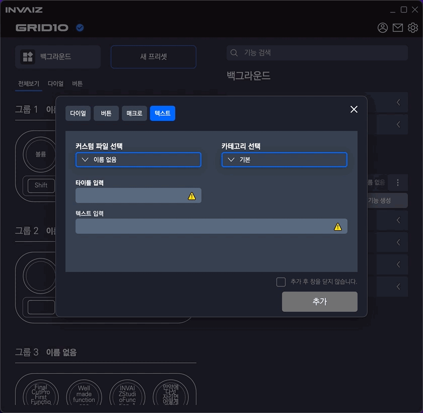
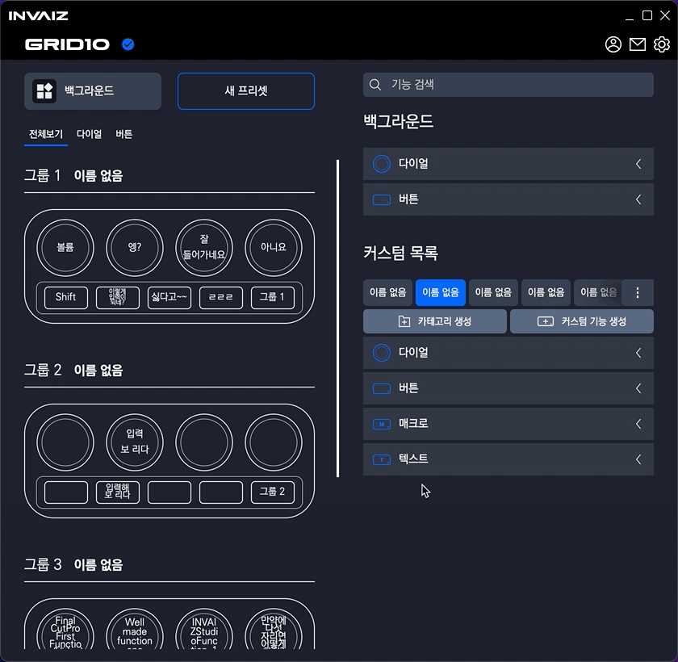

# v2.0.1 베타버전 추가 업데이트

### 2021.12.16(목)

---

## 요약

- 카테고리 생성 시 포커싱
- 카테고리 커스텀 파일 선택 박스 스크롤 추가
- 커스텀 파일 스와이핑 구현
- 그룹 모드에서 포커싱 안 되도록 수정
- 프로그램 포커싱 에러 수정
- 오버레이에서 에러 표시
- 프로그램 업데이트 시 기본 제공 프로그램 값 변경 가능하도록 변경

---

### 카테고리 커스텀 파일 선택 박스 스크롤 추가

- 커스텀 기능 생성에서 커스텀 파일 선택 및 카테고리 선택의 아이템이 여러 개가 됐을 때, 칸을 초과하여 스크롤을 할 수 없는 버그 픽스하였습니다.

---

### 커스텀 파일 스와이핑 구현

- 감도는 지속 개선 예정입니다.
- 스와이프 도중 마우스 위치의 커스텀 목록이 눌러지는데, 개선 예정입니다.
