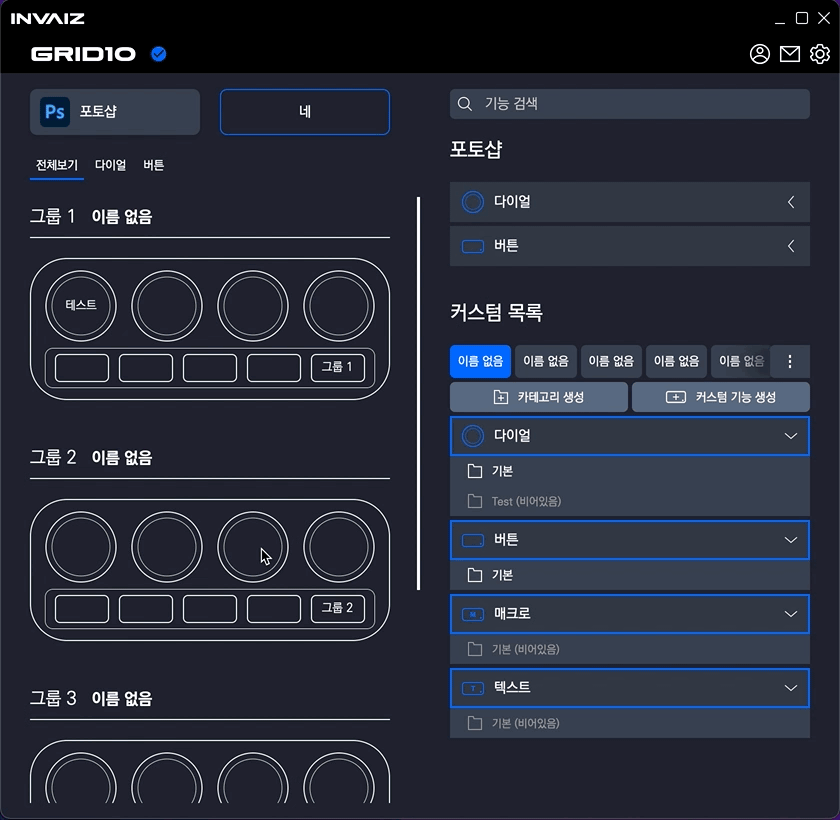
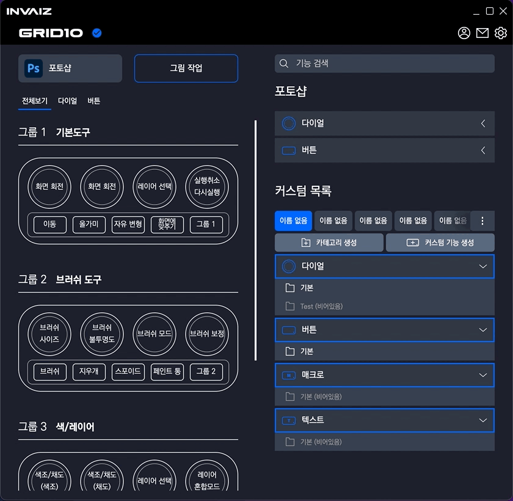
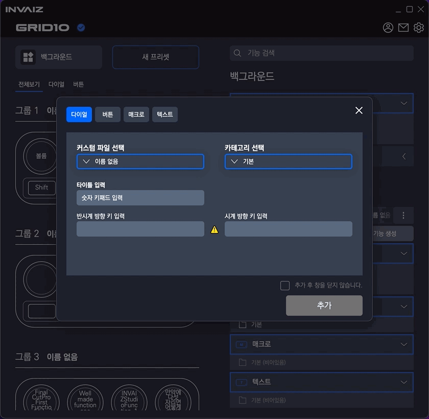
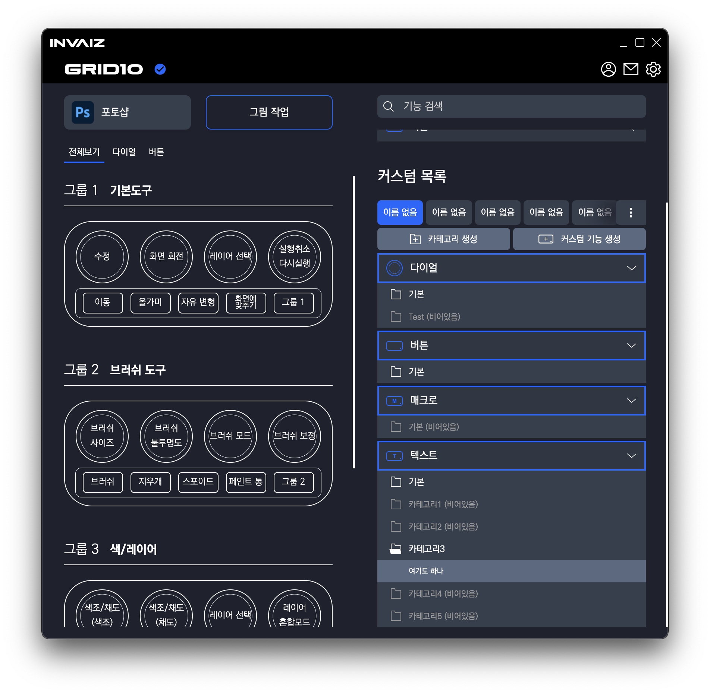
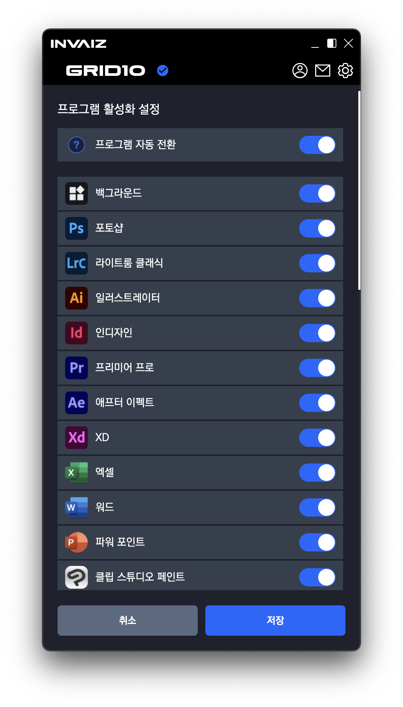

# v2.0.1 베타버전 정식 업데이트

### 2021.12.15(수)

---

## 요약

**[추가 사항](#추가-사항)**

- [오버레이 정보 추가(활성화 프로그램, 프리셋)](#오버레이-정보-추가)
- [빠른 단축키 추가 기능 구현](#빠른-단축키-추가-기능-구현)
- [숫자 키패드 입력 기능 추가](#숫자-키패드-입력-기능-추가)
- [카테고리 비어있을 경우 색 약화](#카테고리-비어있을-경우-색-약화)
- [자동 프로그램 전환 기능](#자동-프로그램-전환-기능)

**수정 사항**

- `INVAIZ Studio` 윈도우 크기 변경 방지
- 기능 리스트 동시에 열기 가능하도록 변경
- 검색 결과 View 변경 출력 및 Key 입력 알고리즘 수정(Tab 등 버그 제거)
- 오버레이 글씨 색상 수정
- `Windows`에서 프로그램 인식 값 변경

---

 

> ## 추가 사항

 

## 오버레이 정보 추가

- 이전 서브 오버레이의 기능인 현재 프로그램, 프리셋을 기존 오버레이에 탑재하였습니다.

---

## 빠른 단축키 추가 기능 구현

- 다이얼 추가

  

  - 커스텀 기능 생성과 마찬가지로 타이틀과 반시계/시계 둘 중 한 기능만 입력하면 추가 가능합니다.
  - 반시계/시계 스위칭 또한 구현되어 있습니다.

- 버튼 추가

  

  - 커스텀 기능 생성과 마찬가지로 타이틀과 기능을 입력해야 추가 가능합니다.

- 수정

  

  - 기존의 입력 값을 수정할 수 있습니다.

    - 이를 응용하면 입력할 수 없는 값`[Ex) 볼륨, 밝기 등]`을 커스텀 할 수 있습니다.
    - `Ex) 반시계 = 볼륨 내리기, 시계 = 밝기 올리기`

  - `CEP`나 `Text`, `Macro`의 경우 빠른 수정을 할 수 없으므로 모두 단축키 입력으로 수정되었습니다.

---

## 숫자 키패드 입력 기능 추가

- 다음과 같이 숫자 키패드의 값을 입력하면 `0`, `1`, `2`가 아닌, 0️⃣, 1️⃣, 2️⃣의 형태로 다른 디자인 출력됩니다.
- 실제 입력 값 또한 숫자 키패드로 입력됩니다.
- 이 외에 `Windows`에서 `Command` 키를 `Window` 키로, `Mac`에서 `Option`키를 `Alt` 키로 변경하였습니다.
- 또한, 볼륨, 밝기 등등 소소한 요소를 아이콘으로 대체하였습니다.

---

## 카테고리 비어있을 경우 색 약화

- 카테고리가 비어있는 경우, 기능이 있는 카테고리의 색을 그대로 사용하지 않고, 색감을 탁하게 하여 비어있다는 느낌을 강하게 주었습니다.

---

## 자동 프로그램 전환 기능

- 프로그램 설정 최상단에 설정 여부가 추가되었으며, 기본 값은 `off` 입니다.
- 동작 상황

  - `INVAIZ Studio`에서 `Background`를 활성화한 후 기능 실행 => 변함 없음.
  - `INVAIZ Studio`에서 켜져있는 프로그램을 활성화한 후 기능 실행 => 켜져있는 프로그램 포커싱.
  - `INVAIZ Studio`에서 꺼져있는 프로그램을 활성화한 후 기능 실행 => 포커싱 하지 않고 실행.
  - 다른 프로그램이 활성화되어 있을 때 프로그램 리스트에 추가된 프로그램을 포커싱한 후 기능 실행 => 포커싱 된 프로그램으로 상태 변경.
  - 다른 프로그램이 활성화되어 있을 때 프로그램 리스트에 추가되지 않은 프로그램을 포커싱한 후 기능 실행 => `Background`가 추가되어 있으면 `Background`로 변경. 추가되어 있지 않으면 활성화된 프로그램 포커싱.

- `Mac`에서는 최대한 테스트하여 `Adobe` 제품은 정상 동작(버전에 따라 다를 수 있음)을 확인하였습니다.
- `Windows`에서는 테스트 부족으로 아직 불완전한 기능. 계속 개선 예정입니다.
