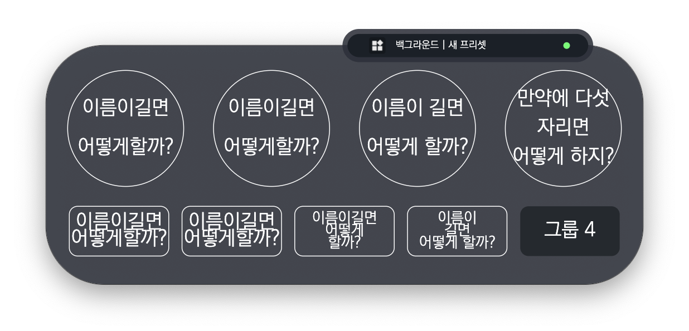
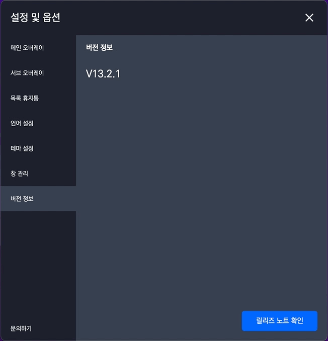
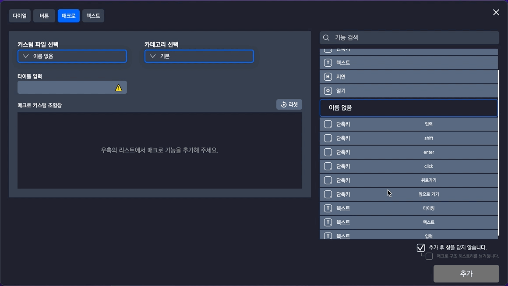
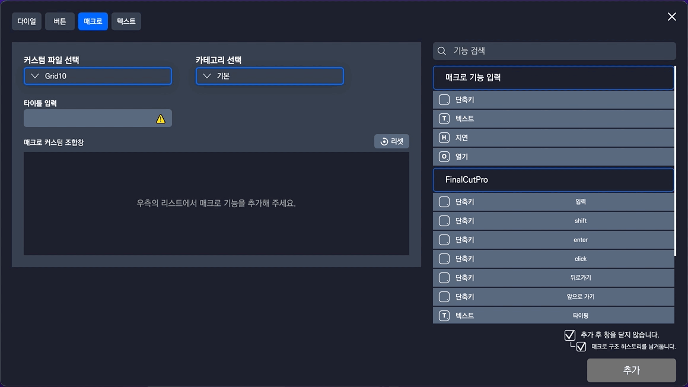
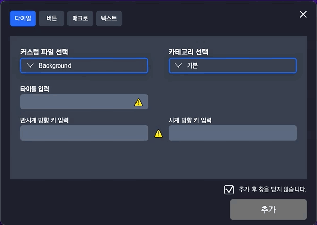
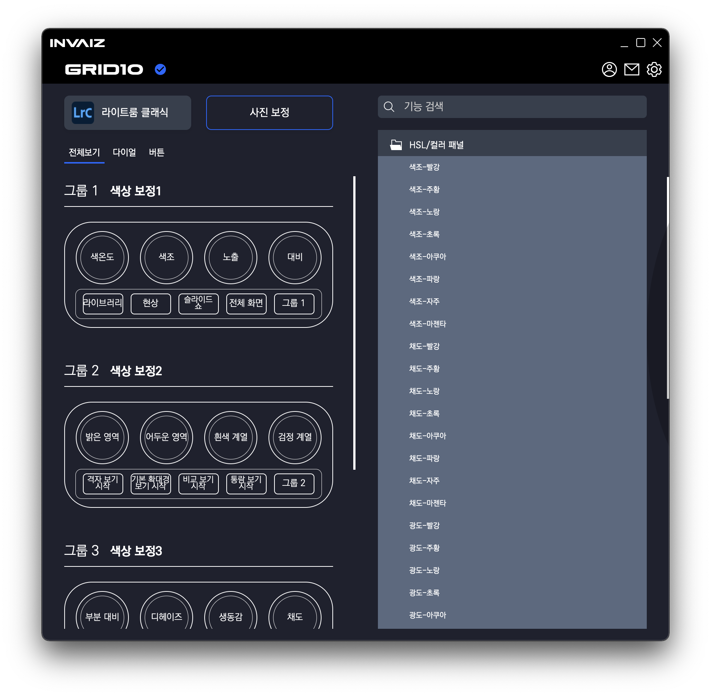

# v2.0.2 베타버전 정식 업데이트

### 2021.12.22(수)

---

## 요약

- 카테고리 생성 `Dialog` 포커싱 등 전체적인 포커싱 업데이트
- `Windows`에서 `Window` 키 포맷팅
- 빠른 단축키의 알림 선의 z축 위치 값 수정
- [글씨 알고리즘 수정](#글씨-알고리즘-수정)
- 프로그램 자동 전환 기본값 `false`
- [키 입력 제거 버튼 추가](#키-입력-제거-버튼-추가)
- [오버레이 다크/라이트 모드 통일](#오버레이-다크/라이트-모드-통일)
- [토글 속도 변경 `0.3s` => `0.1s`](#토글-속도-변경)
- `Drag & Drop` 요소에서 클릭이 제대로 안되는 버그 수정
- [릴리즈 노트 추가](#릴리즈-노트-추가)
- [매크로 매핑 시 커스텀 목록 리스트 가져오기](#매크로에서-커스텀-목록-가져오기)
- [매크로에서 기능 추가 시 해당 기능 활성화 및 스크롤 포커싱](#매크로에서-기능-추가-시-해당-기능-활성화-및-스크롤-포커싱)
- [기능 생성 창에서 커스텀 파일, 카테고리 선택 상태 표시](#기능-생성-창에서-커스텀-파일-카테고리-선택-표시)
- [수정 시 커스텀 파일, 카테고리, 타입 비활성화 및 수정 글자 표시](#수정-시-커스텀-파일-카테고리-타입-비활성화-및-수정-글자-표시)
- [기능 생성 창에서 커스텀 파일, 체크 상태 유지](#기능-생성-창에서-커스텀-파일-체크-상태-유지)
- `Windows` 프로그램 자동 전환 오류 개선
- [라이트룸 `HSL 패널` 기능 추가](#라이트룸-hsl-패널-기능-추가)
- `Windows`에서 기능 생성 창 크기 수정
- [세팅 창에서 크기 조절하는 영역 추가](#세팅-창에서-크기-조절하는-영역-추가)

---

## 글씨 알고리즘 수정

- 변경 후 글씨가 적당 선에서 줄어들고, 공백이 없는 경우 문자를 중간부터 잘라내었습니다.

- 위와 같이 설정 창에서도 오류 없이 잘 보이도록 수정하였습니다.

- `-`의 경우 공백 다음 순서로 먼저 자르고, 제거하였습니다.

- 완벽하게 실제 문자가 렌더링 되는`[Ex) 한글, 브라우저 등]` 프로그램보단 부족하지만 계속 개선해나갈 예정입니다.

---

## 키 입력 제거 버튼 추가

- 입력된 키를 제거하는 버튼 추가하였습니다.

---

## 오버레이 다크/라이트 모드 통일

- 기존에는 오버레이의 글씨가 테마에 따라 변경되어 라이트 모드일 때 잘 안 보였으나 수정하였습니다.

---

## 토글 속도 변경

- 변경 전(0.3초)

  

- 변경 후(0.1초)

  

- 답답함을 줄일 수 있도록 `INVAIZ Studio` 내의 모든 토글 속도를 개선하였습니다.

---

## 릴리즈 노트 추가

- 릴리즈 노트를 볼 수 있게 추가하였습니다.
- 기존의 옵션 창에서 버전 정보 탭 아래의 버튼을 통해 확인 가능합니다.

---

## 매크로에서 커스텀 목록 가져오기

- 매크로를 입력할 때 기존에 추가했던 커스텀 목록에서 버튼, 텍스트 기능을 가져올 수 있습니다.
- 카테고리와는 상관없이 커스텀 파일 기준으로 나열됩니다.

---

## 매크로에서 기능 추가 시 해당 기능 활성화 및 스크롤 포커싱

- 매크로에 기능을 추가할 때, 추가한 기능을 바로 수정할 수 있도록 활성화 됩니다.
- 만약 현재 보이는 범위를 초과하여 기능이 생성되었을 경우, 활성화된 기능을 볼 수 있도록 스크롤이 이동됩니다.

---

## 기능 생성 창에서 커스텀 파일, 카테고리 선택 표시

- 현재 선택된 커스텀 파일, 카테고리가 어떤 요소인지 활성화된 색을 적용하였습니다.

---

## 수정 시 커스텀 파일, 카테고리, 타입 비활성화 및 수정 글자 표시

- 카테고리 수정 시 타입을 변경할 수 없도록 비활성화 되었습니다.
- "생성"이라는 버튼의 글자가 "수정"으로 변경되었습니다.

- 기능 수정 시 타입을 변경할 수 없고, 커스텀 파일, 카테고리를 선택할 수 없도록 비활성화 되었습니다.
- 창을 열거나 닫음을 설정하는 체크박스가 사라집니다.
- "생성"이라는 버튼의 글자가 "수정"으로 변경되었습니다.

---

## 기능 생성 창에서 커스텀 파일, 체크 상태 유지

- 기능 생성 창에서 작업 도중 다른 탭으로 이동해도 미리 선택해둔 커스텀 파일, 체크 상태가 유지됩니다.
- 매크로의 경우 매크로 구조 히스토리 체크 또한 유지됩니다.

---

## 라이트룸 `HSL 패널` 기능 추가

- `Adobe Lightroom Classic`에서 `HSL 패널`의 기능이 추가되었습니다.

---

## 세팅 창에서 크기 조절하는 영역 추가

- 창 크기를 편하게 조절할 수 있도록 넓은 범위의 영역을 생성하였습니다.
