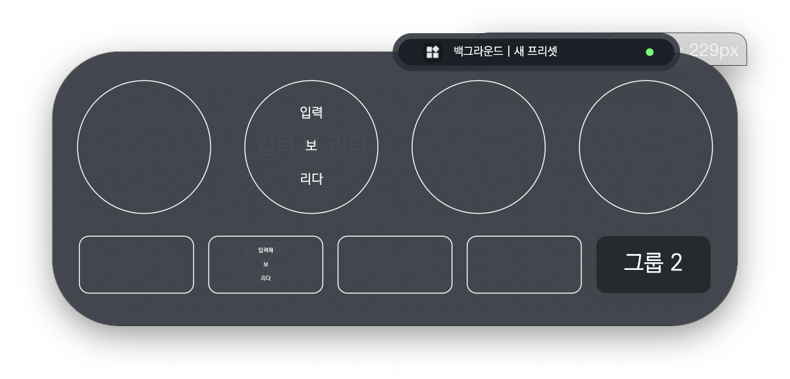
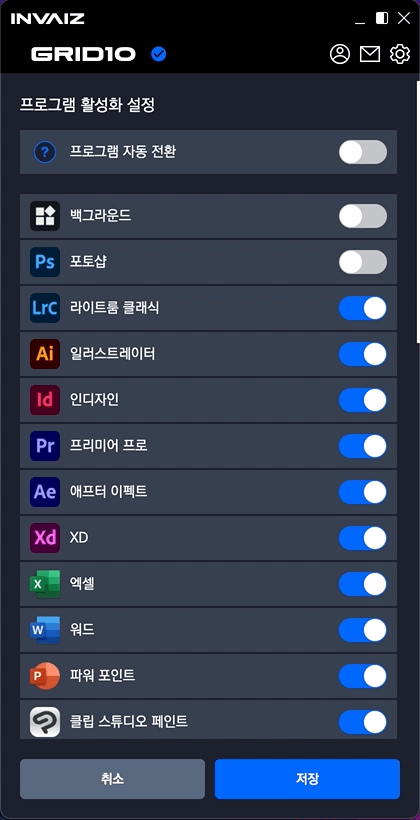

# v2.0.2 베타버전 정식 업데이트

### 2021.12.22(수)

---

## 요약

- 카테고리 생성 Dialog 포커싱 등 전체적인 포커싱 업데이트
- `Windows`에서 `Window` 키 포맷팅
- 빠른 단축키의 알림 선의 z축 위치 값 수정
- Preview, Ovelay 등에서 글씨 알고리즘 수정
- 프로그램 자동 전환 기본값 `false`
- Drag & Drop 요소에서 클릭이 제대로 안되는 버그 수정
- 키 입력 제거 버튼 추가
- 오버레이 다크/라이트 모드 통일
- 토글 속도 변경 0.3s => 0.1s

---

### Preview, Ovelay 등에서 글씨 알고리즘 수정

- 글씨 알고리즘 변경 전

  

  

  - 이처럼 오버레이에서 타이틀에 공백(space)이 없는 기능의 경우 한 줄로 출력하여 칸을 초과하고, 여러 줄로 출력하는 경우 글씨가 지나치게 줄어드는 버그.

- 글씨 알고리즘 변경 후

  

  - 변경 후 글씨가 적당 선에서 줄어들고, 공백이 없는 경우 문자를 중간부터 잘라냄.

  

  

  - 위와 같이 설정 창에서도 오류 없이 잘 보이도록 수정함.

- 완벽하게 실제 문자가 렌더링 되는`[Ex) 한글, 브라우저 등]` 프로그램보단 부족하지만 계속 개선해나갈 예정.

---

### 키 입력 제거 버튼 추가

- 입력된 키를 제거하는 버튼 추가.

---

### 오버레이 다크/라이트 모드 통일

- 기존에는 오버레이의 글씨가 테마에 따라 변경되어 라이트 모드일 때 잘 안 보였으나 수정함.

---

### 토글 속도 변경

- 변경 전(0.3초)

  

- 변경 후(0.1초)

  
