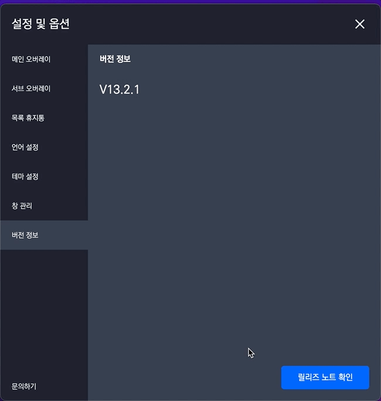
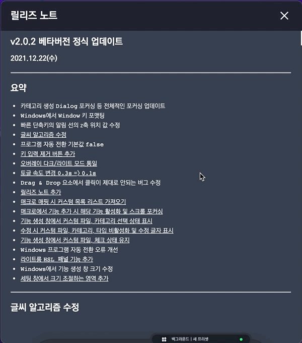
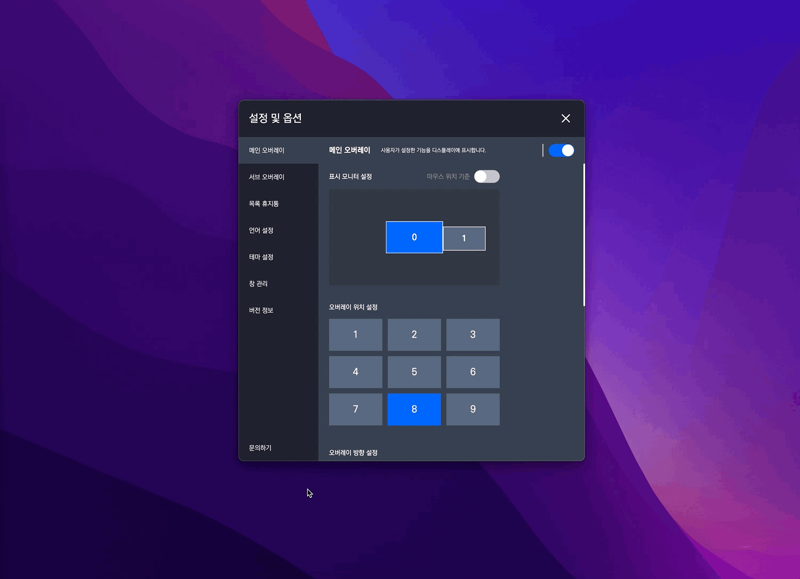
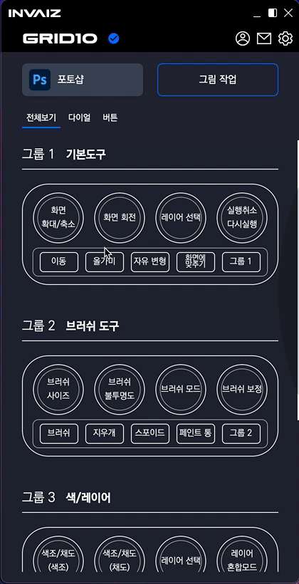
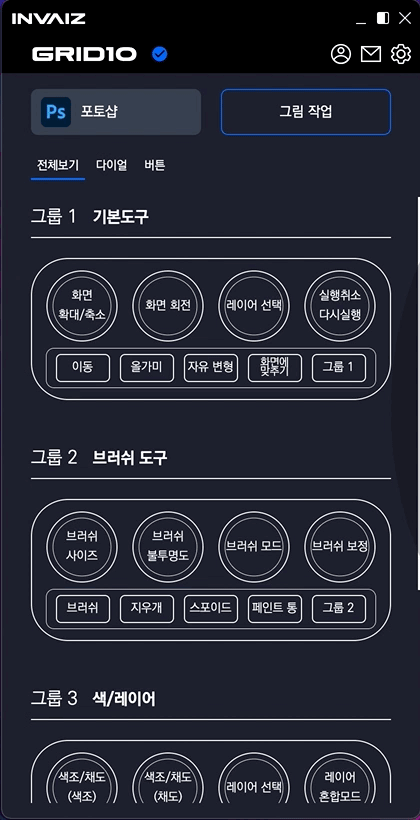
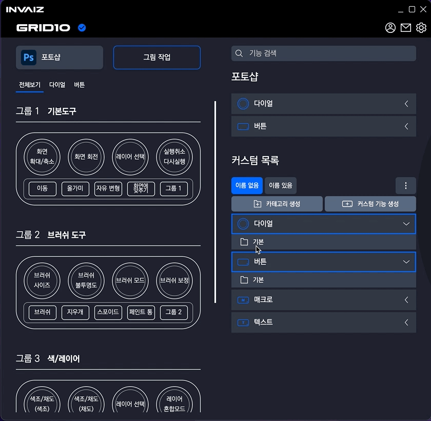
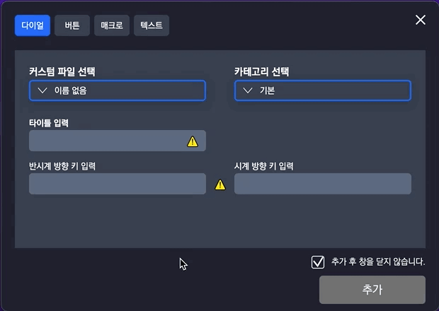
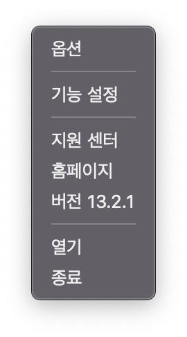
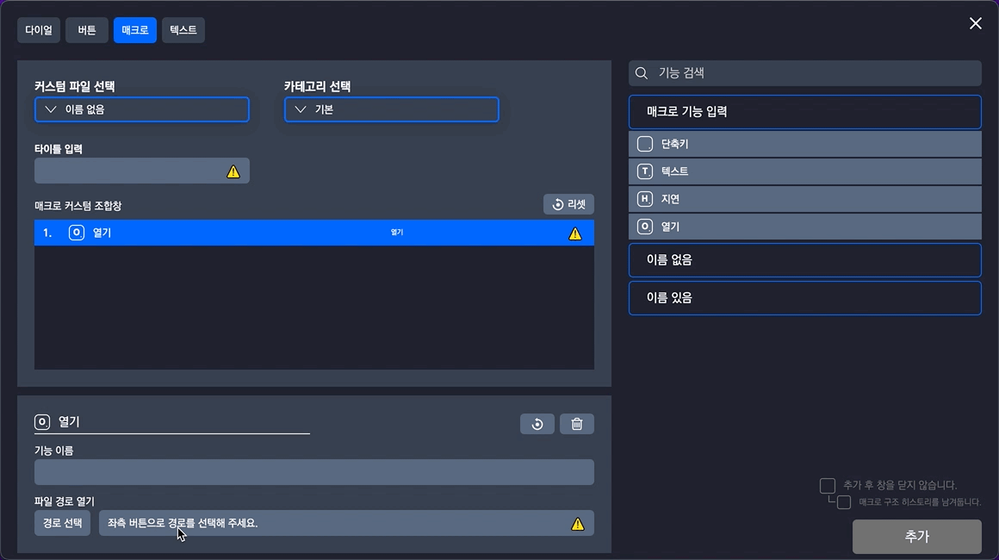

# v2.0.3 베타버전 정식 업데이트

### 2021.12.29(수)

---

## 요약

- 오버레이 크기 기본값 `40` -> `100`으로 변경
- [릴리즈 노트 새 창에서 띄움](#릴리즈-노트-새-창)
- [문의하기 클릭 시 홈페이지 띄움(홈페이지 아래의 채팅으로 문의)](#문의하기-클릭-시-홈페이지)
- [`Dialog`, `Snackbar` 등의 알림 적용](#dialog-snackbar-알림)
- [메뉴 기능 추가](#메뉴-기능-추가)
- 카테고리 생성/수정 디테일
- [파일/폴더/웹사이트 열기 분할](#파일폴더웹사이트-열기-분할)
- `Windows`에서 `Clip Studio Paint` 추천 프리셋 추가
- [프로그램 자동 전환 버그 수정](#프로그램-자동-전환-버그-수정)
- [오버레이 회전 기능 삭제](#오버레이-회전-기능-삭제)

---

## 릴리즈 노트 새 창

- 기존의 릴리즈 노트는 옵션 창 내부에 작은 창으로 띄워졌으나, 이를 새로운 윈도우 창에 띄울 수 있도록 수정하였습니다.

- 또한 릴리즈 노트의 목차에서 링크를 눌러 이동할 수 있으나, 몇몇 링크는 제대로 이동이 되지 않는 현상이 발생합니다.

---

## 문의하기 클릭 시 홈페이지

- 문의하기를 클릭하면(셋팅창, 옵션창) [INVAIZ 홈](https://www.invaiz.com/)페이지를 엽니다.

---

## `Dialog`, `Snackbar` 알림

- `Dialog` 알림

  

  

  

  - 기존의 알림 창과, 확인 창의 디자인을 변경하여 적용하였습니다.

- `Snackbar` 알림

  

  

  

  

  - 어떠한 행동을 했을 때, 그 행동을 각인(확실하게 인지) 하기 위해서 펼쳐진 모드일 경우 우측 하단, 접은 모드일 경우 하단에 알림 요소를 띄웠습니다.

---

## 메뉴 기능 추가

- 기존의 옵션, 기능 설정, 열기, 종료 외에 새로운 기능을 추가하였습니다.
- 지원 센터: [지원 센터](https://dynamic-position-46c.notion.site/INVAIZ-V-1-0-4174e58b8cfe4161ae3a2c0f9579a982) 페이지를 엽니다.
- 홈페이지: [INVAIZ 홈](https://www.invaiz.com/)페이지를 엽니다.
- 버전 정보: 버전 정보를 보여주고, 클릭 시 릴리즈 윈도우를 엽니다.

---

## 카테고리 생성/수정 디테일

- 카테고리 수정 후 수정 버튼을 클릭하면 창이 닫히면서 수정 버튼이 생성 버튼으로 바뀌는 디테일을 수정하였습니다.

---

## 파일/폴더/웹사이트 열기 분할

- 기존의 파일/폴더 통합 선택 시 `Windows`에서는 파일이 선택되지 않는 상태가 나타났습니다.
- 이에 파일 열기, 폴더 열기, 웹사이트 열기를 분할하여 선택할 수 있도록 수정하였습니다.

---

## 프로그램 자동 전환 버그 수정

- `Windows`에서 `Adobe XD`의 자동 전환이 정상적으로 동작하지 않는 버그를 수정하였습니다.

---

## 오버레이 회전 기능 삭제

- 오버레이 회전 기능이 정상적으로 작동하지 않는 것이 확인되어 일시적으로 삭제하였습니다.
