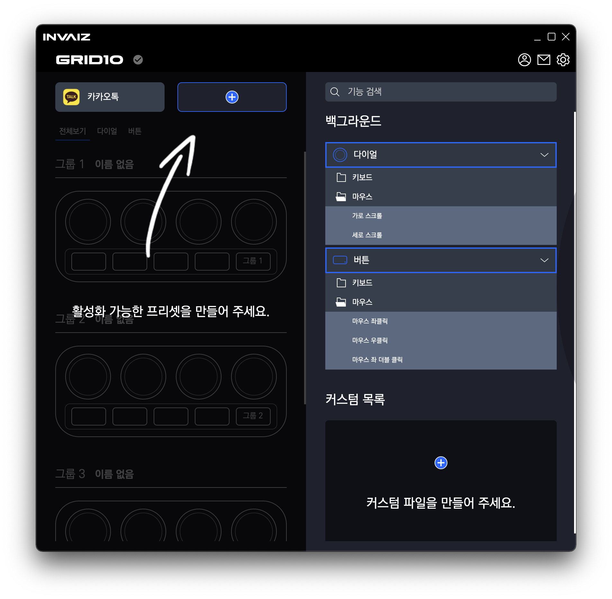

# v2.0.4 베타 버전 업데이트

### 2022.01.12(수)

---

## 요약

**[추가 사항](#추가-사항)**

- [모든 프로그램에서 백그라운드 기능 매핑](#모든-프로그램에서-백그라운드-기능-매핑)
- [추천 프리셋 리스트의 변경(추가, 삭제) 시 적용](#추천-프리셋-리스트의-변경추가-삭제-시-적용)

**[수정 사항](#수정-사항)**

- [`Windows` 마우스 스크롤 버그 수정](#windows-마우스-스크롤-버그-수정)

---

 

> ## 추가 사항

 

### 모든 프로그램에서 백그라운드 기능 매핑

- 모든 프로그램에서 백그라운드의 기능(키보드, 마우스 등)을 적용할 수 있도록 수정하였습니다.

---

### 추천 프리셋 리스트의 변경(추가, 삭제) 시 적용

- 이제부터 추천 프리셋이 업데이트되면 유저의 컴퓨터에 정상적으로 적용이 됩니다.
- 혹여나 추천 프리셋이 삭제될 경우, 이전의 추천 프리셋 데이터는 사라지고 해당 자리에 "새 프리셋"으로 빈 데이터만 남습니다.

---

 
 
 

> ## 수정 사항

 

### `Windows` 마우스 스크롤 버그 수정

- `Windows`에서 마우스 가로, 세로 스크롤이 동작하지 않는 버그를 수정하였습니다.
