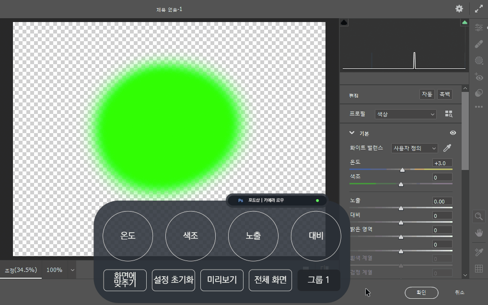

# v2.1.0 정식버전 업데이트

### 2022.02.09(수)

---

## 요약

**[추가 사항](#추가-사항)**

- [가상 키보드 모드](#가상-키보드-모드)
- [`Windows`에서 `Camera Raw`와 픽셀 유동화 기능 추가](#windows에서-camera-raw와-픽셀-유동화-기능-추가)
- [`macOS`에서 `Camera Raw` 기능 추가(테스트)](#macos에서-camera-raw-기능-추가테스트)
- [기본 제공 기능, 지원 프로그램 시각 표시](#기본-제공-기능-지원-프로그램-시각-표시)
- [특수 키 단일 입력 기능 추가](#특수-키-단일-입력-기능-추가)
- [이전 버전 프리셋 호환](#이전-버전-프리셋-호환)
- [`Adobe After Effects` 효과 추가](#adobe-after-effects-효과-추가)

**[수정 사항](#수정-사항)**

- [`INVAIZ Studio v2.x.x` 버전 대 아이콘 변경(`BASQUIAT`)](#invaiz-studio-v2xx-버전-대-아이콘-변경-basquiat)
- [언어 통일화 및 번역 수정](#언어-통일화-및-번역-수정)
- [`Windows` 추가 프로그램 영역 아이콘 로드 버그 수정](#windows-추가-프로그램-영역-아이콘-로드-버그-수정)
- [커스텀 파일 없을 경우 기능 설정 창 열기 불가하도록 수정](#커스텀-파일-없을-경우-기능-설정-창-열기-불가하도록-수정)
- [단축키 입력 범위 초과 표현 수정](#단축키-입력-범위-초과-표현-수정)

**[삭제 사항](#삭제-사항)**

- [서브 오버레이, 목록 휴지통 삭제](#서브-오버레이-목록-휴지통-삭제)

---

 

> ## 추가 사항

 

## 가상 키보드 모드

- `Windows` 키보드 모드

  

- 키보드 모드를 켜는 상황

  

  - 기능을 매핑해서 사용할 수 없는 경우(`fn`, `Scroll Lock`, `Num Lock` 등 키 입력 외적인 조작) 톤을 낮춤으로 사용할 수 없다는 것을 표시하였습니다.

- 특수 키를 입력하는 상황

  

  - 각 사용 가능한 키에 마우스를 호버하면, 크기가 약간 확대되는 애니메이션을 설정하였습니다.
  - 또한 다이얼에서 키보드 모드가, 어떠한 곳에 매핑을 해야하는지 애매한 규정을 마우스 클릭 시 주변에 테두리를 통해 확인할 수 있도록 구성하였습니다.

- 조합 키를 입력하는 상황

  

---

## `Windows`에서 `Camera Raw`와 픽셀 유동화 기능 추가

- `INVAIZ Studio v1.8.0`에 있던 `Camera Raw`, 픽셀 유동화의 기능을 `INVAIZ Studio 2.x.x` 버전에도 추가하였습니다.

  

  

---

## `macOS`에서 `Camera Raw` 기능 추가(테스트)

- `macOS`에서 단축키로 쉽게 조작할 수 없는 `Camera Raw` 패널들을 조작하는 기능을 추가하였습니다.
- 테스트 버전이므로 계속 개선해나갈 예정입니다.
- `Camera Raw` 조작 결과 수치를 오버레이에 표시하였습니다.

  

---

## 기본 제공 기능, 지원 프로그램 시각 표시

- 기본 제공 프리셋, 지원 프로그램을 시각적으로 표시하였습니다.
- 기본 제공 프리셋

  - 기본 제공 프리셋 표시

  

  - 기본 제공 프리셋 툴팁

  

- 지원 프로그램

  - 지원 프로그램 표시

  

  - 지원 프로그램 툴팁

  

---

## 특수 키 단일 입력 기능 추가

- 기존에는 `Control`, `Alt`, `Shift`, `Windows` 키는 단일로 입력될 수 없었으나, 단일 입력 가능하도록 수정하였습니다.

  

---

## 이전 버전 프리셋 호환

- `v1.x.x` 버전 대의 프리셋은 언어팩이 지원되지 않고, `v2.x.x` 버전 대로 넘어오면서 데이터 형식이 변경되어 불러오기 시 오류가 발생하였는데, 호환성을 갖추는 작업을 진행하였습니다.

  

---

## `Adobe After Effects` 효과 추가

- `Adobe After Effects`에서 익스프레스 키로 사용 가능한 효과 기능이 추가되었습니다.

  

---

 
 
 

> ## 수정 사항

 

## `INVAIZ Studio v2.x.x` 버전 대 아이콘 변경(`BASQUIAT`)

- `INVAIZ Studio`의 새로운 버전을 나태는 아이콘으로 변경되었습니다.
- 이번 `INVAIZ Studio`는 두 번째 프로젝트로 예술가 장 미셸 바스키아(`BASQUIAT`)의 디자인적 영감을 얻어와 녹여내어, 낙서 드로잉을 통한 자유로움을 표현하고 있습니다.

---

## 언어 통일화 및 번역 수정

- `INVAIZ Studio 2.0.4` 버전까지 완벽하지 않은 상태의 번역을 정리하였습니다.
- 너무 오래되어 제대로 동작하지 않는 기능, 프리셋을 테스트하여 수정하였습니다.
- 일반화되어 있지 않은 언어들을 최대한 일반화시켰습니다.

  `Ex)` 실행취소 다시실행 => 실행 취소/다시 실행, 투명도 or 불투명도 => 불투명도 등

- 지속적으로 개선해나갈 예정입니다.
- 현재 `Microsoft Office` 제품군과 `한글`의 경우 `Windows`와 `macOS`의 호환의 완벽하지 않아 언어가 다르고, 또한 기능의 수가 타 프로그램에 비해 많아 오래 걸릴 것으로 예상됩니다.

---

## `Windows` 추가 프로그램 영역 아이콘 로드 버그 수정

- `Windows`에서 간혹 실행 중인 프로그램의 아이콘을 가져오지 못하는 버그를 수정하였습니다.

---

## 커스텀 파일 없을 경우 기능 설정 창 열기 불가하도록 수정

- 커스텀 파일이 없으면 기능 설정 창의 의미가 없으므로 열리지 않도록 수정하였습니다.

---

## 단축키 입력 범위 초과 표현 수정

- `macOS`는 매직 마우스, 터치 패드의 가로 스크롤이 용이하여 큰 문제 없으나, `Windows`에서는 칸을 초과할만큼 단축키를 입력하면 보기 힘든 문제가 있습니다.
- 임시로 단축키 입력 칸을 초과했을 경우 보여줄 디자인을 설정하여 적용하였습니다.
- 애니메이션은 따로 적용하지 않고, 호버했을 경우 보이도록 하였습니다.

---

 
 
 

> ## 삭제 사항

 

## 서브 오버레이, 목록 휴지통 삭제

- 서브 오버레이 지원을 하지 않기로 결정하여 삭제하였습니다.
- 목록 휴지통은 현재 구현되지 않아 일시적으로 탭을 삭제하였습니다.
