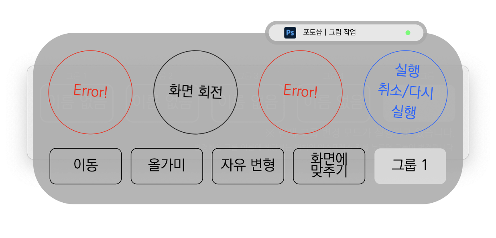
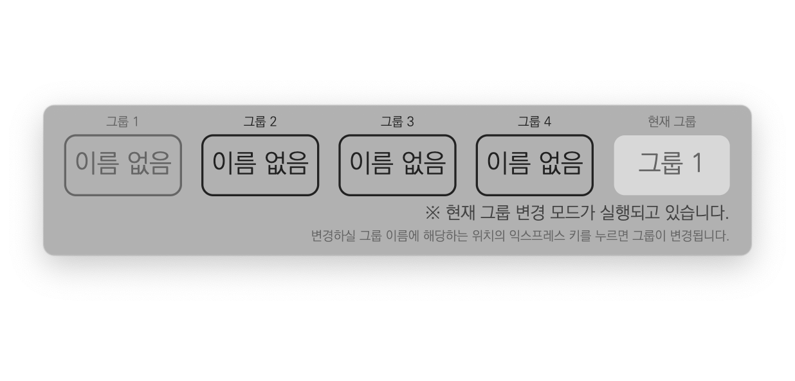
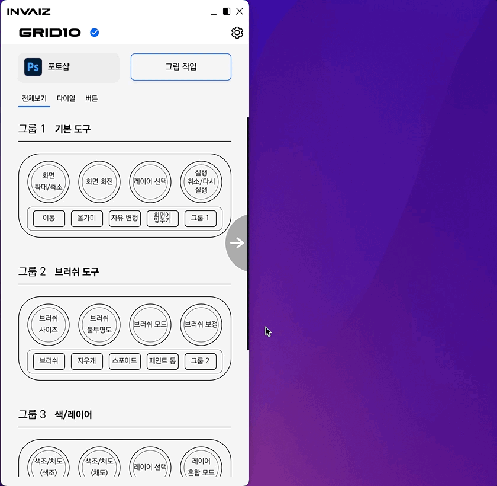
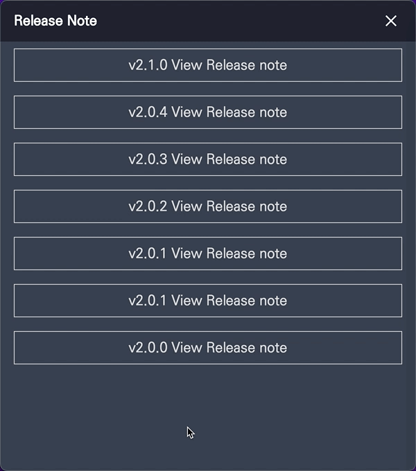
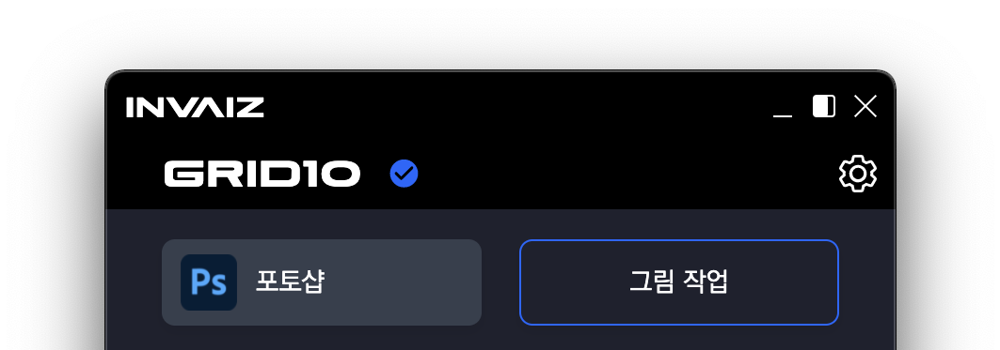

# v2.1.1 정식버전 업데이트

### 2022.03.10(목)

---

## 요약

**[추가 사항](#추가-사항)**

- [오버레이 그룹 변경 모드 설명 추가](#오버레이-그룹-변경-모드-설명-추가)
- [오버레이 라이트 모드 추가](#오버레이-라이트-모드-추가)
- [`Mac M1`에서 `Adobe Photoshop` 지원](#mac-m1에서-adobe-photoshop-지원)
- [업데이트 정보 확인 기능 추가](#업데이트-정보-확인-기능-추가)
- [기기 관리 메뉴 추가](#기기-관리-메뉴-추가)
- [언어 지원 확대](#언어-지원-확대)
- `Plugin` - `Adobe Lightroom Classic`: 플러그인에 등급 및 컬렉션 기능이 추가되었습니다.

**[수정 사항](#수정-사항)**

- [탭 이름 변경](#탭-이름-변경)
- [옵션 창 메인 오버레이 음영 버그 수정](#옵션-창-메인-오버레이-음영-버그-수정)
- [셋팅 창 펼치기 버튼 아이콘 수정](#셋팅-창-펼치기-버튼-아이콘-수정)
- [릴리즈 노트 구성 변경](#릴리즈-노트-구성-변경)
- [`Windows` 알림 창 수정](#windows-알림-창-수정)
- `MSOffice Word`의 글꼴 크기 기능에 있는 오타를 수정하였습니다.
- `Plugin` - `Adobe Illustrator`: 오브젝트 획 조절시 소수점 값을 반환하게 수정하였습니다.
- `Plugin` - `Adobe After Effects`: 효과 추가 기능들의 카테고리 이름에 "효과추과" 명칭이 추가되었습니다.

**[삭제 사항](#삭제-사항)**

- [문의하기, 로그인 제거](#문의하기-로그인-제거)
- 프로그램 추가 목록에서 사용하지 않는 시스템 프로그램들을 제거하였습니다.

---

 

> ## 추가 사항

 

## 탭 이름 변경

---

## 오버레이 그룹 변경 모드 설명 추가

- 사용자 피드백으로 나온 "그룹 변경 모드라는 것을 인식시킬 수 있는 방법"을 반영하여 그룹 변경 모드에서 설명을 통해 그룹 변경 모드라는 것을 노출하였습니다.

  

- 현재 그룹의 색상 톤을 낮추어 다른 그룹을 누를 수 있는 모드라는 것을 인지할 수 있게 시선을 분산시켰습니다.
- 또한, `Apple` 제품을 오마주한 애니메이션을 통해 클릭 시 변화가 있을 예정이라는 인지와 시각적 포인트를 주었습니다.

  

---

## 오버레이 라이트 모드 추가

- 기존에 오버레이는 테마를 설정하더라도 동일한 다크 모드 테마를 유지했는데, 라이트 모드 테마를 추가하였습니다.
- 라이트 모드 기본

  

- 라이트 모드 사용

  

- 라이트 모드 그룹 설정

  

---

## `Mac M1`에서 `Adobe Photoshop` 지원

- **`Mac M1`에서 동작 가능하도록 `UXP`선택 기능**을 구현하였습니다.

  

- 옵션 창에서 설정이 가능하며, ON 상태에서는 `Adobe Creative Cloud`의 플러그인 마켓에서 `InvaizPlugin`을 설치 후 활성화 한 이후에 정상 동작합니다.
- 기본적으로 OFF 상태로 설치되며, 현재 두 통신 방식의 가속도 값이 미세하게 다릅니다.
- 플러그인을 직접 찾아서 다운로드 하기에 번거로움이 있을 수 있어, 다운로드 가능한 링크를 걸어두었습니다.

  

---

## 업데이트 정보 확인 기능 추가

- 버전 정보에 프로젝트 설명 추가

  - 기존의 버전 정보 탭에는 전달하는 정보에 비해서 영역의 크기가 너무 커서 비어 보이는 상태였는데, 이에 내용을 채워넣고자 `INVAIZ Studio v2`가 진행하는 프로젝트의 대한 설명을 추가했습니다.

  

- `Windows`의 경우 자동 업데이트를 지원하므로 큰 의미가 없으나, `macOS`의 경우 자동 업데이트가 지원되지 않아 사용자가 업데이트 관련 소식을 제공받지 못 할 수 있으므로, 간접적으로 업데이트를 유도할 수 있도록 표시하였습니다.

  

- 업데이트 가능한 상태일 경우 아이콘에 표시되며, 이전에는 메뉴에서 버전 정보 클릭 시 릴리즈 노트 창이 떴으나, 해당 상태에서는 옵션 창의 버전 정보 탭으로 이동됩니다.
- 버전 정보 옆에 업데이트라는 버튼이 추가되었으며, 해당 버튼 클릭 시 사용 중인 `OS`에 맞는 설치 파일이 자동으로 브라우저에서 다운로드 됩니다.
- 업데이트 버튼은 일정 시간마다 점프하는 애니메이션을 추가하였습니다.
- 메뉴에 호버하거나, 버전 정보에 마우스를 호버하게 되면, 업데이트 가능이라는 툴팁이 보이게 됩니다.

---

## 기기 관리 메뉴 추가

- 프리셋을 수동으로 변경하는 것에 대한 불편함과 해소 니즈가 많아 필요하다고 판단되어 작업하였습니다.
- 기존에는 프로그램 혹은 프리셋을 변경하기 위해서 세팅 창을 켜야하는 번거로움이 있었는데, 이제는 메뉴에서 프로그램 혹은 프리셋을 변경할 수 있게 하여 조오오오오오금은 더 빠르게 접근할 수 있습니다.
- 현재 활성화된 프로그램 혹은 프리셋은 선택할 수 없으며, 프로그램 자동 전환 상태도 변경 가능합니다.

  

- 또한 프리셋을 `Grid10` 기기로 변경할 수 있도록 그룹 버튼을 두 번 눌렀을 때 프리셋 변경 창을 고안하고 있습니다.

---

## 언어 지원 확대

- 기존에는 셋팅 창, 옵션 창과 같은 창에서만 언어팩 지원이 되었는데, 이제는 알림 창이나, 메뉴, 툴팁 등에도 언어팩이 적용됩니다.

  

---

 
 
 

> ## 수정 사항

 

## 탭 이름 변경

- 기존의 "창 관리" 탭은 단어 선택이 애매하여 해당 탭에서 관리하는 내용이 무엇인지 유추하기 어렵게 했습니다.
- 따라서 "창 관리" 보다 조금은 더 포용성 있는 "상태 관리"("Manage State")라는 이름을 선택하였습니다.

  

- 또한 기존에 있던 "문의하기" 탭도 "지원 센터로" 변경하였습니다.

---

## 옵션 창 메인 오버레이 음영 버그 수정

- 메인 오버레이 끄기 시 음영 버그 수정

  - 옵션 창의 메인 오버레이 영역에서 아래로 스크롤 한 후 오버레이를 끄면, 음영이 비정상적으로 렌더되는 버그가 있었습니다.

  

  - 음영이 가리지 않는 부분은 오버레이가 꺼져 있음에도 불구하고 설정이 되는 문제점이 있었는데, 이를 수정하였습니다.

  

---

## 셋팅 창 펼치기 버튼 아이콘 수정

- 펼치기 버튼 수정

  - 셋팅 창의 모드를 변경하는 펼치기 버튼이 직관적이지 못하여 화살표를 추가하고 크기를 조정하였습니다.

  

---

## 릴리즈 노트 구성 변경

- 릴리즈 노트 수정

  - 릴리즈 노트가 한 번에 모든 내용이 보여 스크롤이 너무 긴 상태여서 선택적으로 열람할 수 있도록 수정하였습니다.
  - 또한 글씨 크기를 조금 키웠으며, ` `이 렌더링 되는 버그나, 링크 클릭 시 영어나 특수 문자가 있는 링크로는 이동이 되지 않는 버그를 수정하였습니다.

  

---

## `Windows` 알림 창 수정

- `Windows`의 알림에서 부실했던 부분을 보완하였습니다.

  

- 아이콘은 현재 사용 중인 `INVAIZ Studio v2`의 로고를 채택하였습니다.

---

 
 
 

> ## 삭제 사항

 

## 문의하기, 로그인 제거

- 더이상 사용하지 않아 불필요한 기능인 셋팅 창의 로그인 버튼, 문의하기 버튼을 삭제하였습니다.

  
