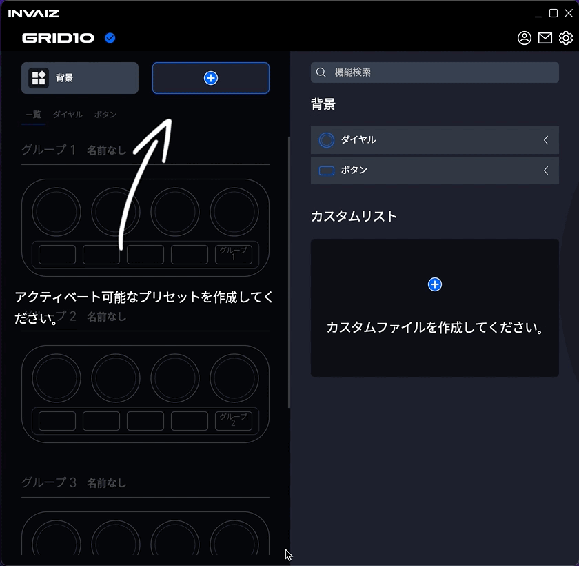
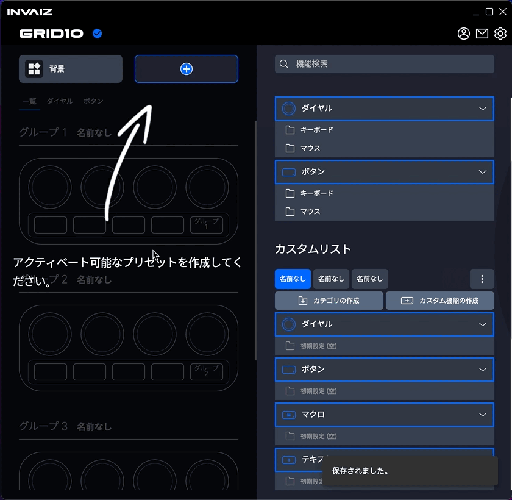
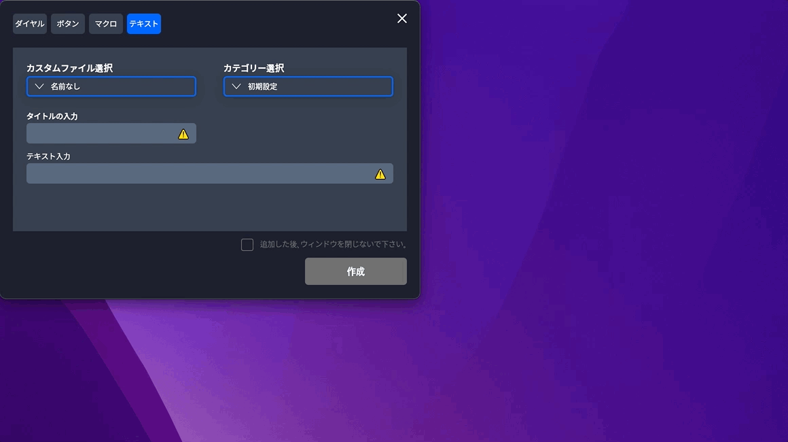
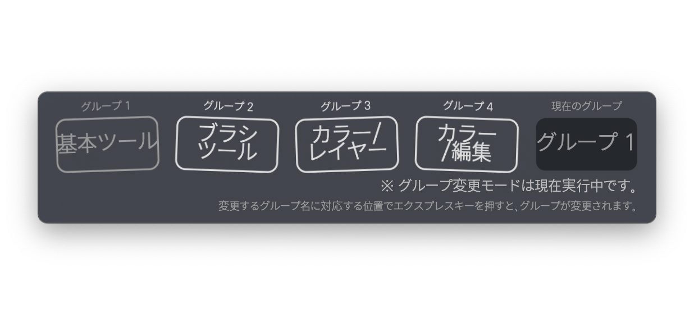

# v2.2.0 정식버전 업데이트

### 2022.04.27(수)

---

## 요약

**[추가 사항](#추가-사항)**

- [일본어 버전 추가](#일본어-버전-추가)
- [`MacBook Pro` 터치 바 지원](#macbook-pro-터치-바-지원)
- [손 쉬운 사용 설정 유도](#손-쉬운-사용-설정-유도)
- [파일 불러오기, 저장 시 유효성 검사](#파일-불러오기-저장-시-유효성-검사)
- [기능 입력 박스 활성화 상태 표시](#기능-입력-박스-활성화-상태-표시)
- [`INVAIZ Studio Basquiat` 뉴스 창 추가](#invaiz-studio-basquiat-뉴스-창-추가)
- `Windows` 자동 업데이트 알림 창 언어팩 지원
- [기능 설정 창 매크로 다중 선택 기능 추가](#기능-설정-창-매크로-다중-선택-기능-추가)

**[수정 사항](#수정-사항)**

- [`INVAIZ Studio` 애플리케이션 이름 `INVAIZ Studio Basquiat`로 변경](#invaiz-studio-애플리케이션-이름-invaiz-studio-basquiat로-변경)
- [불완전한 번역 마무리](#불완전한-번역-마무리)
- [`macOS` 설치 파일 문구 수정](#macos-설치-파일-문구-수정)
- [`macOS` `Adobe Camera Raw` 최적화](#macos-adobe-camera-raw-최적화)
- [`Windows` 한글 입력 시 종료되는 버그 수정](#windows-한글-입력-시-종료되는-버그-수정)
- [`Windows` 텍스트 기능 한글 사용 시 오류 수정](#windows-텍스트-기능-한글-사용-시-오류-수정)
- [기능 설정 창 리스트 표시 수정](#기능-설정-창-리스트-표시-수정)
- [기능 설정 창 상태 유지 버그 수정](#기능-설정-창-상태-유지-버그-수정)
- [기능 설정 창 카테고리 기본 값 버그 수정](#기능-설정-창-카테고리-기본-값-버그-수정)
- [커스텀 목록 디자인 디테일 수정](#커스텀-목록-디자인-디테일-수정)
- [릴리즈 노트 디자인 변경](#릴리즈-노트-디자인-변경)
- [`Adobe Premiere Pro` 버그 수정](#adobe-premiere-pro-버그-수정)
- [커스텀 파일 목록 스와이프 시 클릭되는 오류 수정](#커스텀-파일-목록-스와이프-시-클릭되는-오류-수정)

---

 

> ## 추가 사항

 

## 일본어 버전 추가

- 일본어 버전을 정식 업데이트하였습니다.
- 셋팅 기능 뷰

  

- 셋팅 지원 프로그램

  

- 셋팅 커스텀 파일

  

- 셋팅 프로그램 프리셋

  

- 기능 설정 창

  

- 옵션 창

  

- 릴리즈 노트

  

- 오버레이

  

- 그룹 변경 모드

  

---

## `MacBook Pro` 터치 바 지원

- 단종 되긴 했으나, `MacBook Pro M1` 사용자가 많은 것으로 보아 터치 바 또한 수요가 있을 것으로 판단. 변경이 어려운 프로그램 및 프리셋 변경을 터치 바로 지원할 수 있는 기능을 구현하였습니다.
- 두 가지 방식으로 설정할 수 있는데, 터치 바 특성 상 설정 등의 `INVAIZ Studio Basquiat` 창을 포커싱 한 상태에서만 사용 가능하다는 단점이 있습니다.

  1. 버튼 형

     

     - 현재 선택 상태를 쉽게 판단할 수 있다는 장점이 있으나, 일정 길이를 초과할 시 선택할 수 없는 단점이 있습니다.
     - 각 요소 간의 간격 또한 설정할 수 없는 것으로 보입니다.

  2. 슬라이드 형

     

     - 길이에 구애 받지 않고 선택할 수 있다는 장점이 있으나, 현재 선택 상태가 초기에 렌더링 되지 않는 단점이 있습니다.
     - 글자 수의 제약이 있다는 단점도 존재합니다.
     - 또한, 슬라이드를 너무 빨리할 경우, 프로그램 혹은 프리셋이 짧은 시간 내에 여러 번 변경되어 렉이 좀 걸리는 문제가 있습니다.

---

## 손 쉬운 사용 설정 유도

- `macOS`의 고질적인 문제점인 손 쉬운 사용 설정과 관련하여, `INVAIZ Studio Basquiat` 실행 시 손 쉬운 사용이 체크되어 있지 않은 상태이면, 체크를 유도하도록 하는 기능을 추가하였습니다.

  

---

## 파일 불러오기, 저장 시 유효성 검사

- 기존에는 버전 업데이트 등의 이유로 데이터 형식이 변경되더라도, 이전 버전 사용자가 새로운 버전을 사용할 때 이전 형식 그대로 새로운 버전에서 사용하게 되어 형식이 맞지 않는 버그가 발생하였습니다.
  - 기존의 방식은 심각한 오류를 초래할 가능성이 높고, 버그를 사전에 발견하기 어려웠던 부분이 있습니다.
  - `Ex) 기본 제공 프로그램, 프리셋의 데이터가 유효하지 않아도 실행이 됨.`
- 언어 팩이 추가됐을 때 기존 사용자들의 파일에는 새로 추가된 언어 팩의 데이터가 존재하지 않기 때문에 해당 언어로는 아무 것도 볼 수가 없으며, 수정하려고 하면 치명적인 오류가 뜨게 됩니다.

  - 언어 팩 추가 후 커스텀 파일, 프리셋의 데이터 상태

    

- 이에 비정상적인 데이터를 감지했을 때 그에 따른 처리를 할 수 있는 로직을 추가하였습니다.

  

  - 이전 버전의 프리셋, 커스텀 파일을 로드해도 언어 팩은 영어 기준으로 잘 보이는 것을 확인할 수 있습니다.

---

## 기능 입력 박스 활성화 상태 표시

- 기능 입력 박스에 포커싱이 되면, 테두리 통해 활성화 상태를 표시하였습니다.

  

---

## `INVAIZ Studio Basquiat` 뉴스 창 추가

- 업데이트 시 사용자에게 더욱 직관적으로 정보를 알릴 수 있는 뉴스 창을 추가하였습니다.

  

- 뉴스 창에서는 업데이트 이후 크게 전달할 공지사항을 게시할 수 있으며, 각 업데이트의 핵심 내용을 포함할 수 있습니다.
- 기본적으로 `INVAIZ Studio Basquiat` 실행 시에 창이 켜지며, 아래의 "다음 업데이트 시까지 보지 않습니다." 체크박스를 활성화한 후 창을 종료하면, 다음 업데이트 시까지 창이 뜨지 않습니다.
- 혹여나 창을 종료했는데 다시 보고싶은 경우가 있을 수도 있어, 트레이 메뉴에도 뉴스 탭을 추가하였습니다.

---

## 기능 설정 창 매크로 다중 선택 기능 추가

- `Click`: 선택한 매크로의 입력 창을 보여줍니다.
- `Ctrl` + `Click`: 추가 선택, 선택 취소 => 추가 선택한 매크로의 입력 창을 보여줍니다.

  

- `Shift` + `Click`: 범위 선택 => 마지막으로 선택한 매크로의 입력 창을 보여줍니다.

  

- `Ctrl` + `Shift` + `Click`: 추가 범위 선택 => 마지막으로 선택한 매크로의 입력 창을 보여줍니다.

  

- 여러 개 선택 후 `Drag & Drop`했을 때 `Drop` 위치에 해당하는 매크로의 입력 창을 보여줍니다.

  

- 붙여넣기의 경우 추가된 매크로들 중 마지막 매크로의 입력 창을 보여줍니다.
- 다중 선택 기능을 통해 한 번에 위치를 이동하거나 복사, 붙여넣기, 삭제가 가능합니다.

  

---

 
 
 

> ## 수정 사항

 

## `INVAIZ Studio` 애플리케이션 이름 `INVAIZ Studio Basquiat`로 변경

- `INVAIZ Studio` 패키징을 업데이트하였습니다.
- 추후 소프트웨어와 프로모션 버전 관리 등의 용이성을 위해 `INVAIZ Studio Basquiat`으로 이름을 변경하였습니다.

  

  

- 따라서 이전 버전인 `INVAIZ Studio v2.1.2`이하 버전의 데이터와 호환이 되지 않으므로, 이전 버전에서 "전체 설정 내보내기" 기능을 통해 모든 기능을 내보내신 후, 새로운 버전으로 데이터를 옮기시면 정상적으로 사용하실 수 있습니다.
- 데이터를 옮긴 후엔 이전 버전인 `INVAIZ Studio v2.1.2`이하 버전은 삭제하시는 것이 좋습니다.

---

## 불완전한 번역 마무리

- 일본어 번역과 동시에 기존에 불완전한 상태로 마무리 짓지 못한 `Microsoft Office`, `한글`의 번역을 완료하였습니다.
- `Microsoft Office`의 경우는 언어 별로 번역을 거쳤으나, `한글`은 한글이라는 존재 자체가 외국어와는 궁합이 맞지 않아 모든 언어에서 한글로 보여주는 방식을 채택했습니다.

  - 영어 번역

    

  - 일본어 번역

    

---

## `macOS` 설치 파일 문구 수정

- `macOS`에서 설치 파일 실행 시 텍스트 표시(일반적으로 동의할 문서 및 설명)란에 내용을 새로이 작성하였습니다.

  

- `macOS`에서 설치 완료 시 완료 문구와 버그 발생하지 않도록 유도하는 텍스트를 작성하였습니다.

  

---

## `macOS` `Adobe Camera Raw` 최적화

- `macOS`에 임시로 구현되어 있던 `Adobe Camera Raw`에서, 값의 조작 범위가 모두 `1`로 설정되어 있던 것을 수정하였습니다.
- 각 파라미터에 따라 적절한 값의 범위로 조작할 수 있습니다.

  

- 또한, `raw` 파일의 경우 몇 가지 파라미터의 범위가 다른데, 그 중 온도 값의 범위를 다르게 사용할 수 있도록 하였습니다.

  

---

## `Windows` 한글 입력 시 종료되는 버그 수정

- 단축키를 입력하는 텍스트 필드에서, `Windows`의 경우 현재 키보드 입력 언어 상태가 "한글"일 경우, 짧은 시간 내에 자주 입력하게 되면 `INVAIZ Studio Basquiat`가 비정상적으로 종료되는 버그를 수정하였습니다.
  

---

## `Windows` 텍스트 기능 한글 사용 시 오류 수정

- `Windows`에서 텍스트 입력 기능에 한글을 매핑하게될 경우, `HUX8`과 같은 비정상적인 텍스트가 입력이 되는 버그를 수정하였습니다.

  

- 기존의 문자열에 해당하는 단축키(영어에서만 사용 가능)를 순서대로 나열하여 작성하는 방법과 다르게, 입력되는 속도도 굉장히 빠르며, 소프트웨어이 단축키 기능 또한 실행하지 않습니다.
  - `Ex) Ctrl을 누른 채로 c를 타이핑하더라도 복사가 되지 않음.`

---

## 기능 설정 창 리스트 표시 수정

- 기능 설정 창에서 커스텀 파일 리스트를 열면, 리스트 아래 있어야 할 요소인 알림 표시가 리스트 위로 출력되는 버그를 수정하였습니다.

  

---

## 기능 설정 창 상태 유지 버그 수정

- 기능 설정 창을 수정 모드로 연 뒤에, 셋팅 창이 아닌 트레이 메뉴로 기능 설정 창을 열게 되면, 이전의 수정하는 기능의 상태가 유지되는 버그를 수정하였습니다.

  

---

## 기능 설정 창 카테고리 기본 값 버그 수정

- 기능 설정 창 특정 카테고리 목록에 대해 아무 것도 선택되지 않는 버그가 발생합니다.
- 이를 현재 선택할 수 있는 카테고리 중 첫 번째 카테고리로 선택하도록 변경하였습니다.

  

---

## 커스텀 목록 디자인 디테일 수정

- 커스텀 목록에서 끝 부분이 튀어나와 보이는 현상이 발견되어 이를 수정하였습니다.

  

---

## 릴리즈 노트 디자인 변경

- 기존 릴리즈 노트는 디자인적으로 가독성이 떨어지는 것 같아 디자인을 변경하였습니다.

  

- 좌측에는 릴리즈 노트의 버전이 나열되어 있고, 중간 영역에 내용, 우측 영역에 요약 네비게이션을 배치하였습니다.

---

## `Adobe Premiere Pro` 버그 수정

- `Adobe Premiere Pro`의 `v22.3` 버전 업데이트 후 `Lumetri Color` 관련하여 발생하는 버그를 수정하였습니다.

---

## 커스텀 파일 목록 스와이프 시 클릭되는 오류 수정

- 커스텀 파일 목록에서 선택을 위해 스와이프(드래그)를 할 경우, 클릭한 요소가 활성화되는 불편한 `UX`를 수정하였습니다.

  
