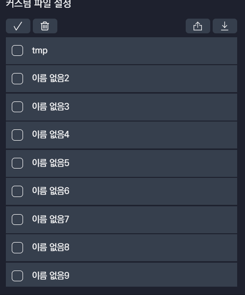

# v2.2.1 정식 버전 업데이트

### 2022.05.31(화)

---

## 요약

**[추가 사항](#추가-사항)**

- [`Final Cut Pro` 테스트 지원](#final-cut-pro-테스트-지원)
- [단축키 입력 오버레이 적용](#단축키-입력-오버레이-적용)
- [프리셋, 커스텀 파일 등의 목록에서 범위 선택 기능](#프리셋-커스텀-파일-등의-목록에서-범위-선택-기능)
- [`Scroll Bar` 변경](#scroll-bar-변경)

**[수정 사항](#수정-사항)**

- [추가 프로그램 리스트에 프로그램 없을 시 `Drag & Drop` 불가능 현상 수정](#추가-프로그램-리스트에-프로그램-없을-시-drag--drop-불가능-현상-수정)
- [오버레이 상태 바에서 프리셋 없을 시 표시 변경](#오버레이-상태-바에서-프리셋-없을-시-표시-변경)
- [`Windows`에서 레이아웃 고정 현상 안정성 수정](#windows에서-레이아웃-고정-현상-안정성-수정)
- [`macOS`에서 `Adobe` 소프트웨어 `invaiz Extension` 확장 로드 에러 수정](#macos에서-adobe-소프트웨어-invaiz-extension-확장-로드-에러-수정)
- [`macOS`에서 `Adobe Premiere Pro` 추천 프리셋 버그 수정](#macos에서-adobe-premiere-pro-추천-프리셋-버그-수정)
- [`Adobe Premiere Pro` 위치, 크기 조절 가속도 변경](#adobe-premiere-pro-위치-크기-조절-가속도-변경)
- [`Adobe Premiere Pro`의 `Lumetri Color` 선명 인덱스 버그 수정](#adobe-premiere-pro의-lumetri-color-선명-인덱스-버그-수정)

---

 

> ## 추가 사항

## `Final Cut Pro` 테스트 지원

- 이제 `INAVIZ Studio Basquiat`에서도 `Final Cut Pro`의 기능을 정식으로 사용하실 수 있습니다!

  

  

- `Final Cut Pro`에서 사용할 수 있는 모든 단축키 534개를 제공해드리고 있으며, `INVAIZ Studio Basquiat`에서 제공하는 단축키 기능은 컴퓨터에 설치된 `Final Cut Pro`의 명령 편집기와 연동되어 동작하므로, `Final Cut Pro`의 명령 편집기에 설정되어 있지 않은 단축키는 기능이 실행되지 않습니다.

  - 따라서, 사용하실 기능이 `Final Cut Pro`의 명령 편집기에 실제로 매핑되어 있는지 확인 후 사용해야 정상적으로 사용하실 수 있습니다.

    

  - 명령 편집기를 켜는 위치는 다음과 같습니다.

    

- 크레이티브 다이얼에서는 기본적인 타임라인, 확대 축소 이외에도 색상 휠 패널에서 효율적인 수치 조절이 가능하도록 다양한 기능들을 추가하였습니다.

  

  - 색상 휠에서는 기본적으로 `RGB`, 채도, 밝기 조절 이외에도 중심을 기준으로 한 거리, 회전 조절이 가능하여 기존 마우스로 조작하는 불편함을 더욱 해소할 수 있습니다.

    

    > ⚠️ 거리, 회전 조절은 `RGB` 파라미터가 정중앙(중점)에 있을 경우에는 동작하지 않는 점 유의하여 사용해주세요.

- 편하게 사용하실 수 있도록 기본적인 프리셋 1가지(색보정)를 제공해드리고 있습니다.

  

- 이후에도 계속해서 사용성 업데이트가 예정되어 있습니다. 테스트 버전인만큼 많은 관심 및 피드백 주시면 감사하겠습니다!

> ⚠️ 테스트 버전이므로 정상적으로 동작하지 않을 수 있습니다. 불편함을 겪고 계실 때는 (주)인바이즈 홈페이지로 문의주시면 감사하겠습니다.

## 단축키 입력 오버레이 적용

- 단축키 입력은 다른 입력과는 다르게 어떠한 실행에 대한 결과 값(수치, 실행 결과, 에러 여부 등)을 전달받을 수 없어 기능의 이름만으로 어떠한 동작을 하는지 정확하게 판단하기 어려울 수 있습니다.
  - 또한 사용자의 입장에서 어떠한 기능이 `CEP` 등의 통신 기능인지 강제 입력 기능인지 알 방법이 없어 기능에 대한 이해도가 낮으며 문의 대응 시 혼란이 올 수 있었습니다.
- 이에 단축키 입력 기능을 실행하더라도 어떠한 기능을 실행했는지 오버레이에 보여주도록 적용하였습니다.

  

## 프리셋, 커스텀 파일 등의 목록에서 범위 선택 기능

- 목록에서 선택, 순서 변경, 삭제 등의 기능을 이용함에 있어 단일 선택은 불편함을 야기하므로 범위 선택이 가능하도록 적용하였습니다.
- 범위 선택, 범위 선택 후 `Drag & Drop`, 삭제 등의 기능을 사용할 수 있습니다.
- 프리셋

  

- 커스텀 파일

  

- `Drag & Drop`

  

- 매크로의 경우 순서가 있으므로 복수 선택 후 `Drag & Drop` 시 같이 움직입니다.
- 그 외 다른 부분에서는 순서가 없으므로 선택한 하나만 움직입니다.

## `Scroll Bar` 변경

- `INVAIZ Studio Basquiat`의 스크롤 가능한 영역에서, 스크롤 중에만 `Scroll Bar`가 나타나는 기능을 추가하였습니다.
- `Scroll Bar`에 마우스를 올리면 잡기 쉽도록 넓어집니다.

  

 

---

 
 
 

> ## 수정 사항

## 추가 프로그램 리스트에 프로그램 없을 시 `Drag & Drop` 불가능 현상 수정

- 혹여나 추가 프로그램 리스틔 프로그램을 모두 추가하여 더이상 프로그램을 추가할 수 없을 때, 추가했던 프로그램을 삭제할 수 없게 되는 현상을 수정하였습니다.

  

## 오버레이 상태 바에서 프리셋 없을 시 표시 변경

- 기존에는 프로그램만 추가되어 있고 프리셋이 없을 때, 오버레이의 상태 바에서 프리셋을 `undefined`로 표시하였는데, 이 표현보다 더 직관적인 방식으로 표현할 수 있도록 변경하였습니다.

  

## `Windows`에서 레이아웃 고정 현상 안정성 수정

- `Windows`에서 간혹 발생하는 레이아웃 고정 현상 및 `INVAIZ Studio Basquiat` 먹통 현상이 최대한 발생하지 않도록 안정성을 높였습니다.
- 발생할 경우 `USB` 및 기기 연결과 관련한 문제일 가능성이 높으므로, `INVAIZ Studio Basquiat`가 여러 개 실행되어 있지는 않은지, `USB`를 인식할 수 있는 정상적인 단자에 삽입하였는지 확인해주시면 감사하겠습니다.

> 아직까지 100% 발생하지 않는 것은 아닐 수 있으므로, 발생 시 빠르게 문의주시면 조치해드리도록 하겠습니다.

## `macOS`에서 `Adobe` 소프트웨어 `invaiz Extension` 확장 로드 에러 수정

- `INVAIZ Studio Basquiat`의 버전 `v2.2.0`를 배포하면서, `CEP` 서명 솔루션을 자동화하였는데 마침 `Adobe` 측의 `CEP` 서명 정책에 변화가 있었는지 `Windows`에서 압축 해제한 폴더를 `macOS`에서 접근하거나 배포하면 서명 오류가 발생하였습니다.

  

- 해당 버그를 수정하였습니다.

> `macOS`에서 새로운 설치 방법을 처음 적용하였기 때문에 버그의 발생 가능성이 있습니다.

## `macOS`에서 `Adobe Premiere Pro` 추천 프리셋 버그 수정

- 데이터의 타입이 변경되면서 기존 추천 프리셋에서 사용 중인 `Lumetri` 기능들의 값 또한 변경해주는 작업을 진행하였는데, `Windows`는 정상 진행하였지만 `macOS`에서는 데이터 변경이 누락되어 발생하는 버그를 수정하였습니다.

## `Adobe Premiere Pro` 위치, 크기 조절 가속도 변경

- 기존 `Adobe Premiere Pro`에서 위치 및 크기 값을 조절하는 다이얼의 회전 값이 느려 답답한 점이 있었습니다.
- 이에 기존보다 조금 더 빠른 속도로 조절할 수 있도록 가속도의 값을 변경하였습니다.

> ❗️ 모든 프로그램의 가속도 값은 고객님의 피드백에 따라 언제든지 재구성될 수 있습니다!

## `Adobe Premiere Pro`의 `Lumetri Color` 선명 인덱스 버그 수정

- `Adobe Premiere Pro`의 `v22.3` 버전 업데이트 후 `Lumetri Color` 관련하여 발생하는 버그를 수정하였습니다.
