# v2.2.2 정식 콩 버전 업데이트

# v2.2.2 정식 콩 버전 업데이트

> 어라 왜 업데이트 제목이 두 번 써지지...  
> 어라 왜 업데이트 제목이 두 번 써지지...

### 2022.07.06(수)

### 2022.07.06(수)

---

## 요약

**[추가 사항](#추가-사항)**

- [튜토리얼 페이지 및 사용자 데이터 수집 개시](#튜토리얼-페이지-및-사용자-데이터-수집-개시)
- [`INVAIZ Studio Basquiat` 내 기본 제공 데이터 동시 관리](#invaiz-studio-basquiat-내-기본-제공-데이터-동시-관리)
- [설치 시 라이센스 확인](#설치-시-라이센스-확인)
- [`macOS` 설치 시 `Adobe Software` 종료 알림](#macos-설치-시-adobe-software-종료-알림)
- [스크롤 속도 기능 추가](#스크롤-속도-기능-추가)

**[수정 사항](#수정-사항)**

- [`Final Cut Pro` 듀얼 모니터 모드 오류 수정](#final-cut-pro-듀얼-모니터-모드-오류-수정)
- [`Windows`에서 `Camera Raw`, 픽셀 유동화 미작동 현상 수정](#windows에서-camera-raw-픽셀-유동화-미작동-현상-수정)
- [`macOS` 다중 선택 완전 적용](#macos-다중-선택-완전-적용)
- [기능 툴팁 사용자 경험 개선](#기능-툴팁-사용자-경험-개선)
- [스크롤 바 디테일 수정](#스크롤-바-디테일-수정)
- [`Clip Studio Paint` 브러쉬 전환 단축키 수정](#clip-studio-paint-브러쉬-전환-단축키-수정)
- [한글 문서 작업 프리셋 내보내기 후 불러오기 불가 버그 수정](#한글-문서-작업-프리셋-내보내기-후-불러오기-불가-버그-수정)

---

 

> ## 추가 사항

## 튜토리얼 페이지 및 사용자 데이터 수집 개시

- 지금까지는 `INVAIZ Studio Basquiat`를 사용하시는 고객분들이 소프트웨어 내에 가이드가 따로 존재하지 않아 홈페이지 방문 혹은 문의 등의 어려운 적응 과정을 거치며 사용하셨습니다. 그럼에도 불구하고 저희 인바이즈를 사랑해주셔서 정말 감사합니다.
- 앞으로 `INVAIZ Studio Basquiat` 초기 사용자 분들을 위해 가이드 및 튜토리얼을 제공합니다.

  

- 현재는 최소한의 가이드만 제공하고 있으나, 앞으로 `INVAIZ Studio Basquiat` 자체의 사용법을 넘어서 어떻게 하면 효율적으로 작업할 수 있는지, `Grid10`을 잘 쓰는 방법 등 다양한 가이드등을 제공할 수 있도록 하겠습니다. 감사합니다.
- 또, 저희 `(주)인바이즈`는 앞으로 `INVAIZ Studio Basquiat`를 사용하시는 고객분들의 사용 데이터를 수집하여 더욱 좋은 사용성을 위한 개선의 참고 자료로 사용하려 합니다.
- 수집하고자 하는 데이터는 다이얼의 사용과 버튼의 사용에 대한 내용이며, 개인 정보는 일체 수집하지 않음을 약속드립니다.
- 데이터 사용 동의를 해주신다면 추후 고객님들의 사용성 개선에 큰 도움이 될 수 있음을 약속드리겠습니다. 감사합니다.

---

## `INVAIZ Studio Basquiat` 내 기본 제공 데이터 동시 관리

- `Adobe`, `MSOffice`, `Final Cut Pro` 등의 프로그램들은 계속 변하며, 그에 따라 단축키나 기능들이 변화될 수 있습니다.
- 저희 `(주)인바이즈`도 그러한 현상을 많이 겪었고, 그럴 때마다 `INVAIZ Studio Basquiat`에서 제공하고 있는 데이터를 동시에 관리하고 있지 않아 저희가 특정 실행 기능을 업데이트를 하더라도 고객님들에게 바로 반영이 되지 않아, 꼭 복사하거나 다시 매핑하는 등의 번거로운 과정을 거쳐야 했습니다.

  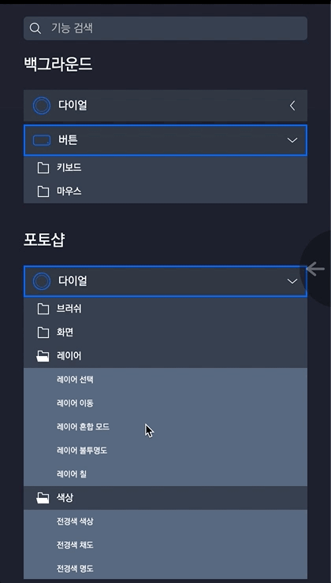

- 또한, 제공하고 있는 기능이 너무 많아 고객님에게 같은 기능임에도 불구하고 단축키가 다르거나, 이름이 달라 혼란을 주는 경우도 있었습니다.
- 이에, 데이터 관리 방식을 새롭게 정의하여 저희가 기본적으로 제공하는 기능은 모두 동시에 관리할 수 있도록 하였습니다.
- 앞으로는 단축키가 변경되거나 버그가 발생하는 등의 치명적인 오류로 인해 기능을 업데이트하면 고객님들에게 바로 반영됩니다.
- ⚠ 만약, 기본 제공 기능을 빠른 단축키 입력 등으로 변경하게 되면, 동기화가 풀린다는 점 주의 부탁드리겠습니다.

---

## 설치 시 라이센스 확인

- 이제부터 `INVAIZ Studio Basquiat`를 설치하거나 업데이트할 때, 라이센스 동의를 확인할 수 있습니다.
- `Windows`

  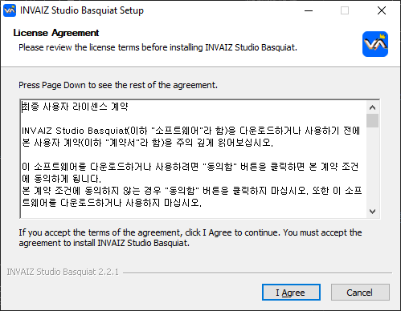

- `macOS`

  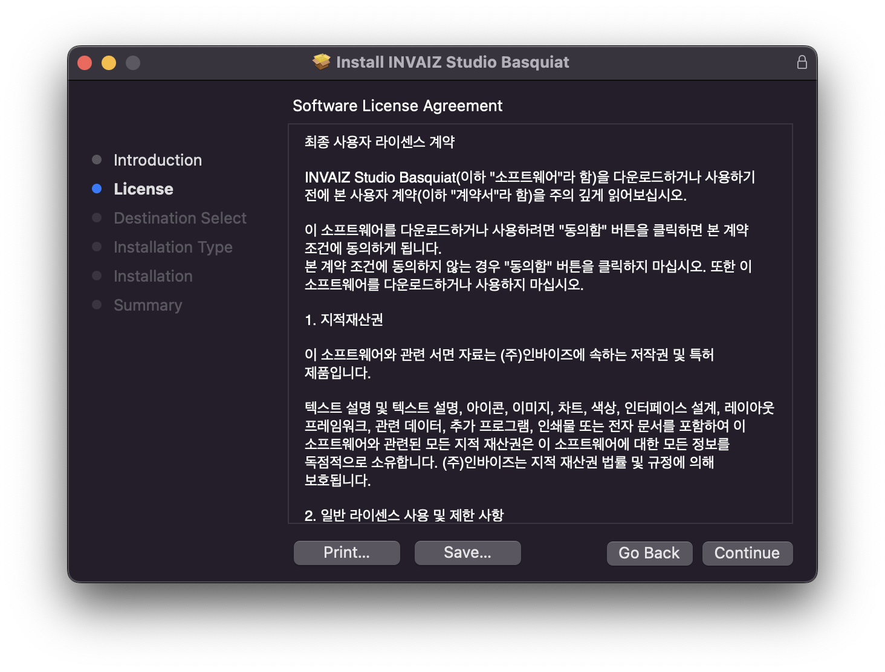

---

## `macOS` 설치 시 `Adobe Software` 종료 알림

- `macOS`에서 설치 후 원할한 사용을 위해 연동되는 소프트웨어인 `Adobe Software`를 종료한 후 설치하도록 설치 파일에 확인 창을 추가하였습니다.

  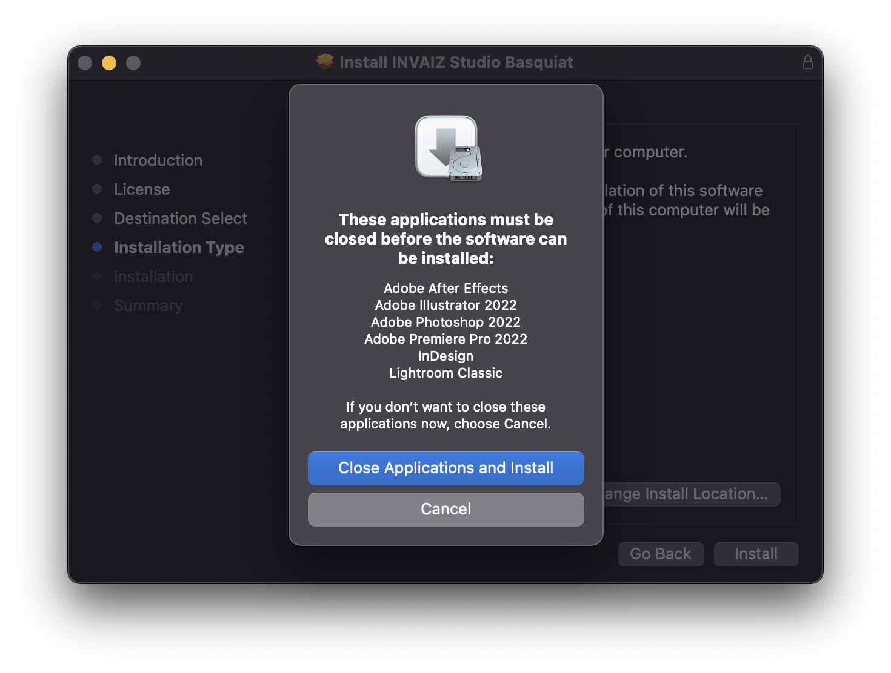

---

## 스크롤 속도 기능 추가

- 기존에 사용하던 가로 / 세로 스크롤은 속도에 제한이 걸려있어 스크롤 속도를 총 4가지 버전으로 추가 제공하였습니다.

  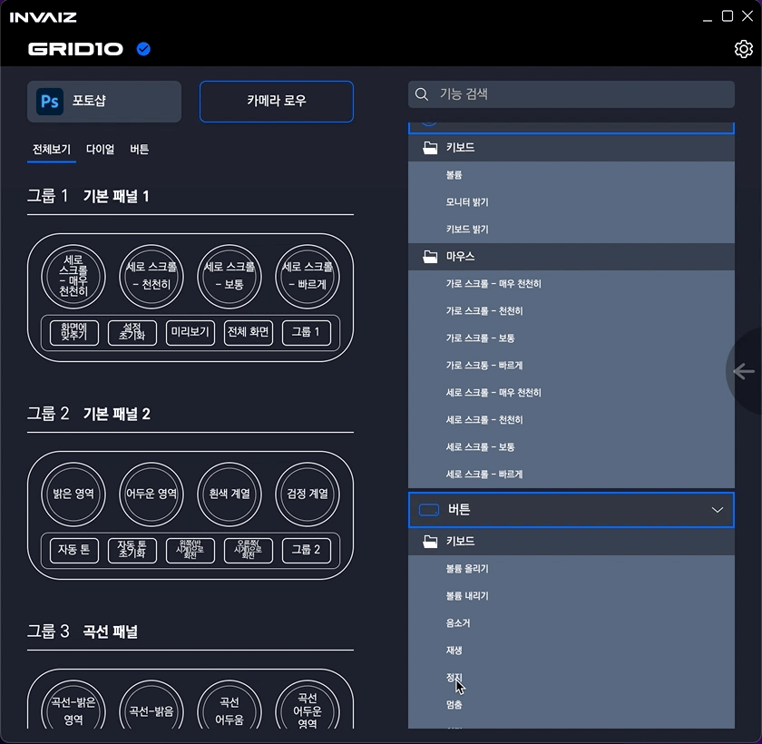

 

---

 
 
 

> ## 수정 사항

## `Final Cut Pro` 듀얼 모니터 모드 오류 수정

- `Final Cut Pro`에서 듀얼 모니터 상태로 색상 휠 기능을 동작하면 비정상적으로 꺼지는 버그를 수정하였습니다.

---

## `Windows`에서 `Camera Raw`, 픽셀 유동화 미작동 현상 수정

- `Windows`에서 `Camera Raw`, 픽셀 유동화가 동작하지 않는 현상을 수정하였습니다.

---

## `macOS` 다중 선택 완전 적용

- `macOS`에서 `Command`를 통해 다중 선택하는 기능이 제대로 동작하지 않는 현상을 다시 적용하였습니다.

  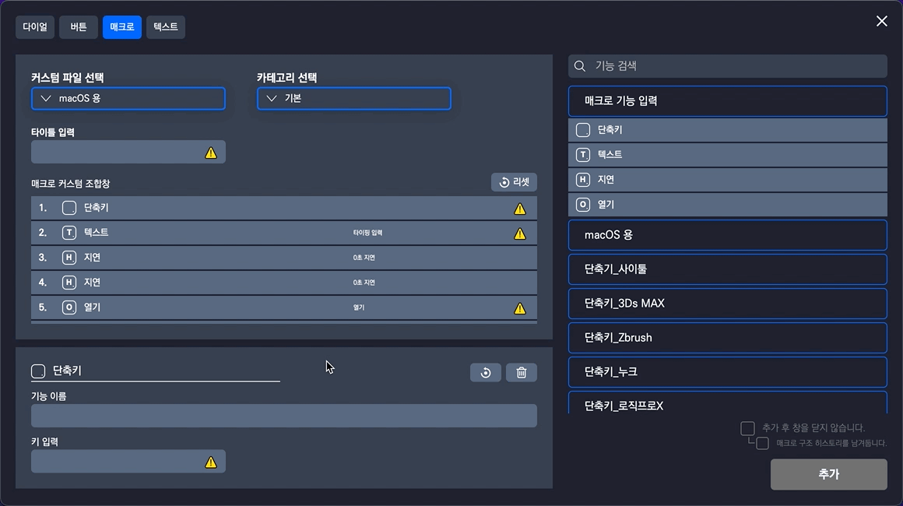

---

## 기능 툴팁 사용자 경험 개선

- 기존에는 기능에 마우스를 올리면 보이는 툴팁에 마우스를 포커스하면 내려가지 않아, 리스트 등에서 클릭과 다른 영역의 상호작용을 방해하여 사용자 경험을 저해하였습니다.

  

- 툴팁에는 마우스를 포커스하더라도 굳이 계속 띄울 필요가 없다고 판단되어 기능 영역에서 벗어날 경우 바로 사라지도록 설정하여 사용자 경험을 개선하였습니다.

  

---

## 스크롤 바 디테일 수정

- 스크롤 바의 디자인을 변경한 이유 디테일을 갖추기 위해 수정 작업을 진행하였습니다.

### 스크롤 바 내용 변경 시 위치를 제대로 찾지 못하는 버그 수정

- 단축키 목록을 길게 나열한 후 프로그램을 변경해서 단축키 목록이 사라지게 되면, 스크롤 바가 높이에 맞춰 이동하는 것이 아니라, 계속해서 아래 위치를 유지하는 버그를 수정하였습니다.
- 수정 전

  

- 수정 후

  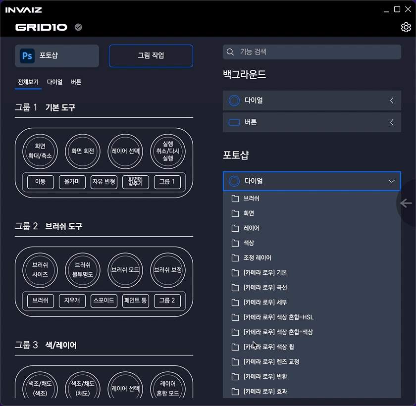

### 내용 변경 시 스크롤 최상단으로 이동 추가

- 셋팅 창 좌측 미리보기 영역에 스크롤이 아래로 이동된 상태에서, 프로그램이 변경되면 스크롤이 최상단으로 이동되는 기능을 추가하였습니다.

  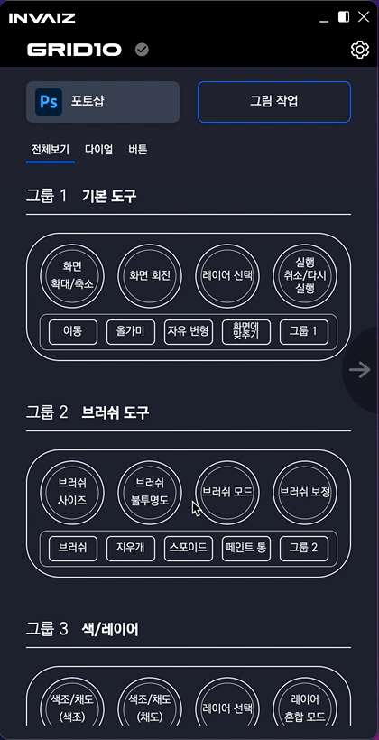

### 스크롤 감도 조정

- 스크롤 바의 감도를 수정하였습니다.
- `Windows`의 경우, 계속해서 스크롤 바를 드래그하여 이동하거나, 특정 영역을 벗어날 경우 마우스 포인터 위치가 처음 클릭한 위치와 맞지 않거나, 드래그가 풀리는 현상을 수정하였습니다.
- `macOS`의 경우 마우스 휠 이동 시 버벅거리는 움직임과, 스크롤 바를 드래그하여 이동할 때의 이질적인 감도를 모두 수정하였습니다.

  - 수정 전

    

    

  - 수정 후

    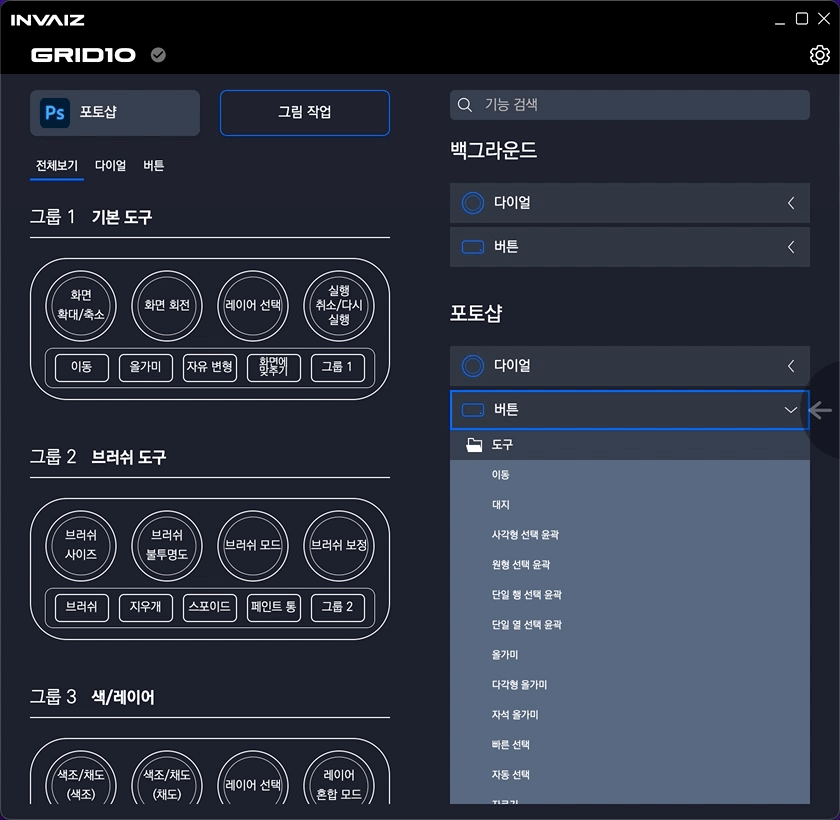

    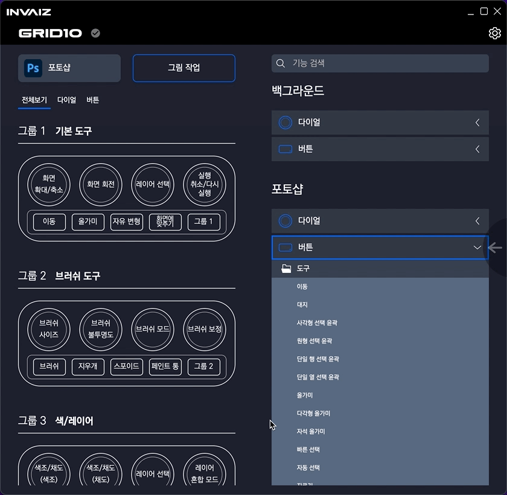

### 스크롤 바 활성화 시 배경 음영 설정

- 스크롤 바를 드래그하여 이동할 때, 뒤에 배경 영역이 처리되면서, 스크롤 바의 끝부분이 둥글어지고 클릭되었음을 알려주는 상호작용 요소를 적용하였습니다.

  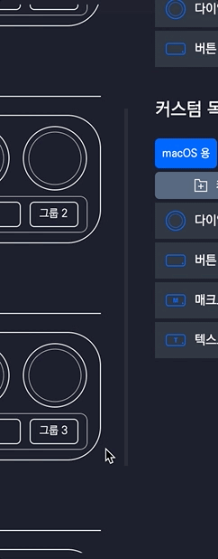

---

## `Clip Studio Paint` 브러쉬 전환 단축키 수정

- `Clip Studio Paint`에 기본 제공 중인 '브러쉬 전환' 단축키가 동작하지 않는 것으로 확인되어 기존 [`Ctrl` + `Shift` + `.`과, `Ctrl` + `Shift` + `,`] 이었던 단축키를 `.`과 `.`으로 변경하였습니다.

---

## 한글 문서 작업 프리셋 내보내기 후 불러오기 불가 버그 수정

- 한글에 있는 문서 작업 프리셋을 내보내기한 후 불러올 경우, "잘못된 데이터가 포함되거나 누락된 프리셋입니다."라는 오류 창이 뜨면서 제대로 로드되지 않는 버그를 수정하였습니다.

---
