# v2.2.3 정식 버전 업데이트

### 2022.09.07(수)

---

## 요약

**[추가 사항](#추가-사항)**

- [프리셋, 커스텀 파일 로드 시 에러 표시](#프리셋-커스텀-파일-로드-시-에러-표시)
- [프리셋, 커스텀 파일, 전체 설정 파일 드래그로 불러오기](#프리셋-커스텀-파일-전체-설정-파일-드래그로-불러오기)
- [기본 단축키 추가 및 모든 프로그램에 통용되는 단축키 통합](#기본-단축키-추가-및-모든-프로그램에-통용되는-단축키-통합)

**[수정 사항](#수정-사항)**

- [매크로 조합창 `Drag & Drop` 버그 수정](#매크로-조합창-drag--drop-버그-수정)
- [전체 설정 가져오기 후 빈 프리셋 상태 수정](#전체-설정-가져오기-후-빈-프리셋-상태-수정)
- [`Windows` 불러오기/내보내기 등의 창 켤 때 응답 없음 현상 수정](#windows-불러오기내보내기-등의-창-켤-때-응답-없음-현상-수정)
- [매크로 생성 시 단축키 기능 툴팁 수정](#매크로-생성-시-단축키-기능-툴팁-수정)
- [자동 전환 설명 툴팁 디자인 디테일 수정](#자동-전환-설명-툴팁-디자인-디테일-수정)
- [커스텀 파일 목록 삭제 시 스크롤 범위 초과 버그 수정](#커스텀-파일-목록-삭제-시-스크롤-범위-초과-버그-수정)
- [일본어 버전에서 실행되지 않는 오류 수정](#일본어-버전에서-실행되지-않는-오류-수정)
- [`Final Cut Pro` 기능 실행 버그 수정](#final-cut-pro-기능-실행-버그-수정)
- [이전 버전 마우스 입력 기능 로드 시 불러올 수 없는 현상 수정](#이전-버전-마우스-입력-기능-로드-시-불러올-수-없는-현상-수정)
- [초기 언어 셋팅 한글 고정 버그 수정](#초기-언어-셋팅-한글-고정-버그-수정)
- [에러 출력 포맷 수정](#에러-출력-포맷-수정)
- [`M1 Mac`에서 `Adobe` 소프트웨어 기능 실패 오류 수정](#m1-mac에서-adobe-소프트웨어-기능-실패-오류-수정)
- [자동 전환 타이밍 오류 수정](#자동-전환-타이밍-오류-수정)
- [상태 변경 시 반영이 제대로 되지 않는 버그 수정](#상태-변경-시-반영이-제대로-되지-않는-버그-수정)
- [`CPU`, 메모리, 호환성 최적화](#cpu-메모리-호환성-최적화)

**[삭제 사항](#삭제-사항)**

- [툴팁 마우스 인식 제거](#툴팁-마우스-인식-제거)
- [마우스 포커스 시 자동 전환 기능 제거](#마우스-포커스-시-자동-전환-기능-제거)

---

 

> ## 추가 사항

### 프리셋, 커스텀 파일 로드 시 에러 표시

- 호환되지 않는 프리셋을 정상적으로 로드할 수 있도록 도와주는 마법사를 추가하였습니다.
- 버전이 업데이트되어 감에 따라 프리셋의 형식이 변경되었고, 이에 따라 최신 버전에서 이전 버전의 프리셋을 로드하려고 할 때 오류가 발생하였는데, 이를 최대한 사용자들에게 편리하게 노출할 수 있도록 해주는 창입니다.
- 프리셋을 로드할 때 크게 4가지의 문제가 발생할 수 있습니다.
  1. 잘못된(손상되거나 버전이 업데이트되면서 호환하기 난해한) 프리셋을 추가하려는 경우
  2. 다른 프로그램의 프리셋을 추가하려는 경우
     - Ex) `Adobe Photoshop`의 프리셋 목록에 `Adobe InDesign` 프리셋을 추가하려고 한다.
  3. 다른 운영체제의 프리셋을 추가하려는 경우
     - Ex) `Windows`의 프리셋을 `macOS`에 추가한다.
  4. 다른 제품의 프리셋을 추가하려는 경우
     - Ex) `Grid Pro`의 프리셋을 `Grid10`에 추가한다.
- 이 중, 2~4번까지의 경우에는 `INVAIZ Studio Basquiat`에 후속 조치를 통해 프리셋을 추가할 수 있도록 하였습니다.
- 전체 프리셋 불러오기 예시

  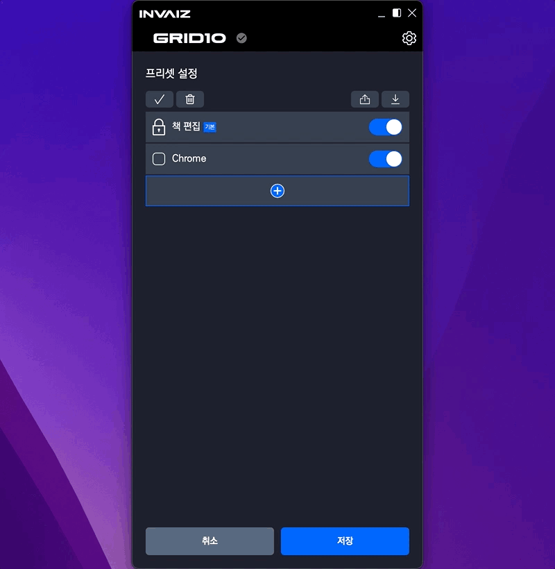

  1. 잘못된 프리셋을 추가하려는 경우

     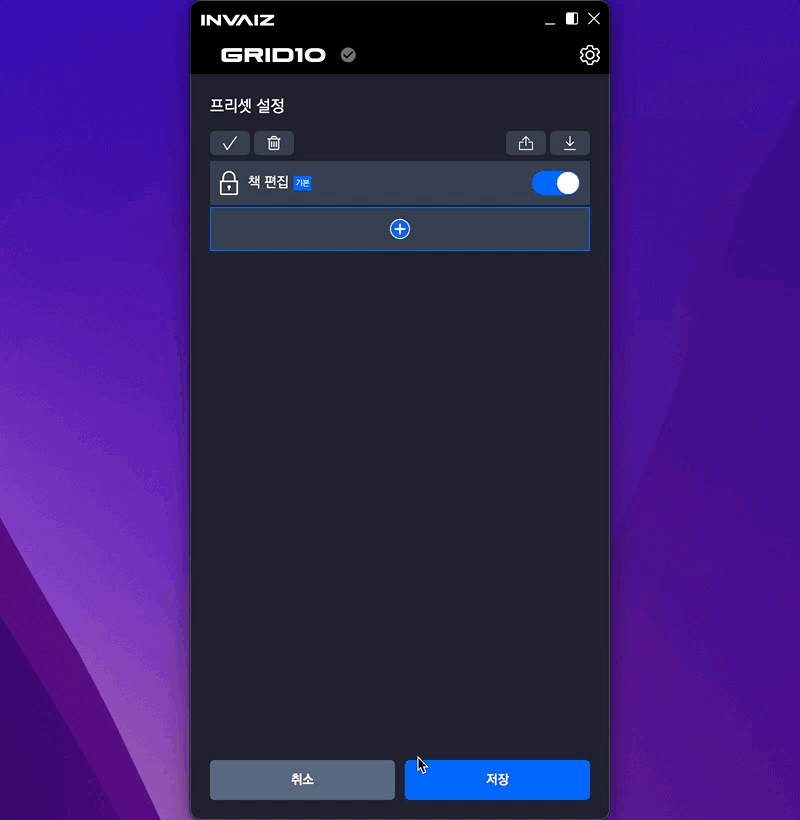

     - 잘못된 프리셋은 현재 일반적인 방법으로 데이터를 추가할 수 없습니다.
     - 현재는 개발자에게 직접 문의하여 수정된 파일을 받는 방식으로 진행해야 하며, 추후 로그를 서버로 전송하여 개발자가 바로 조치를 취할 수 있도록 계획 중에 있습니다.

  2. 다른 프로그램의 프리셋을 추가하려는 경우

     

     - 다른 프로그램의 프리셋은 해당 프로그램으로 바로 프리셋을 추가해줍니다.
     - 현재 활성화된 프로그램을 추가한 프리셋의 프로그램으로 바로 변경해주는 기능도 고려를 해보았지만, 불러오기를 여러 개 하기 때문에 난해하므로 좀 더 고민해 보아야 할 것 같습니다.

  3. 다른 운영체제의 프리셋을 추가하려는 경우

     

     - 다른 운영체제의 프리셋을 추가할 때, 단축키 기능의 경우 `Command`와 `Control`의 치환 여부를 물어봅니다.
     - `Windows` <-> `macOS`에서, 보통 `Control` 키와 `Command` 키만 다른 경우가 많으므로 질문을 통한 추가 여부를 물어보는 기능을 추가하였습니다.

  4. 다른 제품의 프리셋을 추가하려는 경우

     

     - 다른 프로그램과 마찬가지로 다른 제품의 현재 프로그램으로 바로 프리셋을 추가해줍니다.

- 복합적인 경우(다른 제품/다른 운영체제/다른 프로그램 등 조합) 예시

  

  - 복합적인 경우, 제품 -> 운영체제 -> 프로그램 순으로 오류를 다시 사용자에게 인식하여 사용자가 다음에 프리셋을 추가할 경우 어떤 절차를 거쳐야하는 지 좀 더 직관적으로 나타내었습니다.
  - 한 번에 메세지를 모두 보낼 경우 가독성이 떨어져서 위와 같은 방식을 선택하였습니다.

---

### 프리셋, 커스텀 파일, 전체 설정 파일 드래그로 불러오기

- 이제 설정 파일들을 불러오기할 때 귀찮게 창을 띄워서 선택하는 방식을 사용하지 않고, 드래그를 통해서 불러올 수 있습니다!

  - 전체 설정 파일 가져오기

    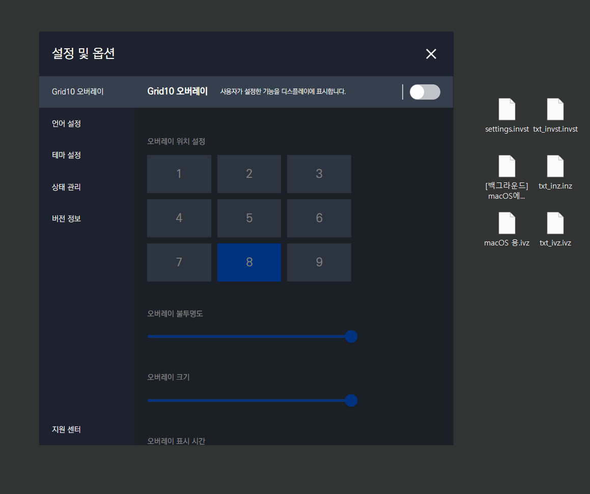
    

  - 프리셋 파일 가져오기

    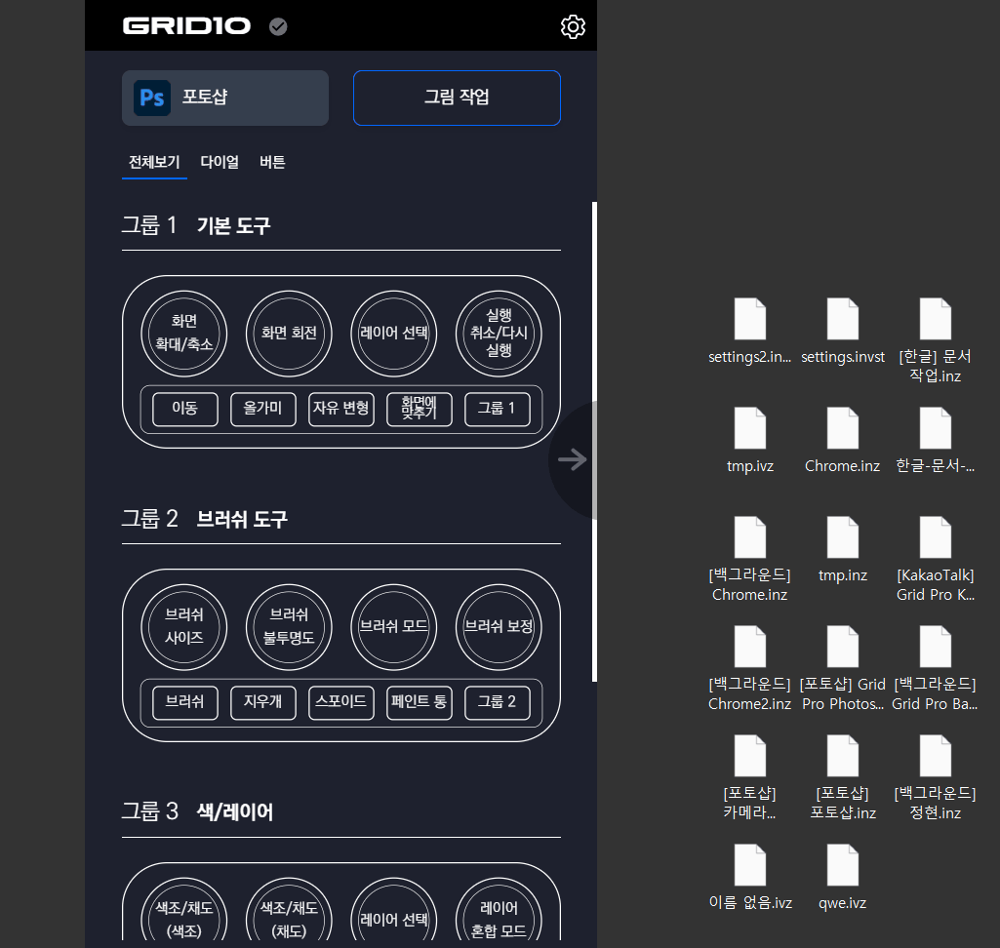

  - 프리셋, 커스텀 파일 동시에 가져오기

    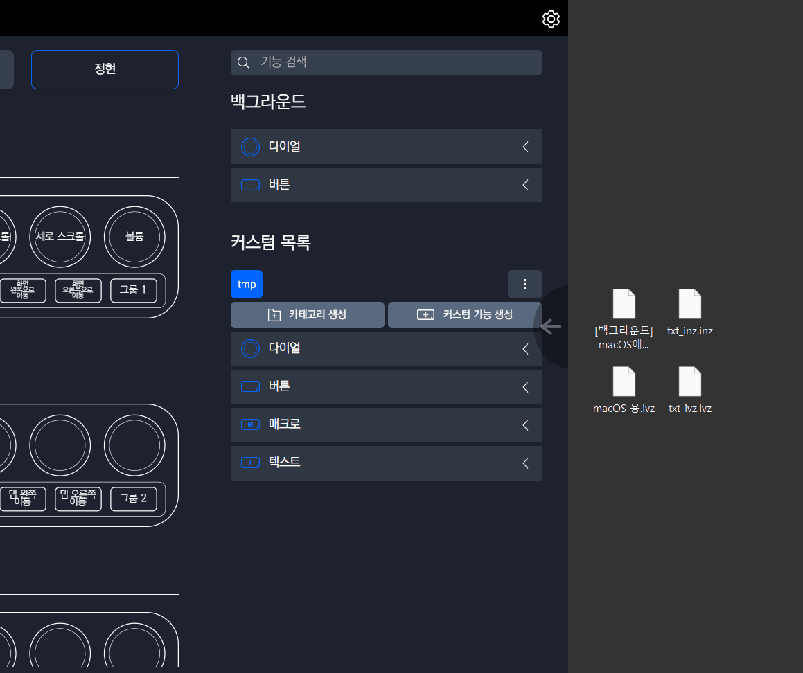

---

### 기본 단축키 추가 및 모든 프로그램에 통용되는 단축키 통합

- 현재까지 지원 중인 프로그램들 중에서 `저장`, `복사`, `붙여넣기`, `전체 선택` 등의 기능은 모두 단축키가 같았습니다.
- 또한, 어떠한 프로그램에는 `붙여넣기`가 `붙이기`로, `전체 선택`이 `모두 선택` 등으로 저장되어 있거나, 번역본(영어, 일본어)가 서로 다른 경우도 있어 이를 통합하여 `Background`에서 추가할 수 있게 하였습니다.
- 또한 모든 각 OS 별로 임의의 카테고리를 부여하여 관리하였습니다.
- `macOS`에서 사용하는 단축키 중 `INVAIZ Studio Baquiat`에서 사용 가능한 단축키를 추가하였습니다.

  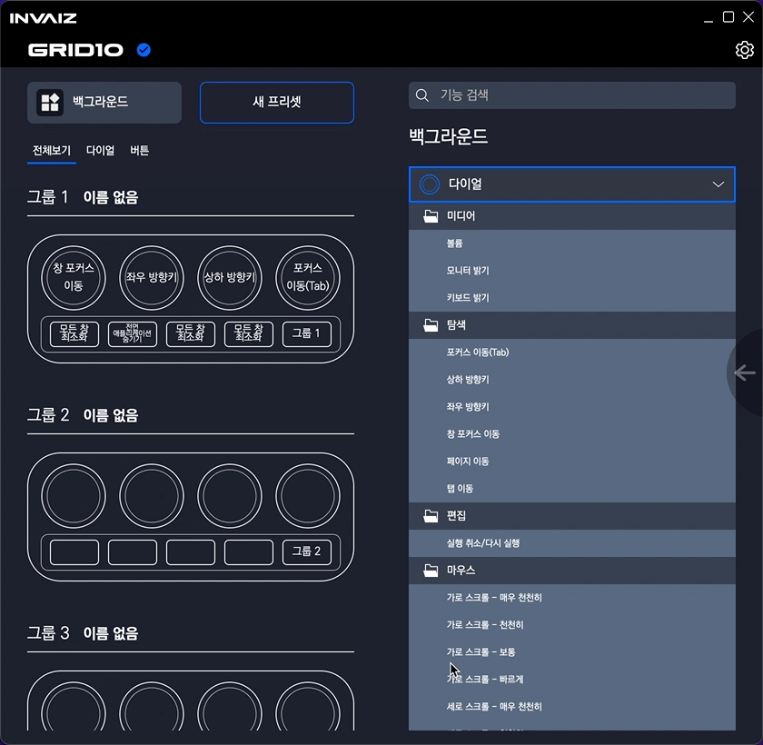

- `Windows`에서 사용하는 단축키 중 `INVAIZ Studio Baquiat`에서 사용 가능한 단축키를 추가하였습니다.

  

 

---

 
 
 

> ## 수정 사항

### 매크로 조합창 `Drag & Drop` 버그 수정

- 조합창 크기를 벗어나면(스크롤 후) `Drag & Drop`이 작동하지 않는 버그를 수정했습니다.

  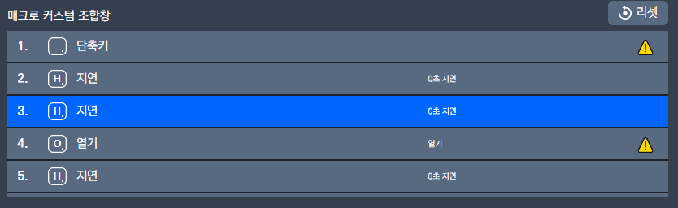

---

### 전체 설정 가져오기 후 빈 프리셋 상태 수정

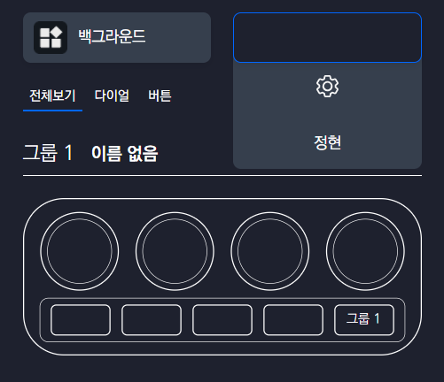

- 프리셋이 하나도 없을 때 전체 설정 가져오기를 하면 발생했습니다.
- 가져오기 후 첫 번째 프리셋을 선택해놓은 상태로 변경했습니다.

---

### `Windows` 불러오기/내보내기 등의 창 켤 때 응답 없음 현상 수정

- `Windows`에서 가끔 파일 불러오기/내보내기 등의 창(`dialog`)를 로드하려고 하면, 응답 없음이 뜨면서 `INVAIZ Studio Basquiat`가 정지되는 현상을 수정하였습니다.
- 버그 상황

  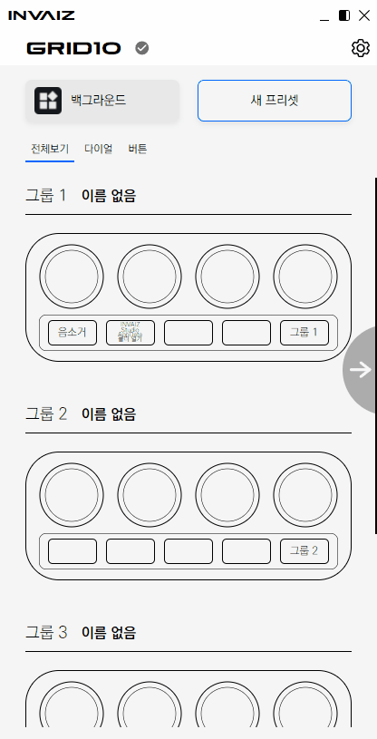

- 수정 상황

  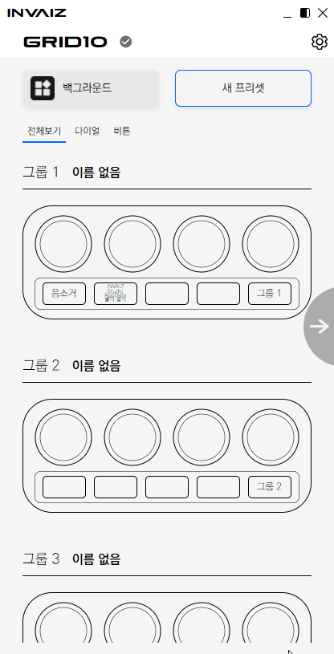

---

### 매크로 생성 시 단축키 기능 툴팁 수정

- 툴팁에서 아무 것도 뜨지 않는 상태를 수정하였습니다.

  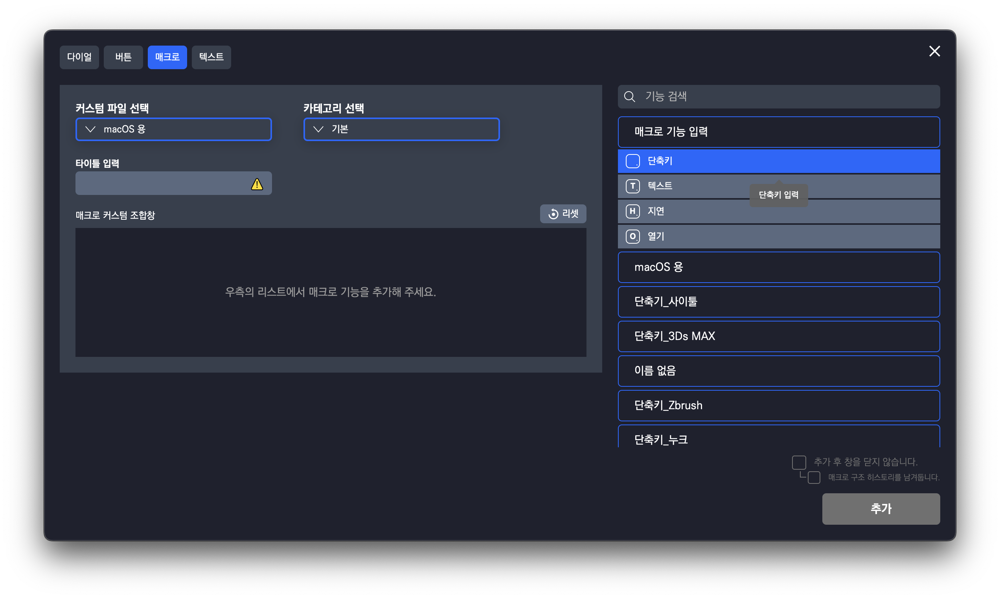

---

### 자동 전환 설명 툴팁 디자인 디테일 수정

- 프로그램 자동 전환 설명 툴팁의 디자인을 조금 수정하였습니다.

  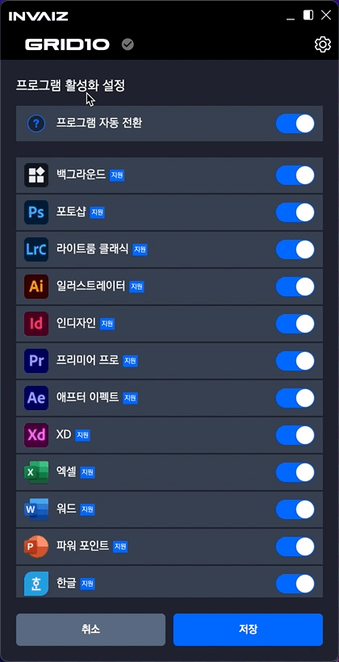

---

### 커스텀 파일 목록 삭제 시 스크롤 범위 초과 버그 수정

- 커스텀 파일 목록에서 스크롤을 컨트롤할 수 없게 되는 버그를 수정하였습니다.

  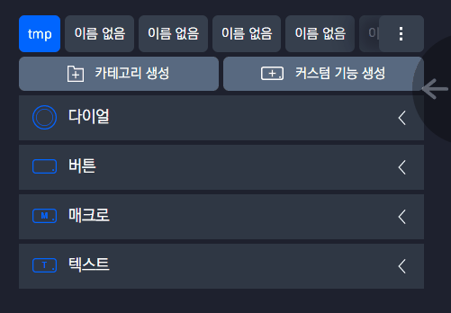

- 삭제 후 스크롤이 없는 경우에는 가장 앞으로 이동합니다.

  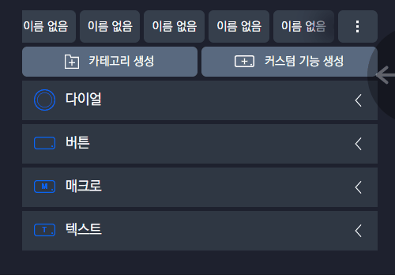

- 삭제 후 스크롤이 남아 있는 경우에는 가장 뒤로 이동합니다.

  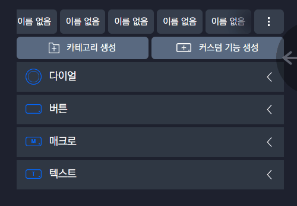

---

### 일본어 버전에서 실행되지 않는 오류 수정

- 일본어 `macOS`에서 `INVAIZ Studio Basquiat`가 실행되지 않는 오류를 수정하였습니다.

---

### `Final Cut Pro` 기능 실행 버그 수정

- `Final Cut Pro`가 업데이트를 하면서 거의 모든 단축키 기능이 실행되지 않는 버그를 수정하였습니다.

  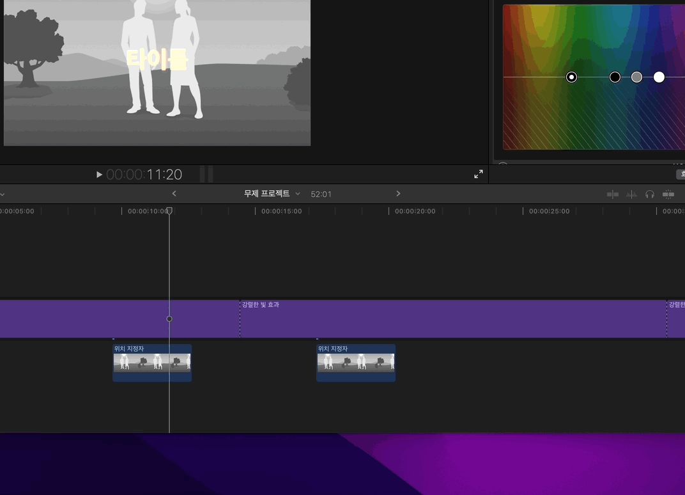

---

### 이전 버전 마우스 입력 기능 로드 시 불러올 수 없는 현상 수정

- `Andywarhol`(`v1`)에서 사용하던 기능 중 마우스 기능이 포함된 프리셋이 로드될 경우 발생하는 버그를 수정하였습니다.

---

### 초기 언어 셋팅 한글 고정 버그 수정

- `INVAIZ Studio Basquiat` 첫 실행 시 실행한 `OS`가 따르는 언어를 선택해야 하는데 한글로 고정되어 실행되는 버그를 수정하였습니다.

---

### 에러 출력 포맷 수정

- 이러한 일이 없어야 하지만, 사용자분들이 불편을 겪을 때 조금 더 용이하게 해결할 수 있는 에러 로그 파일의 출력 포맷을 수정하였습니다.
- 앞으로 만약 문제가 생기더라도 사용자분들의 버그를 최대한 빨리 해결해드릴 수 있도록 하겠습니다.

---

### `M1 Mac`에서 `Adobe` 소프트웨어 기능 실패 오류 수정

- `M1 Mac`에서 `Adobe` 소프트웨어의 기능이 계속 실행되지 않는 오류를 수정하였습니다.

---

### 자동 전환 타이밍 오류 수정

- 설정 창이 켜져 있고, 마우스 포커스가 아닌 기기 조작으로 프로그램 자동 전환이 실행되는 시점에 실행되는 기능이 전환 이전의 프로그램/프리셋의 기능으로 동작하는 현상을 수정하였습니다.

  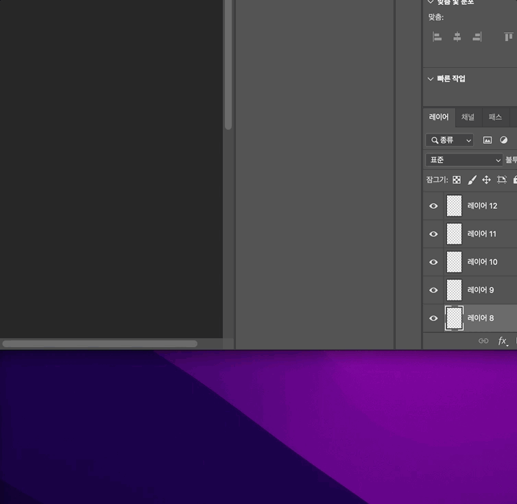

---

### 상태 변경 시 반영이 제대로 되지 않는 버그 수정

- 프로그램 자동 전환으로 상태 변경이 됐을 경우에는 `Mac M1`의 터치 바나 트레이 메뉴에서 변경 사항이 적용되지 않는 현상이 있었는데, 이를 수정하였습니다.

  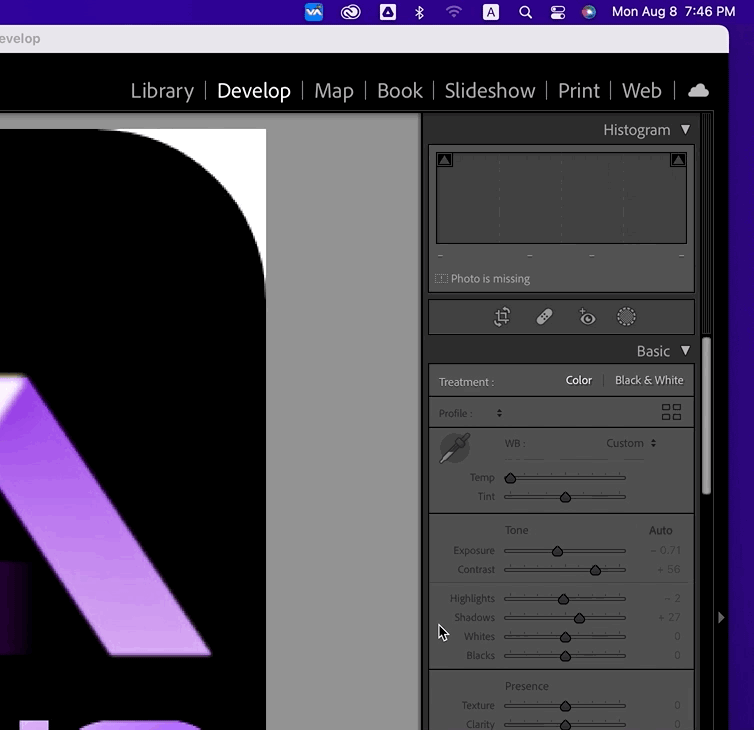

---

### `CPU`, 메모리, 호환성 최적화

- 소프트웨어의 역할에 비해 비정상적으로 많은 리소스(`macOS`에서 특히)를 차지하고 있었는데, 이를 최적화하였습니다.

  - `macOS`에서 비정상적으로 급등 현상도 수정하였습니다.

  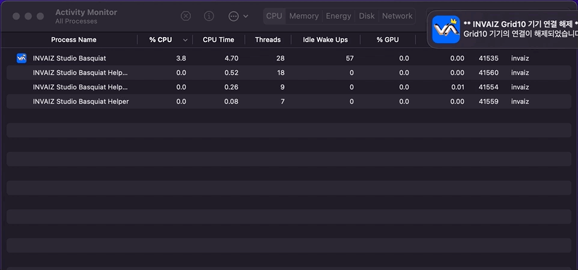

- 기존보다 약 50% 이상 고성능(저점유)의 효과를 내고 있으며, 노트북 등 배터리 환경에서의 배터리 사용량도 최적화하였습니다.
- 또한, `M1 Mac`, `Windows 11`에서의 호환 안정성도 증가하였습니다.

 

---

 
 
 

> ## 삭제 사항

### 툴팁 마우스 인식 제거

- 모든 툴팁에 대서 마우스로 인한 `UX`를 방해하는 현상을 제거하였습니다.

  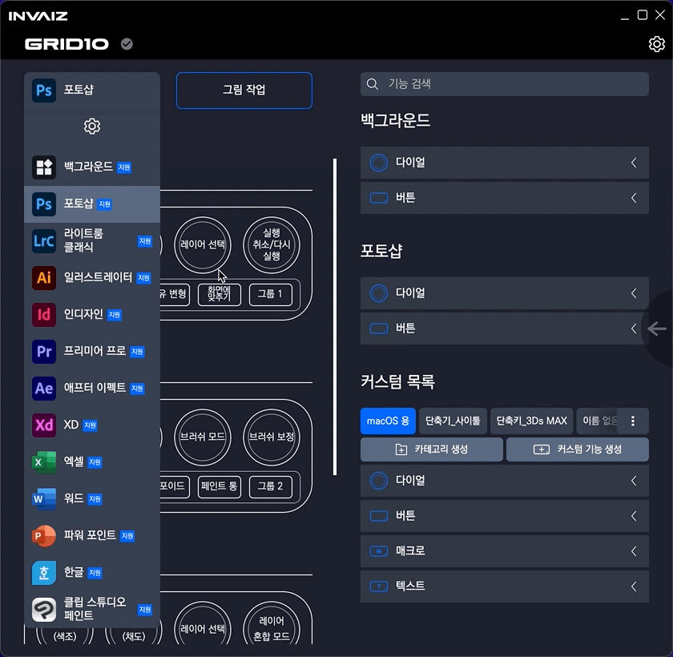

---

### 마우스 포커스 시 자동 전환 기능 제거

- "프로그램 자동 전환"이 켜져 있을 때, 마우스로 다른 프로그램에 포커스될 때마다 현재 프로그램 상태를 즉각적으로 변경하는 기능이 `CPU` 시간에 큰 영향을 주어 배터리 성능 등을 고려, 해당 기능을 제거하였습니다.
- 하지만 기능 실행 시 포커스되어 있는 프로그램으로 상태를 변경하는 "프로그램 자동 전환"은 여전히 사용 가능합니다.
