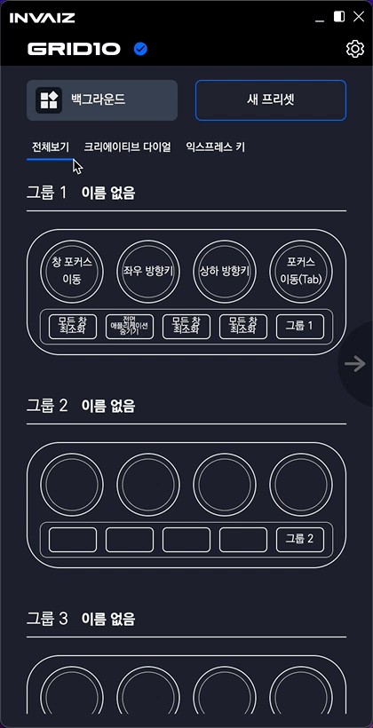
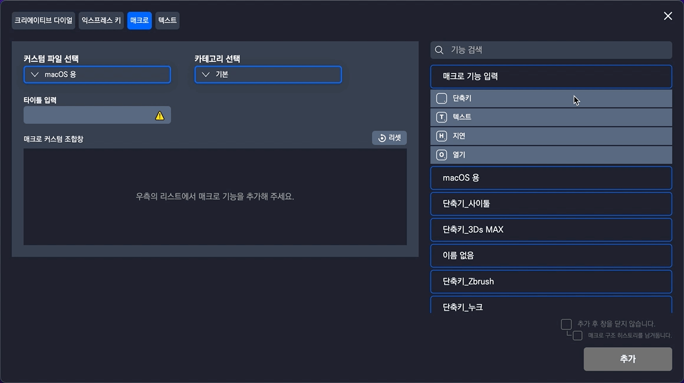
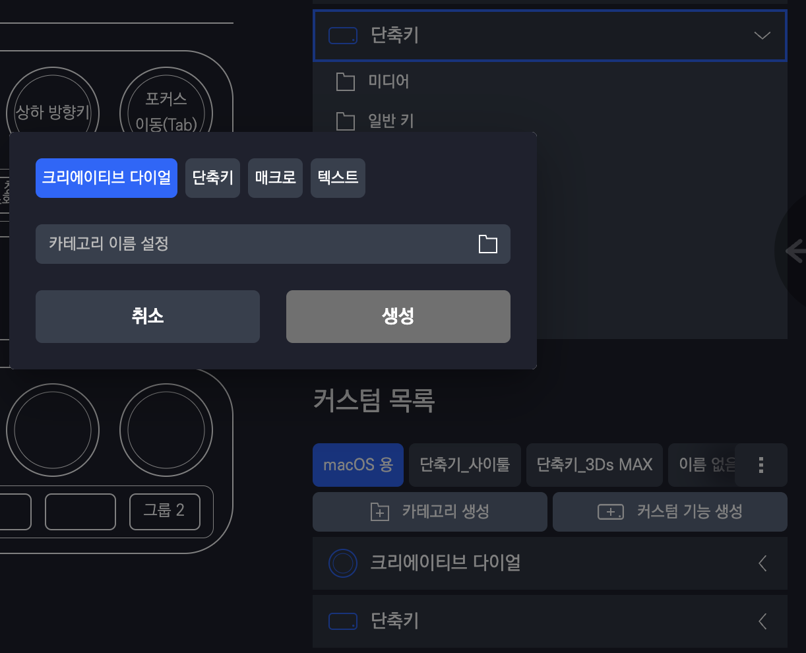

# v2.2.4 추가 업데이트

### 2022.09.15(목)

---

## 요약

**[수정 사항](#수정-사항)**

- [실행 중인 프로그램 목록 불러오기 무한 로딩 버그 수정](#실행-중인-프로그램-목록-불러오기-무한-로딩-버그-수정)
- [매크로 기능 입력 영역 애니메이션 수정](#매크로-기능-입력-영역-애니메이션-수정)
- [익스프레스 키 → 단축키 등 자잘한 이름 변경](#익스프레스-키-단축키-등-자잘한-이름-변경)

---

> # 수정 사항

## 실행 중인 프로그램 목록 불러오기 무한 로딩 버그 수정

- `v2.2.3` 버전 업데이트 이후 `Grid10`을 통해 아무 기능을 실행하지 않은 채로 프로그램 설정 창을 켜게 되면 무한 로딩으로 프로그램 설정을 할 수 없는 현상이 발생하였습니다.

---

## 매크로 기능 입력 영역 애니메이션 수정

- `v2.2.3` 버전 업데이트 이후 매크로 생성 창에서 좌측 하단의 매크로 기능 입력 영역이 열리거나 닫힐 때, 좌측에서 들어오거나 나가는 애니메이션이 있었는데 사라졌던 현상을 수정하였습니다.

---

## 익스프레스 키 → 단축키 등 자잘한 이름 변경

- 커스텀 파일에서 카테고리로 사용하고 있는 익스프레스 키는 문맥상 단축키가 좀 더 적합한 것 같아 수정하였습니다.
- 이외에도 그룹 버튼 → 그룹 키로 변경하였습니다.
