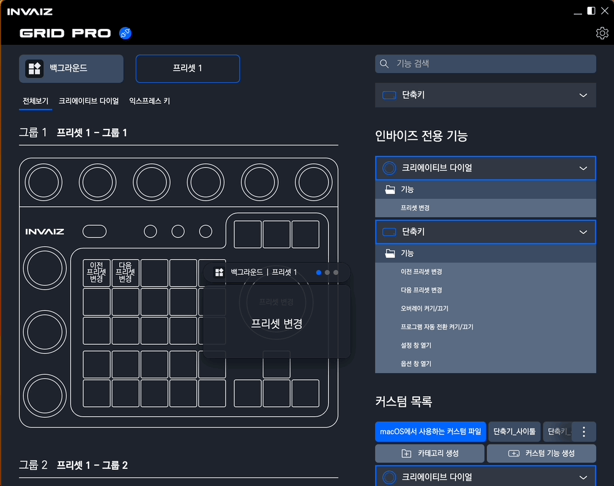
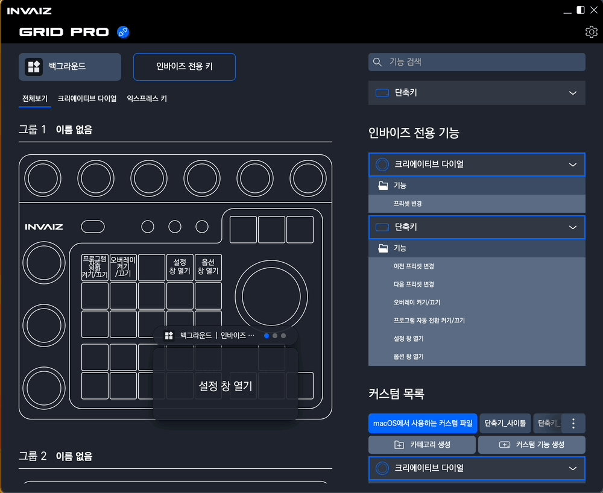
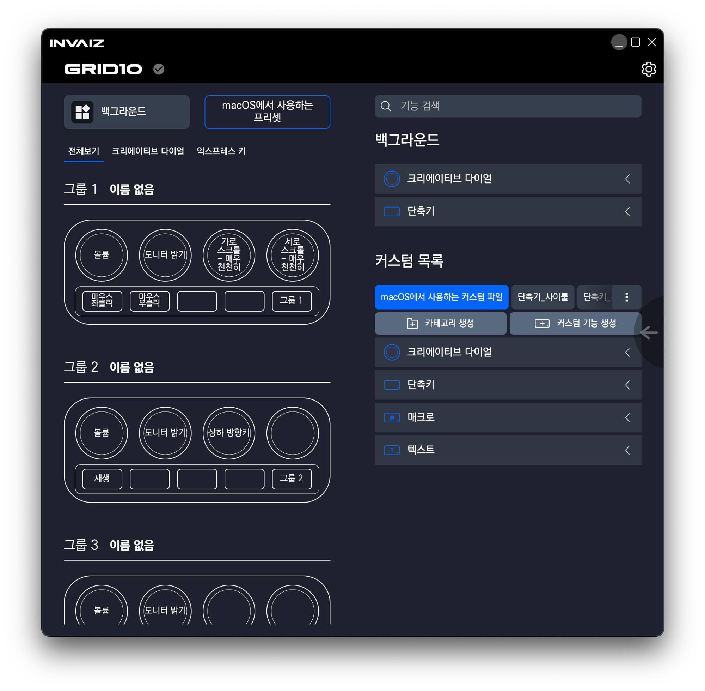
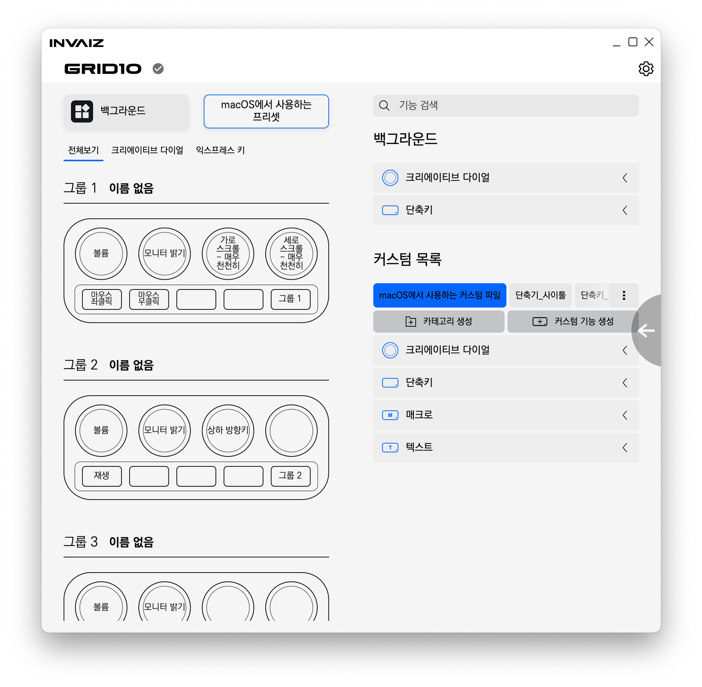

# v2.2.5 정식 버전 업데이트

### 2023.02.28(화)

---

## 요약

**[추가 사항](#추가-사항)**

- [`Grid Pro` 지원 추가](#grid-pro-지원-추가)
- [기능 생성 창의 매크로 입력 영역에서 기본 제공 기능 사용 가능](#기능-생성-창의-매크로-입력-영역에서-기본-제공-기능-사용-가능)
- [`Drag & Drop`으로 기능 변경 시 스왑 / 덮어쓰기 기능](#drag--drop-으로-기능-변경-시-스왑--덮어쓰기-기능)
- [`Drag & Drop` 도중 스크롤 이동](#drag--drop-도중-스크롤-이동)
- [용량 최적화](#용량-최적화)

**[수정 사항](#수정-사항)**

- [가로 스크롤이 세로 스크롤로 작동하는 버그 수정](#가로-스크롤이-세로-스크롤로-작동하는-버그-수정)
- [설정 창에서 화면 초과하는 버그 수정](#설정-창에서-화면-초과하는-버그-수정)
- [스크롤 디테일 수정](#스크롤-디테일-수정)
- [최대화 / 최소화 아이콘 반대로 표시되는 현상 수정](#최대화--최소화-아이콘-반대로-표시되는-현상-수정)
- [프로그램 리스트에서 이름 길어질 경우 추가 버튼이 작아지는 현상 수정](#프로그램-리스트에서-이름-길어질-경우-추가-버튼이-작아지는-현상-수정)
- [툴팁 디자인 통일](#툴팁-디자인-통일)
- [수치 조작 기능 / `Adobe` 통신 기능 동작 및 메시지 수정](#수치-조작-기능--adobe-통신-기능-동작-및-메시지-수정)
- [컨텍스트(우클릭) 메뉴 화면 밖으로 나가는 버그 수정](#컨텍스트우클릭-메뉴-화면-밖으로-나가는-버그-수정)
- [지원되지 않는 기능 수정](#지원되지-않는-기능-수정)

**[삭제 사항](#삭제-사항)**

- [`macOS` 픽셀 유동화 지원 제거](#macos-픽셀-유동화-지원-제거)

---

 

> # 추가 사항

## `Grid Pro` 지원 추가

- 2022년 12월에 `Wadiz` 펀딩으로 처음 소개된 `Grid Pro`를 지원할 수 있도록 미리 소프트웨어를 업데이트하였습니다!

### `Grid Pro` 설정 화면

- 이제 `INVAIZ Studio Basquiat`의 설정 창을 처음 열면, 제품 모델을 선택하여 매핑 화면으로 이동할 수 있습니다.

- 매핑 화면은 `Grid10`과 유사한 형태로 우선 구현되어 있으며, 그룹은 총 3개까지 사용 가능합니다.

- 옵션 창에서도 `Grid Pro` 관련 설정을 하실 수 있습니다.
- `Grid10`의 설정과 거의 동일한 설정을 채택하였습니다.

### `Grid Pro` 오버레이

- 오버레이는 기본적으로 작게 렌더링되도록 하였습니다.
- 상단에 현재 프로그램과 활성화된 프리셋 이름, 그룹의 번호가 나타납니다.

- 전체 보기 버튼을 꾹 누르고 있으면 현재 그룹에서 매핑되어 있는 모든 기능을 확인할 수 있습니다.
- 전체 보기 버튼이 켜져 있을 때도 사용이 가능하며, 어떤 기능이 실행되었는지 확인할 수 있습니다.

### `Grid Pro` 사용 예제

### 인바이즈 전용 키 생성

- 인바이즈 전용 기능 5가지를 추가하였습니다.
  - 프리셋 변경: 이전 / 다음 프리셋으로 변경하기
  - 오버레이 켜기/끄기: 해당 기기의 오버레이를 켜고 끄는 기능
  - 프로그램 자동 전환 켜기/끄기: 프로그램 자동 전환 기능을 켜고 끄는 기능
  - 설정 창 열기
  - 옵션 창 열기

### 색상 시스템 적용

---

## 기능 생성 창의 매크로 입력 영역에서 기본 제공 기능 사용 가능

- 기능 생성 창의 매크로 입력 영역에서 기본 제공 기능을 볼 수 있습니다.
- 마우스를 보여주기 위해 아이콘을 추가하였습니다.

---

## `Drag & Drop`으로 기능 변경 시 스왑 / 덮어쓰기 기능

- 이제 `Drag & Drop` 시 기능이 덮어쓰기만 되는 것이 아닌, 상호 전환(스왑)도 가능합니다!

- 기본적으로 기능을 `Drag & Drop` 할 경우, 시작 위치의 기능과 도착 위치의 기능이 스왑됩니다.
- 만일 트리거 키(`Windows` - `Control`, `macOS` - `Command`)를 누른 채로 `Drag & Drop`할 경우, 기능이 덮어씌워집니다.
- 현재 어떤 형태로 동작할 것인지 Drag 중인 아이템 아래에서 확인할 수 있습니다.

---

## `Drag & Drop` 도중 스크롤 이동

- 기존에 `Drag & Drop` 시 스크롤을 사용할 수 없어 멀리 있는 기능에 매핑할 때 번거로움이 있었습니다.
- 이를 해결하여 `Drag & Drop`과 동시에 영역의 상단 / 하단에 위치하게 되면, 일정한 속도로 스크롤 되는 기능을 추가하였습니다.

---

## 용량 최적화

- 기능은 추가되었지만, 이전에 사용하던 불필요한 리소스들을 제거하여 용량을 최적화하였습니다.

 

---

 
 
 

> # 수정 사항

## 가로 스크롤이 세로 스크롤로 작동하는 버그 수정

- 가로 스크롤 - 매우 천천히를 제외한 기능이 모두 실제로는 세로 스크롤로 매핑되어 있는 현상을 수정하였습니다.

- 이제 해당 기능을 정상적으로 사용하실 수 있기 때문에, 새롭게 매핑하여 사용하시면 됩니다.

---

## 설정 창에서 화면 초과하는 버그 수정

- 간혹 설정 창에서 발생하는 칸 초과, 디자인 깨짐 등의 버그를 수정하였습니다.

---

## 스크롤 디테일 수정

- 스크롤 바 위에서 마우스 스크롤을 통한 스크롤이 되지 않는 현상을 수정하였습니다.

---

## 최대화 / 최소화 아이콘 반대로 표시되는 현상 수정

- 최대화 / 최소화 아이콘이 의도와는 반대로 적용되어 있는 현상을 수정하였습니다.

---

## 프로그램 리스트에서 이름 길어질 경우 추가 버튼이 작아지는 현상 수정

- 추가할 프로그램의 이름이 길 경우, 오른쪽의 추가 버튼이 작아지는 디자인 버그가 있었는데 이를 수정하였습니다.

---

## 툴팁 디자인 통일

- 툴팁의 디자인을 기존보다 크고 잘 보이게 수정하였습니다.
- 또한 특정 상황(프로그램 설정 창이 켜졌을 경우 등)에 툴팁의 디자인이 변경되는 버그를 수정하였습니다.

---

## 수치 조작 기능 / `Adobe` 통신 기능 동작 및 메시지 수정

### `Adobe Photoshop` 브러쉬

- `브러쉬 사이즈` 조절 시 브러쉬가 선택이 되어 있지 않으면 에러 메시지 한 번 출력 후 브러쉬로 선택 상태를 변경합니다.

### `Adobe Photoshop` 조정 레이어 메시지

- 조정 레이어에서 실행 후 결과 값을 오버레이에 출력하였습니다.
- 그 외에 값이 범위를 잠깐 벗어나서 표현되는 경우를 수정하였습니다.
- `색상 균형`과 `흑백`을 제외하고 정상적으로 진행됩니다.

### `Adobe Premiere Pro` X / Y 값 메시지

- X / Y 등의 값을 변경하는 기능(`기준점`, `위치` 등)을 조작할 경우 오버레이에 결과 값이 출력되도록 수정하였습니다.

### `Adobe Premiere Pro` 클립 미선택 메시지

- 클립이 선택되지 않으면 에러 메시지를 오버레이에 출력합니다.
- 클립을 선택하고 사용해야 하는 기능에서 발생합니다.

### `Adobe Premiere Pro` `HSL` `흐림 효과` 버그 수정

- 효과 이름이 `흐름` → `흐림 효과`로 변경되어서 발생한 버그입니다.
- 추후에 기능의 이름이 변경될 경우 또 비슷한 버그가 발생할 수 있습니다.

---

## 컨텍스트(우클릭) 메뉴 화면 밖으로 나가는 버그 수정

- 우클릭 메뉴가 가장자리에서 실행될 경우 일부분이 화면을 벗어나는 현상이 있었습니다.
- 이를 수정하고 우클릭 메뉴의 각 항목이 중앙 정렬 되도록 수정하였습니다.

---

## 지원되지 않는 기능 수정

- 지원 중인 각 소프트웨어의 버전이 업데이트됨에 따라, 호환성이 깨진 기능들을 점검하고 수정하였습니다.

### `Final Cut Pro` 색상 휠 전체 화면 모드에서 실행 안되는 버그 수정

- 컬러휠을 전체화면으로 키울 경우, 조작할 수 없는 버그를 수정하였습니다.
- 이에 더해 듀얼 모니터 모드에서 다른 창을 잡고 있을 때 조작 가능하도록 업데이트도 함께 진행했습니다.
- 현재, 듀얼 모니터 모드 - 타임라인에서 타임라인을 포커스하고 있을 경우에는 실행이 제대로 되지 않는 버그가 존재합니다.

 

---

 
 
 

> # 삭제 사항

## `macOS` 픽셀 유동화 지원 제거

- 현재 `Windows`에서만 제공하고 있는 픽셀 유동화 기능을, `macOS`에서도 마치 제공하는 것처럼 목록을 보여주고 있습니다.
- 이를 제거하였습니다.