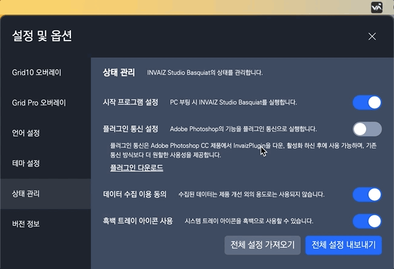
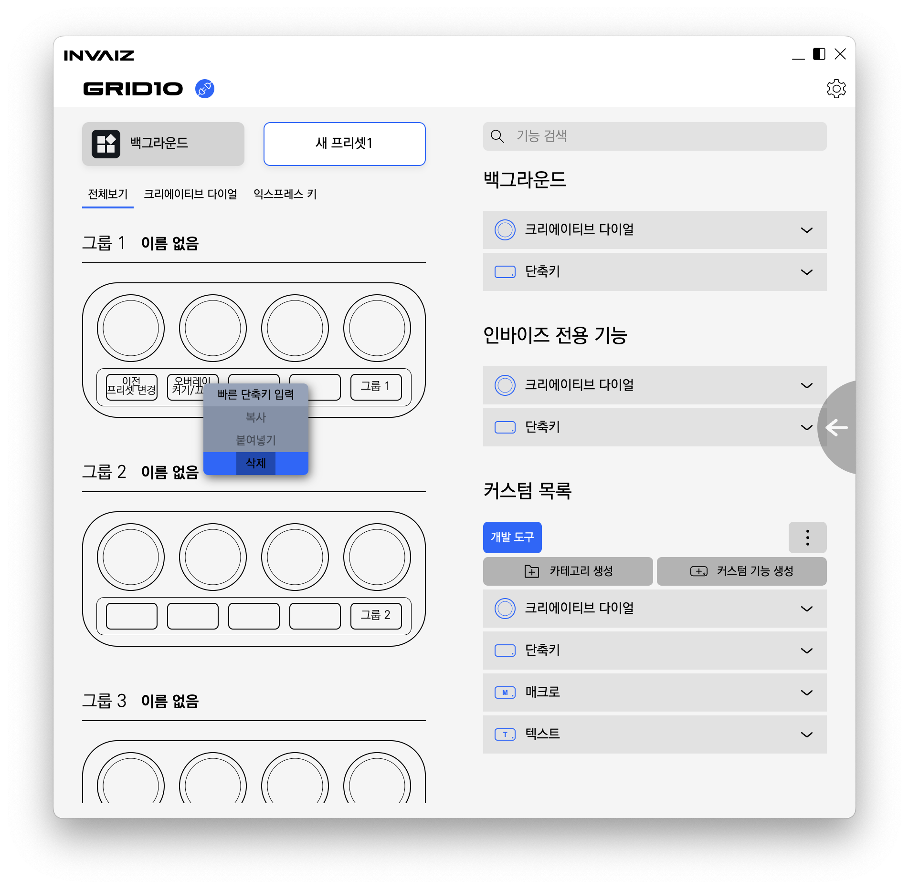
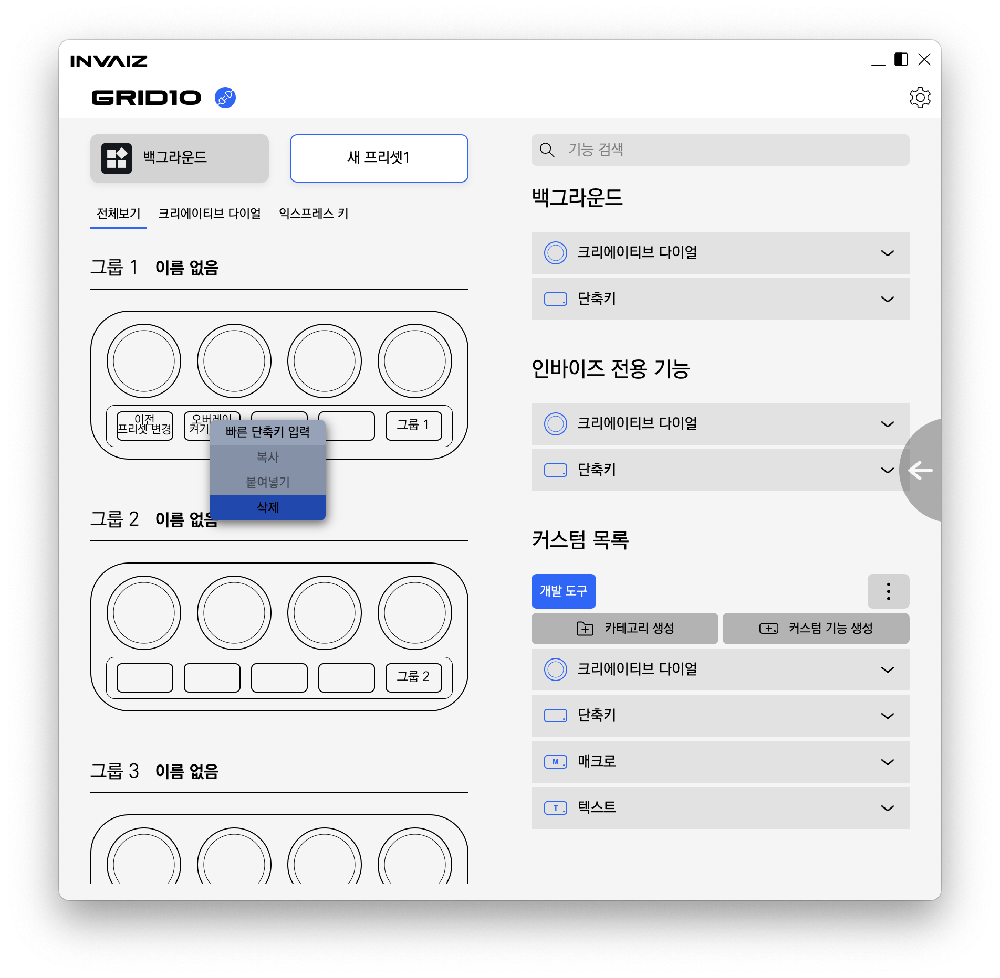

# v2.2.6 추가 업데이트

### 2023.03.24(금)

---

##

**[추가 사항](#추가-사항)**

- [트레이 아이콘 색상 조절 기능](#트레이-아이콘-색상-조절-기능)

**[수정 사항](#수정-사항)**

- [기능 생성 창을 정상적으로 켤 수 없는 버그 수정](#기능-생성-창을-정상적으로-켤-수-없는-버그-수정)
- [우클릭 메뉴(컨텍스트 메뉴)의 선택 영역이 비정상적인 버그 수정](#우클릭-메뉴컨텍스트-메뉴의-선택-영역이-비정상적인-버그-수정)
- [스크롤 버벅임 현상 감도 수정](#스크롤-버벅임-현상-감도-수정)

> 추가 전달
>
> - `Windows` 자동 업데이트 알림 창 언어팩 지원

---

 

> # 추가 사항

## 트레이 아이콘 색상 조절 기능

- 시스템 트레이 아이콘의 색상(흑백, 컬러)을 변경할 수 있습니다.

 

---

 
 
 

> # 수정 사항

## 기능 생성 창을 정상적으로 켤 수 없는 버그 수정

- 기능 생성 창을 실행할 때, 최초 1회 실행 이후 계속해서 안켜지는 현상을 수정하였습니다.

---

## 우클릭 메뉴(컨텍스트 메뉴)의 선택 영역이 비정상적인 버그 수정

- 우클릭 메뉴의 실제 선택 영역 범위가 좁아 선택하기 어려워진 현상을 수정하였습니다.

---

## 스크롤 버벅임 현상 감도 수정

- `macOS`에서 스크롤을 한 번에 움직일 때 비정상적으로 버벅거리는 현상을 조금 수정하였습니다.
