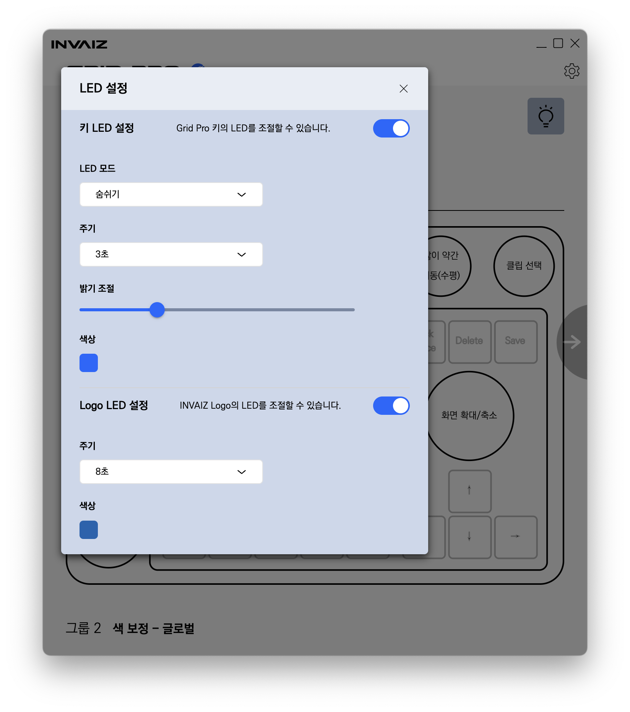
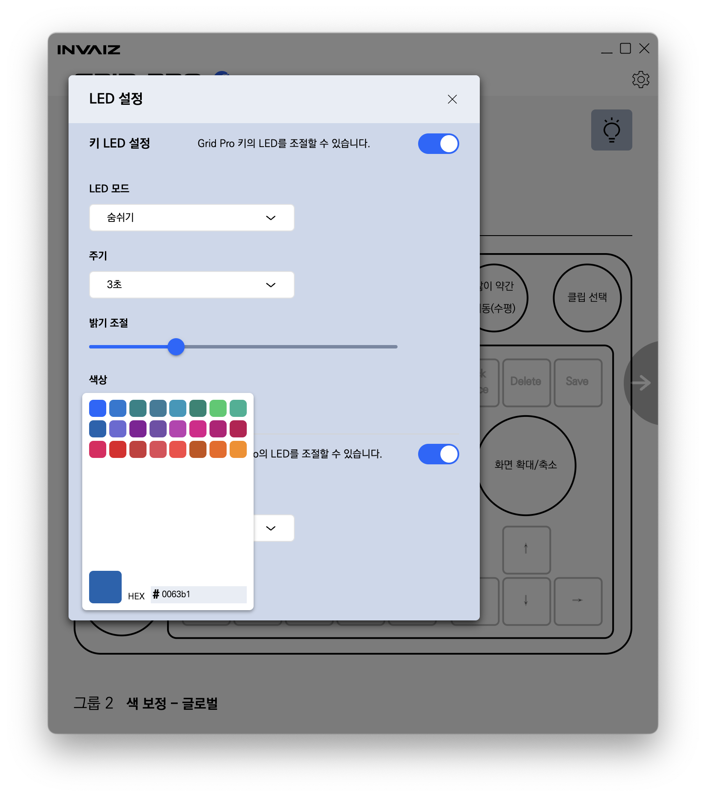
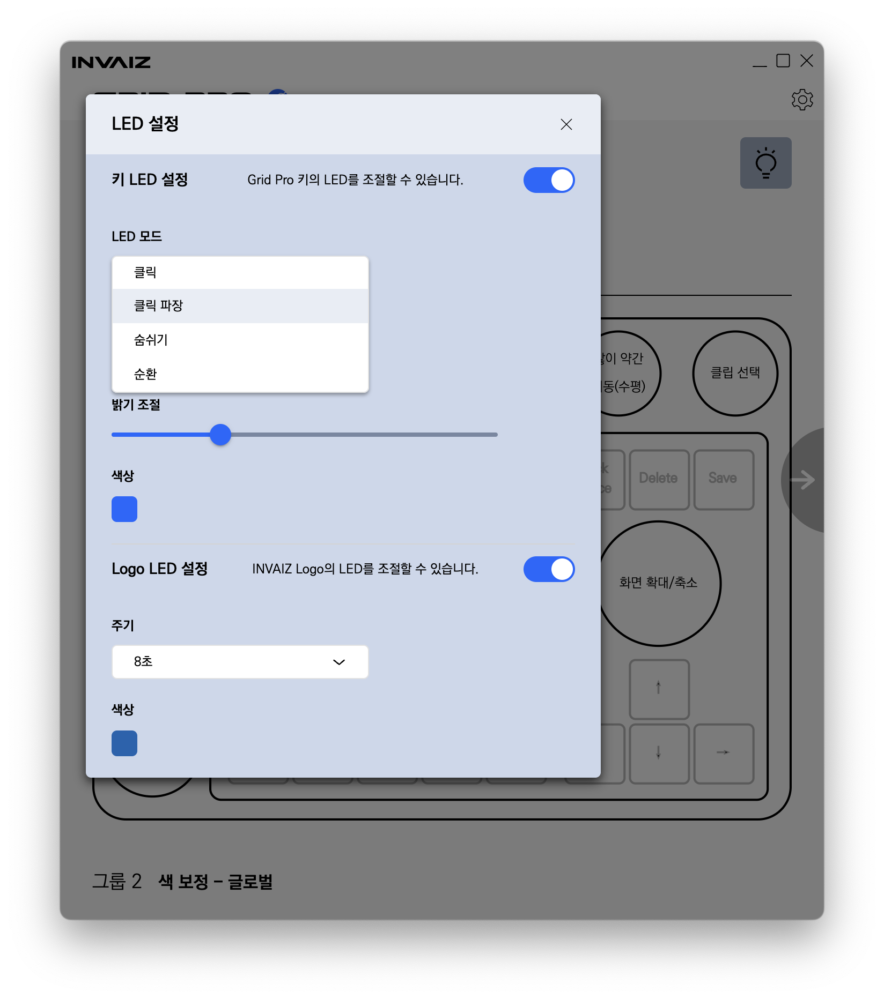
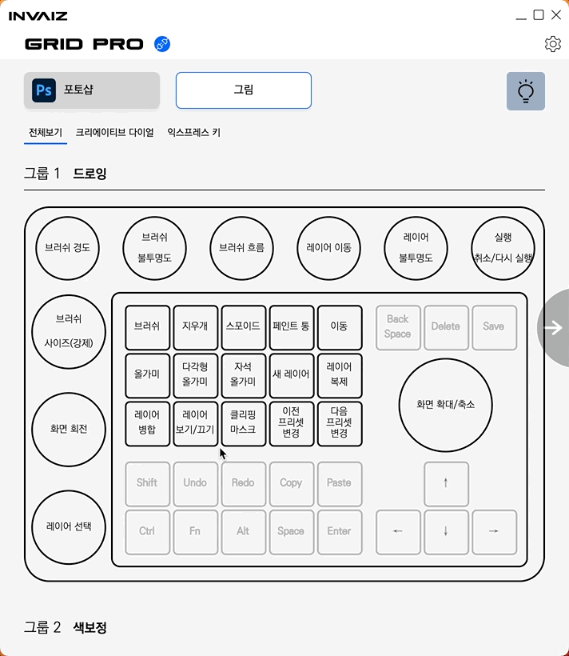
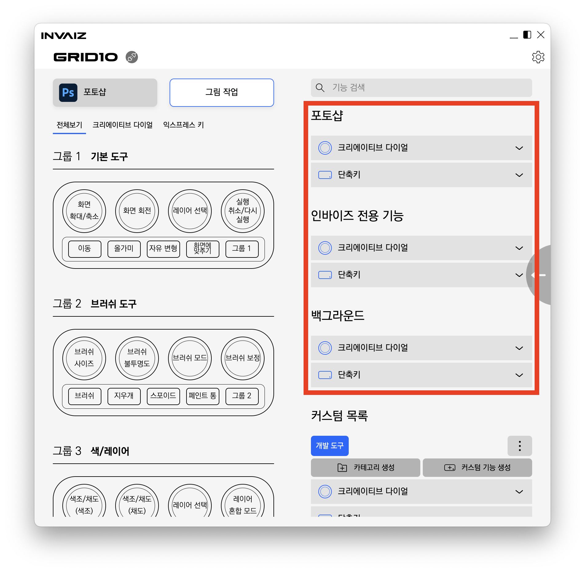
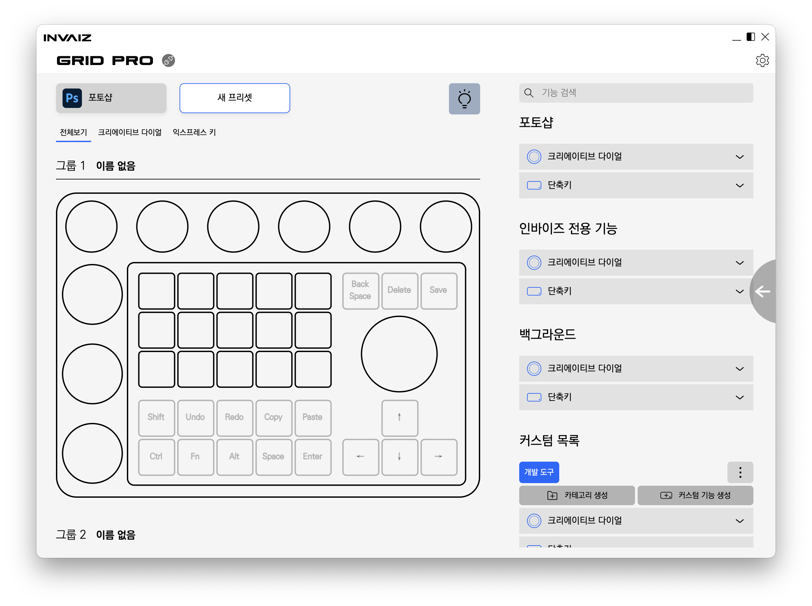
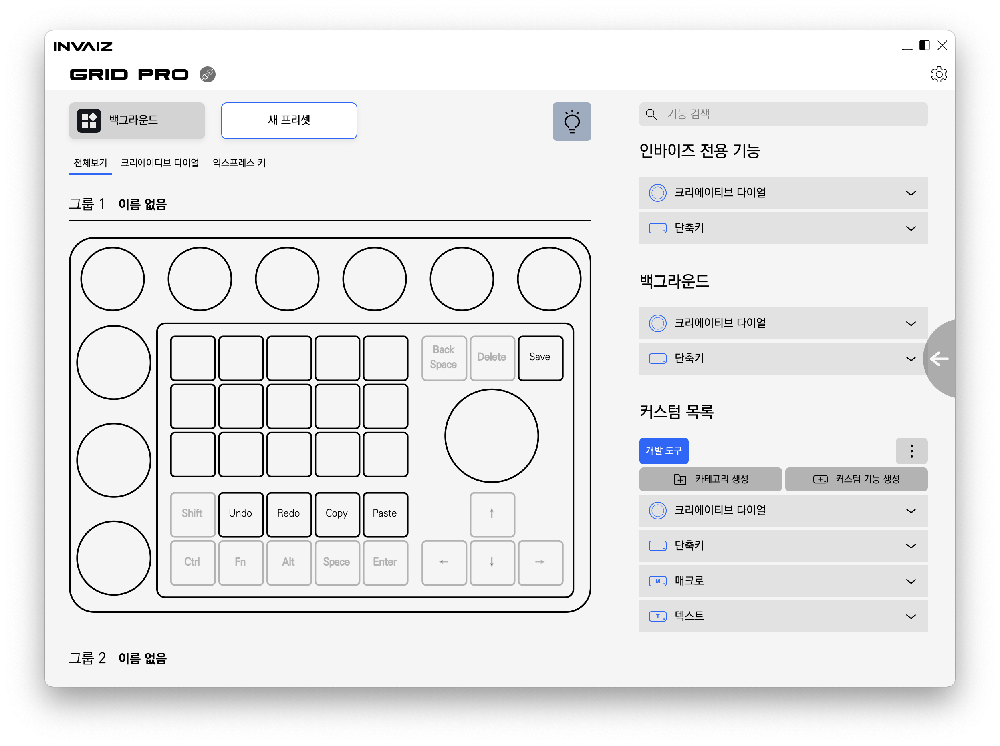

# v2.3.0 정식 버전 업데이트

### 2023.03.31(금)

---

## 요약

**[추가 사항](#추가-사항)**

- [`Grid Pro` LED 지원](#grid-pro-led-지원)
- [`Grid Pro` 추천 프리셋 지원](#grid-pro-추천-프리셋-지원)

**[수정 사항](#수정-사항)**

- [기능 목록 리스트 나열 순서 변경](#기능-목록-리스트-나열-순서-변경)
- [`Grid Pro` 설정 화면 디자인 수정](#grid-pro-설정-화면-디자인-수정)
- [`macOS`에서 특수 키 단일 입력 시 정상적으로 동작하지 않는 현상 수정](#macos에서-특수-키-단일-입력-시-정상적으로-동작하지-않는-현상-수정)

> 추가 전달
>
> - `Grid Pro`가 펀딩을 통해 처음 공개되면서 업데이트 된 버전입니다.
> - 내부적으로는 충분한 테스트를 거쳤으나, 실 사용에 있어서 자잘한 버그가 있을 수 있는 점 미리 양해 부탁드리며, 혹시나 버그가 발생한다면 언제든지 [홈페이지](https://invaiz.com)의 문의 톡을 통해 연락주시면 감사드리겠습니다.

---

 

> # 추가 사항

## `Grid Pro` LED 지원

- `Grid Pro`의 LED를 설정할 수 있습니다.
- 크게 키 LED와 로고 LED로 구분할 수 있으며, 키 LED를 끌 경우 로고 LED도 함께 꺼집니다.
- LED 색상 조절은 가능하지만, LED 부품 표현력의 한계로 인해 요구하는 색상과 다를 수 있습니다.
  - 특히 적색 계열의 색은 잘 구현하지 못합니다.
- 주기는 LED가 켜졌을 때부터 다시 꺼질 때까지 걸리는 시간을 지칭합니다.
  - 0초로 지정할 경우 항상 켜져 있게 됩니다.

- LED 색상 설정은 HEX 코드를 기반으로 지원합니다. 기본적으로 쉽게 클릭하여 사용할 수 있는 색상 24가지도 함께 지원하고 있습니다.
- 키 LED는 총 4가지 모드가 존재합니다.
  1. 클릭: 클릭한 위치에 LED가 발생합니다.
  2. 클릭 파장: 클릭한 위치를 기준으로 LED가 퍼져나갑니다.
  3. 숨쉬기: 전체 LED가 단색으로 서서히 켜졌다 꺼졌다 합니다.
  4. 순환: 항상 켜져 있으면서 색이 계속해서 변화합니다.

---

## `Grid Pro` 추천 프리셋 지원

- 처음 `Grid Pro`를 사용하실 때 직접 매핑하는 번거로움을 제거하고, 좋은 사용성을 지원해드리고자 추천 프리셋을 제작하였습니다.
- 각 지원 프로그램 별로 1~2개씩 지원하고 있습니다.

 

---

 
 
 

> # 수정 사항

## 기능 목록 리스트 나열 순서 변경

- 기존의 오른쪽 기능 목록 리스트에서, 백그라운드가 가장 위에서 보이는 상태에서 각 지원 프로그램 → 인바이즈 전용 기능 → 백그라운드 순으로 나열될 수 있도록 수정하였습니다.

---

## `Grid Pro` 설정 화면 디자인 수정

- 이전의 `Grid Pro` 설정 화면의 불필요한 디자인을 제거하여 간결하게 설정할 수 있도록 디자인을 수정하였습니다.
- 이제는 아래쪽 고정 키를 수정할 수 없습니다만, 일부 키에 한해 지원 프로그램이 아닌 백그라운드 / 추가된 프로그램에서는 수정할 수 있도록 제공합니다.

---

## `macOS`에서 특수 키 단일 입력 시 정상적으로 동작하지 않는 현상 수정

- 지금까지 `macOS`에서는 `Shift`, `Command`, `Control`, `Option` 등의 특수 키를 단일로 실행해도 제대로 동작하지 않는 상태였습니다.
- 이에 각각 단일 동작에 대해서는 꾹 누르는 상태가 유지될 수 있도록 수정하였습니다.
- `macOS`에서 INVAIZ의 제품을 좀 더 잘 활용할 수 있게 됐습니다.
