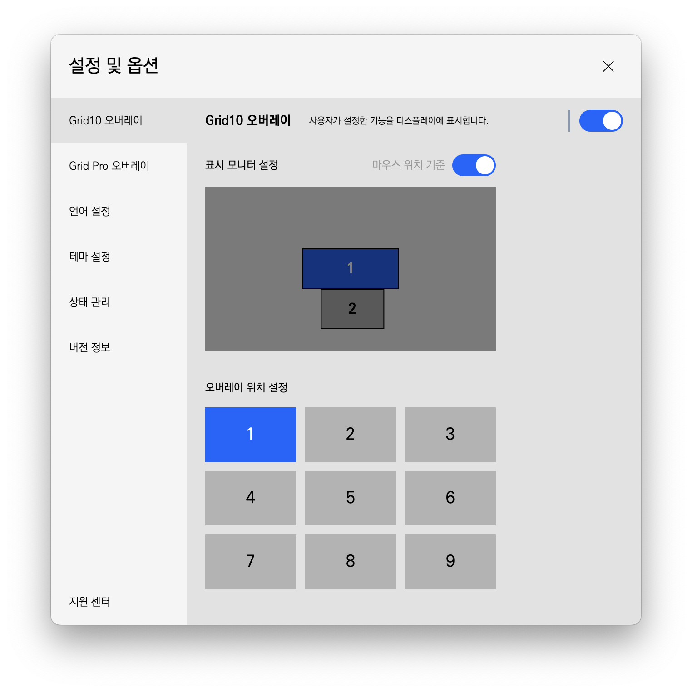
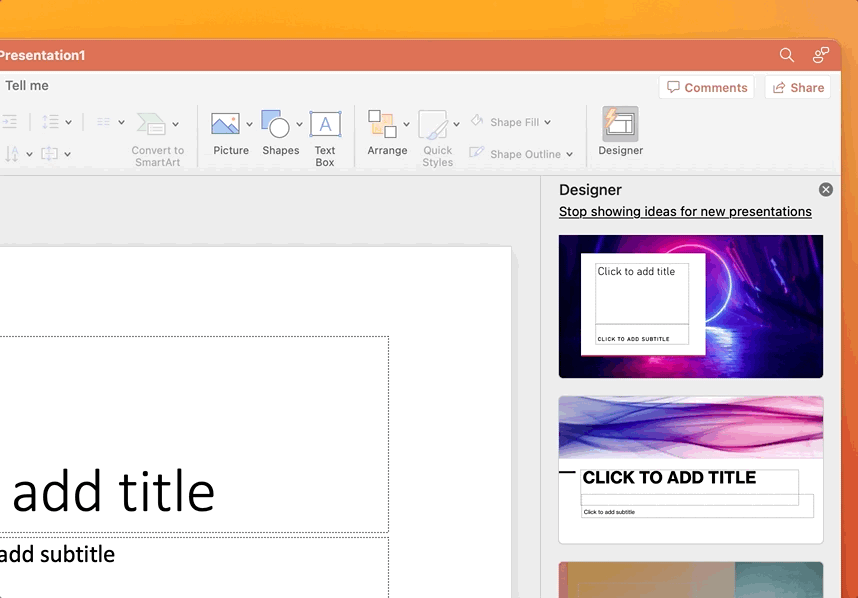

# v2.3.1 추가 업데이트

### 2023.04.04(화)

---

##

**[추가 사항](#추가-사항)**

- [일부 프로그램 단축키 추가 제공](#일부-프로그램-단축키-추가-제공)

**[수정 사항](#수정-사항)**

- [일부 프로그램 잘못된 단축키 제공 수정](#일부-프로그램-잘못된-단축키-제공-수정)
- [넘버링 수정](#넘버링-수정)
- [트레이 아이콘 메뉴에서 프로그램 자동 전환 변경 불가 버그 수정](#트레이-아이콘-메뉴에서-프로그램-자동-전환-변경-불가-버그-수정)
- [`macOS`에서 `Microsoft Power Point`를 자동 전환으로 인식할 수 없는 버그 수정](#macos에서-microsoft-power-point를-자동-전환으로-인식할-수-없는-버그-수정)
- [기능 실행 시 CPU 성능 개선](#기능-실행-시-cpu-성능-개선)

> 추가 전달
>
> - 이 버전은 문제 발생으로 인해 긴급하게 수정한 버전입니다.

---

 

> # 추가 사항

## 일부 프로그램 단축키 추가 제공

### Adobe Photoshop

- `Windows`에서 **‘화면 확대 축소’**의 동작 방식을 수정하였습니다.
- **‘카메라로우 저장’**, **‘픽셀유동화 저장’**: `Enter`를 추가했습니다.

### Adobe Lightroom Classic - Windows

- **‘다시 실행’**: `Control+Y`를 추가했습니다.
- **‘실행 취소/다시 실행’**을 추가했습니다.
  - 시계 방향: `Control+Y`
  - 반시계 방향: `Control+Z`

### Adobe Illustrator

- **‘앞/뒤로 보내기’**를 추가했습니다.
  - 시계 방향: `Control/Command+]`
  - 반시계 방향: `Control/Command+[`

### Adobe InDesign - macOS

- **‘아래첨자’**: `Command+Shift+Option+=`를 추가했습니다.

### Adobe AfterEffects

- **‘모드 전환’**을 추가했습니다.
  - Windows: `\``
  - macOS: `‘`

### Microsoft Office Word - Windows

- **‘다른 이름으로 저장’**: `F12`를 추가했습니다.

### Microsoft Office Excel - Windows

- **‘확대/축소’**를 추가했습니다.
  - 시계 방향: `Control+Alt+=`
  - 반시계 방향: `Control+Alt+-`

### 한글 - Windows

- **‘셀 이동’**을 추가했습니다.
  - 시계 방향: `Shift+Tab`
  - 반시계 방향: `Tab`

### Clip Studio Paint

- **‘회전 모드’**: `r`를 추가했습니다.
- **‘실행 취소/다시 실행’**을 추가했습니다.
  - 시계 방향: `Control/Command+Y`
  - 반시계 방향: `Control/Command+Z`

 

---

 
 
 

> # 수정 사항

## 일부 프로그램 잘못된 단축키 제공 수정

- 아래의 프로그램 일부 기능에서, 잘못된 단축키가 매핑되어 있어 이름과는 다르게 동작하지 않았던 현상을 수정하였습니다.

### Adobe Lightroom Classic - Windows

- **‘Undo’**: `Control+Shift+Z` → `Control+Y`

### Clip Studio Paint

- 기존 **‘회전 모드’**: `Shift+Space` 단축키의 이름을 **‘회전 상태 활성화’**로 변경하였습니다.

### Final Cut Pro

- **‘Undo’**가 없는 프리셋만 제공하는 것을 수정하였습니다.
- **‘실행 취소/다시 실행’**의 일본어 명을 수정하였습니다.

---

## 넘버링 수정

### `Grid Pro` 그룹 변경 오버레이

- 그룹 변경 시 발생하는 그룹 번호에서 0번부터 시작하지 않고 1번부터 시작하도록 수정하였습니다.

### 옵션 창 - 모니터 설정

- 모니터 번호를 0번부터 시작하지 않고 1번부터 시작하도록 수정하였습니다.

---

## 트레이 아이콘 메뉴에서 프로그램 자동 전환 변경 불가 버그 수정

- 트레이 아이콘으로 열 수 있는 메뉴에서 프로그램 자동 전환이 동작하지 않는 현상을 수정하였습니다.

---

## `macOS`에서 `Microsoft Power Point`를 자동 전환으로 인식할 수 없는 버그 수정

- `macOS`에서 `Microsoft Power Point`에 포커스를 해도, 해당 프로그램이 `Microsoft Power Point`인지 감지할 수 없는 현상을 수정하였습니다.

---

## 기능 실행 시 CPU 성능 개선

- 프로그램 자동 전환을 켜고, 백그라운드에서 기능을 실행할 때마다 CPU 사용량이 비정상적으로 증폭되는 현상을 수정하였습니다.
- 또한, 기본적인 CPU 사용량을 약 20% 효율적으로 개선하였습니다.
