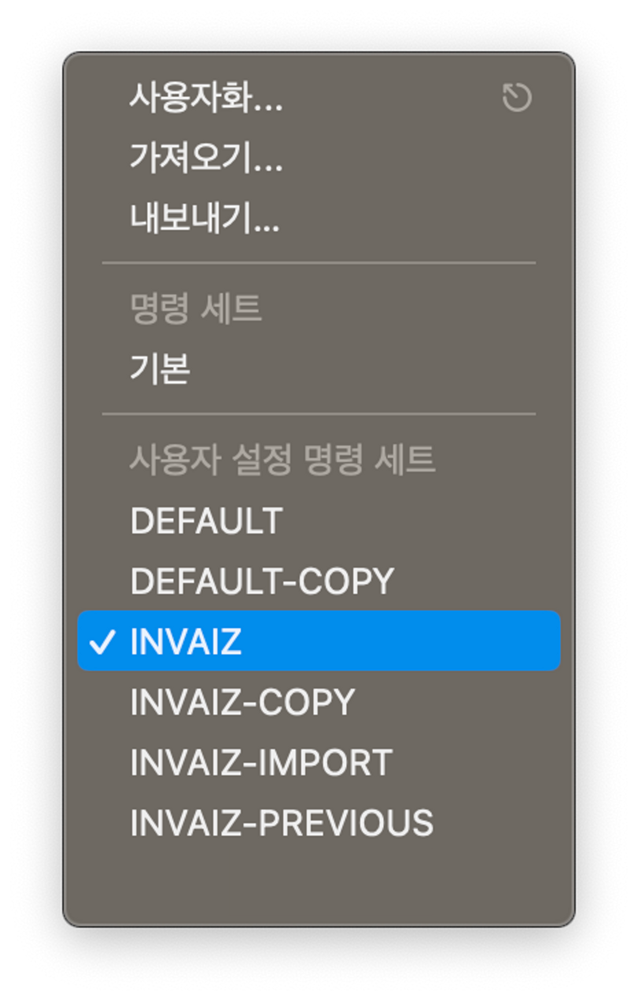
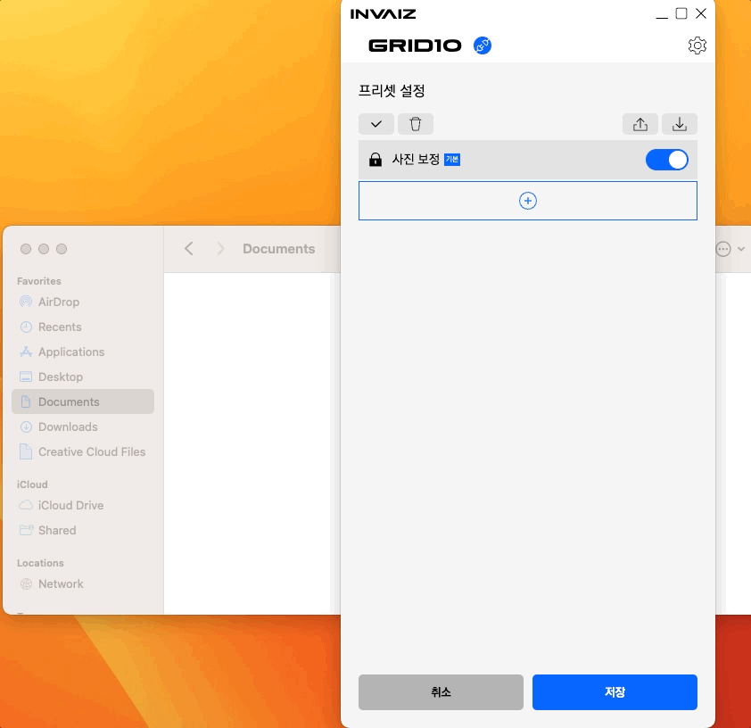
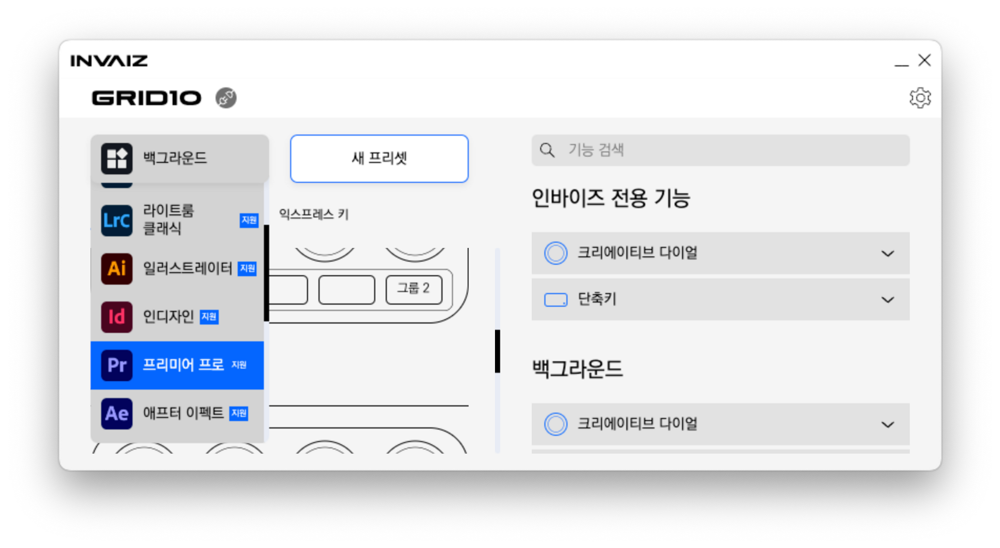
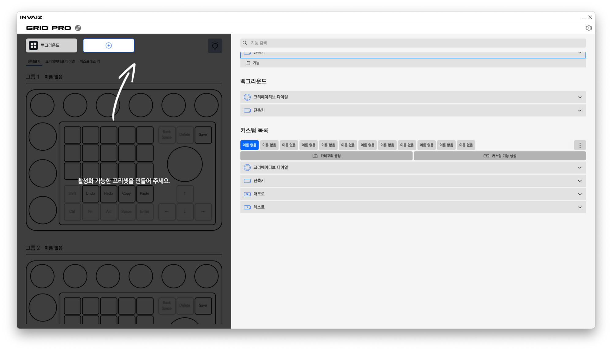
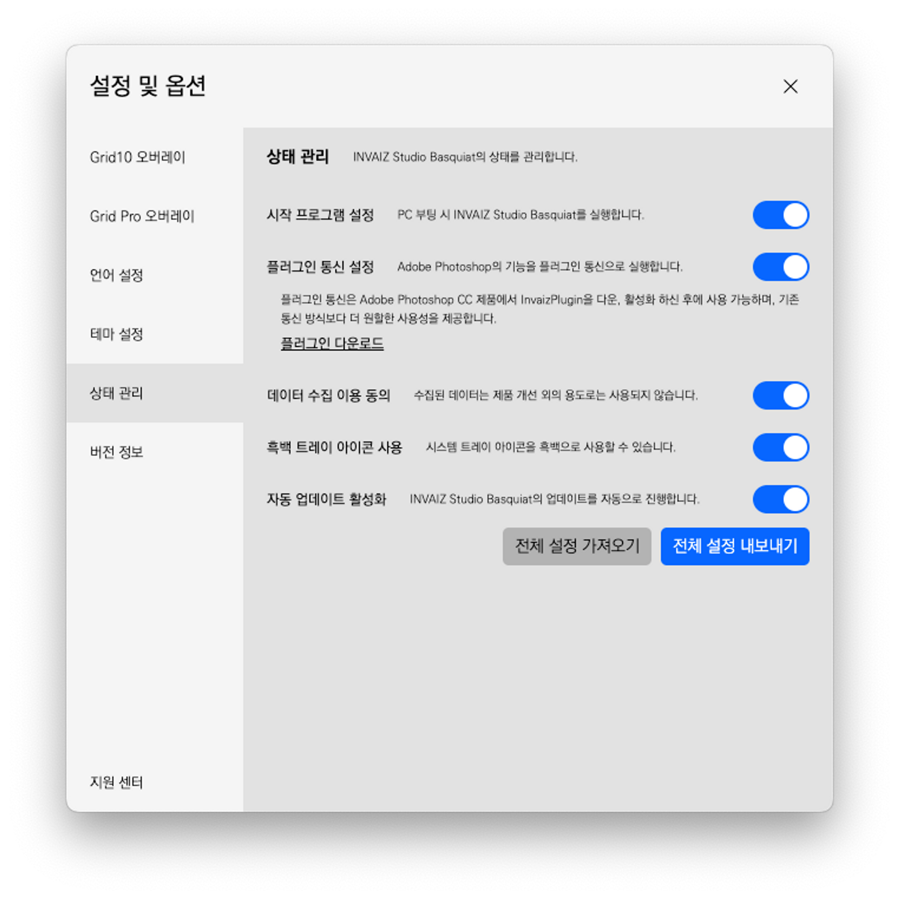
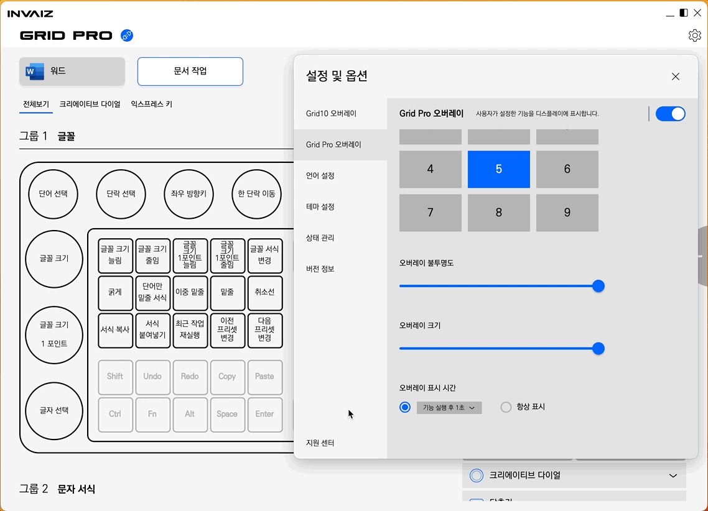
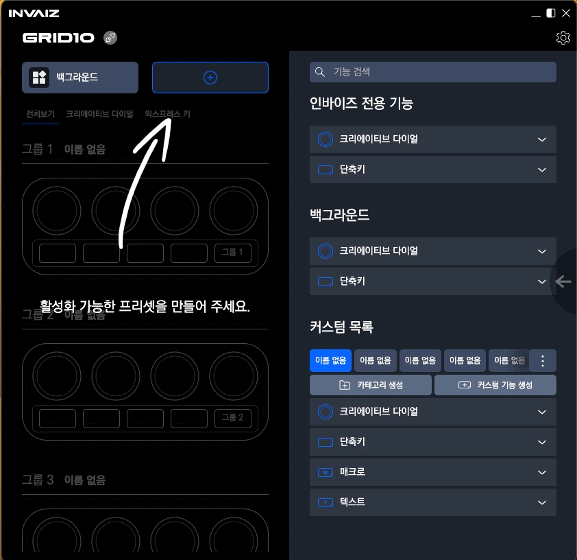
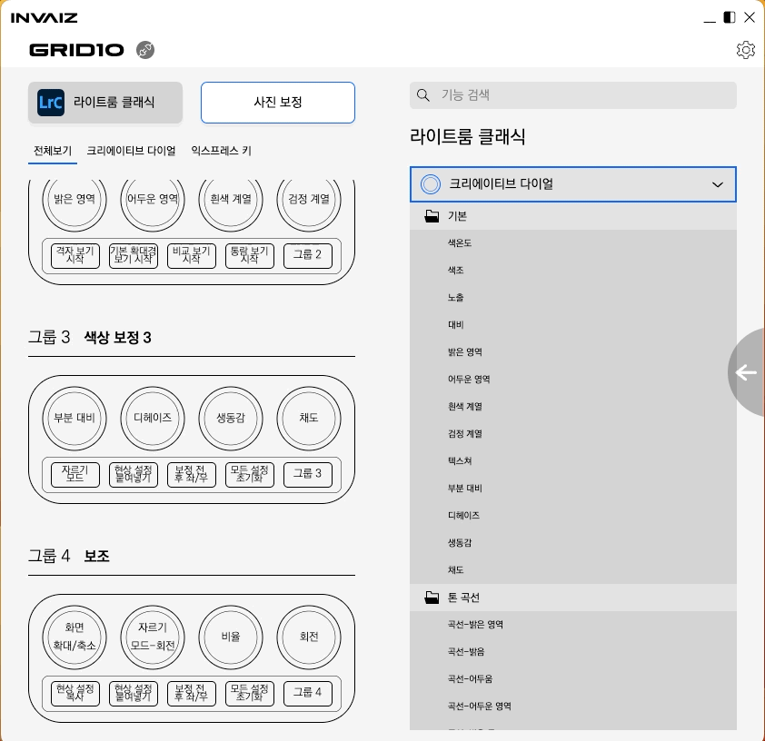

# v2.3.2 정식 업데이트

### 2023.07.31(월)

---

## 요약

**[추가 사항](#추가-사항)**

- [설치 시 `Final Cut Pro`의 명령 세트 자동 적용](#설치-시-finai-cut-pro의-명령-세트-자동-적용)
- [프리셋 내보내기 시 사용할 수 있는 기기의 이름 추가](#프리셋-내보내기-시-사용할-수-있는-기기의-이름-추가)
- [`Clip Studio Paint`에서 화면 회전 기능 리스트에 추가](#clip-studio-paint에서-화면-회전-기능-리스트에-추가)
- [설정 창에서 접기 / 펼치기 모드와 버튼을 제거, 가변 크기 설정 기능 추가](#설정-창에서-접기--펼치기-모드와-버튼을-제거-가변-크기-설정-기능-추가)
- [`Windows`에서 자동 업데이트 `On/Off` 토글 추가](#windows에서-자동-업데이트-onoff-토글-추가)

**[수정 사항](#수정-사항)**

## 용량 최적화

- [`Windows`의 `Microsoft Office`에서 `Alt`와 연관된 키를 조작 오류 수정](#windows의-microsoft-office에서-alt와-연관된-키를-조작-오류-수정)
- [`Windows7`에서 사용할 수 있도록 조치](#windows7에서-사용할-수-있도록-조치)
- [`Grid Pro`의 오버레이 기능 전체 보기를 `On/Off` 토글 방식으로 변경](#grid-pro의-오버레이-기능-전체-보기를-onoff-토글-방식으로-변경)
- [연결되지 않은 기기의 오버레이를 띄우지 않도록 수정](#연결되지-않은-기기의-오버레이를-띄우지-않도록-수정)
- [`macOS`에서 설치 시 `Adobe Premiere Pro` 최신 버전도 종료하도록 명령](#macos에서-설치-시-adobe-premiere-pro-최신-버전도-종료하도록-명령)
- [설정 페이지 애니메이션 시 하얀 영역 노출 수정](#설정-페이지-애니메이션-시-하얀-영역-노출-수정)
- [스크롤 성능 개선](#스크롤-성능-개선)
- [`INVAIZ Studio Basquiat` 실행 시 터치 바 영어로 표시되는 버그 수정](#invaiz-studio-basquiat-실행-시-터치-바-영어로-표시되는-버그-수정)

---

<br />

> # 추가 사항

## 설치 시 `Finai Cut Pro`의 명령 세트 자동 적용

- `INVAIZ Studio Basquiat`를 설치할 때, `Final Cut Pro`의 모든 기능이 단축키로 매핑되어 있는 명령 세트를 적용하도록 하였습니다.
- 이 명령 세트는 `Final Cut Pro`의 사용자 설정 명령 세트에서 `INVAIZ`라는 이름으로 확인할 수 있습니다.



---

## 프리셋 내보내기 시 사용할 수 있는 기기의 이름 추가

- 프리셋 내보내기 한 파일에 어떠한 기기에서 사용할 수 있는 프리셋인지도 명시하였습니다.
- 형태는 아래와 같습니다.

```bash
[(모델 이름) - (프로그램 이름)] 프리셋 이름.inz
```



---

## `Clip Studio Paint`에서 화면 회전 기능 리스트에 추가


- `Clip Studio Paint`의 화면 회전 단축키가`Grid Pro`프리셋에서만 포함되어 있었고, 기능 리스트에는 없었습니다.
- 이에 화면 회전 단축키를 기능 리스트에 추가합니다.

---

## 설정 창에서 접기 / 펼치기 모드와 버튼을 제거, 가변 크기 설정 기능 추가





- 설정 창에서 접기 / 펼치기 모드를 제거합니다.
- 우측의 화면을 키우는 영역 버튼을 제거합니다.
- 높이와 너비의 가변이 가능하기 때문에, 이에 따른 처리를 하였습니다.
- 너비는 모든 뷰가 다 보일 정도의 크기가 최소이고, 높이는 기본 높이의 반만큼을 최소 크기로 지정했습니다.

---

## `Windows`에서 자동 업데이트 `On/Off` 토글 추가



- `Windows` 운영체제에서 자동 업데이트를 켜고 끌 수 있도록 설정하는 토글을 생성하였습니다.
- 업데이트를 하고 싶지 않은데 계속해서 자동 업데이트가 뜨는 상황이 불편할 때, 이 토글을 `Off`하여 자동 업데이트 사용을 제거할 수 있습니다.

<br />

---

<br />
<br />
<br />

> # 수정 사항

## 용량 최적화

- 일부 사용하지 않는 파일을 정리하여 용량을 최적화하였습니다.

---

## `Windows`의 `Microsoft Office`에서 `Alt`와 연관된 키를 조작 오류 수정

- `Windows` 환경에서 사용할 때, `Microsoft Office`에서 `Alt`로 시작하는 연계 키가 동작하지 않는 것을 수정하였습니다.
- 일반 단축키로 제공하고 있던 기능을 매크로로 수정하여 적용, 제공합니다.

---

## `Windows7`에서 사용할 수 있도록 조치

- `v2.3.1` 버전 업데이트 후 `Windows`에서 사용할 수 없는 현상이 발생하여 이를 원상복구하였습니다.
- 추후에는(언젠가) `Windows10` 이전 버전에 대해서는 지원이 중단될 예정입니다.

---

## `Grid Pro`의 오버레이 기능 전체 보기를 `On/Off` 토글 방식으로 변경



- `Fn`키를 통해`Grid Pro`의 오버레이 전체 보기 모드의 동작을`Grid10`의 그룹 모드 켜기 / 끄기와 유사하게 동작하도록 수정하였습니다.
- 전체 보기 모드를 꾹 눌러서 활성화하는 것이 아니라, 한 번 클릭할 때마다`on`/`off`합니다.
- 전체 보기 모드 상태에서는 기능을 동작해도 오버레이가 꺼지지 않습니다.
- 전체 보기 모드 상태를 끄면 오버레이가 '꺼지도록' 수정하였습니다.
- 이외에도 오버레이 동작에 자잘한 버그를 수정하였습니다.

---

## 연결되지 않은 기기의 오버레이를 띄우지 않도록 수정

- 기기에 연결될 때 오버레이를 켜도록 수정하였습니다.
- 기존에는 기기에 연결되지 않아도 다른 모든 오버레이가 켜지는 상태를 제거하였습니다.

---

## `macOS`에서 설치 시 `Adobe Premiere Pro` 최신 버전도 종료하도록 명령

- `macOS`에서 설치 파일을 실행하면, 최신 버전의 `Adobe` 프로그램도 모두 종료해야 실행할 수 있도록 수정하였습니다.

---

## 설정 페이지 애니메이션 시 하얀 영역 노출 수정



- 설정창 페이지 이동 시 하얀색 영역이 눈에 띄게 보이는 현상을 제거하였습니다.

---

## 스크롤 성능 개선



- 스크롤을 빠르게 이동했을 때 버벅거리는 현상을 제거하였습니다.
- 추가로, 내용 영역의 크기가 변경되었을 때, 스크롤이 곧바로 크기를 다시 인식할 수 있도록 수정하였습니다.

---

## `INVAIZ Studio Basquiat` 실행 시 터치 바 영어로 표시되는 버그 수정

- `Touch Bar`가 장착된 `MacBook`에서 `INVAIZ Studio Basquiat`를 실행시켰을 때 터치바에 보이는 박스 내용이 반드시 영어로 출력되는 현상을 수정하였습니다.