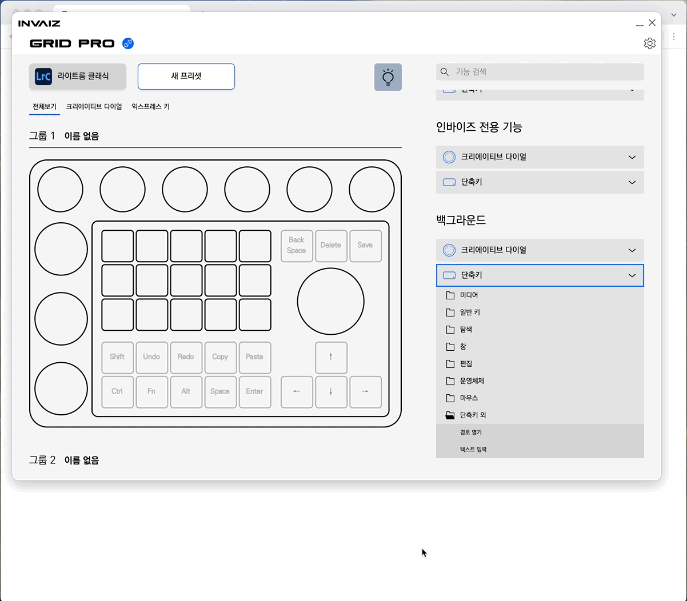
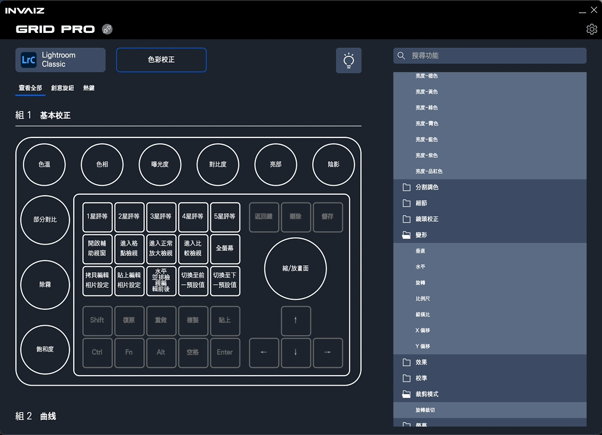
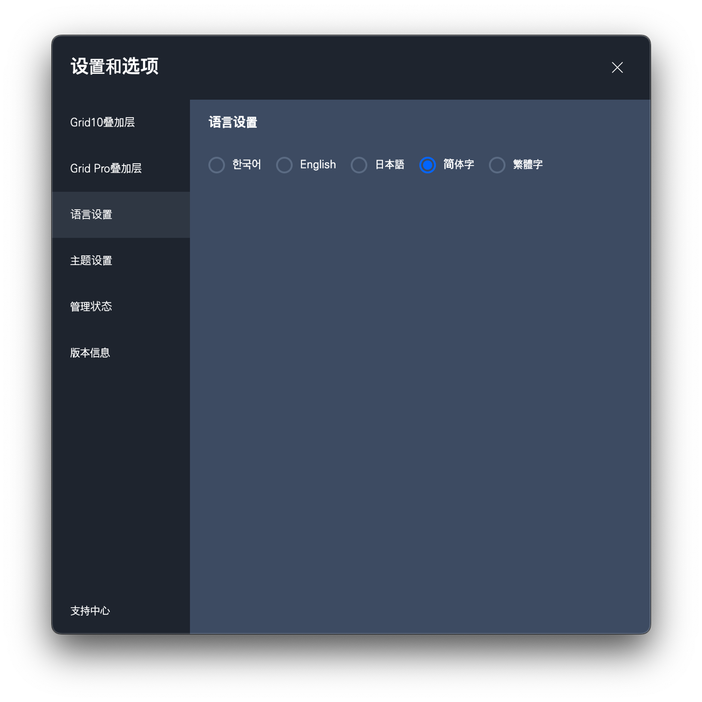
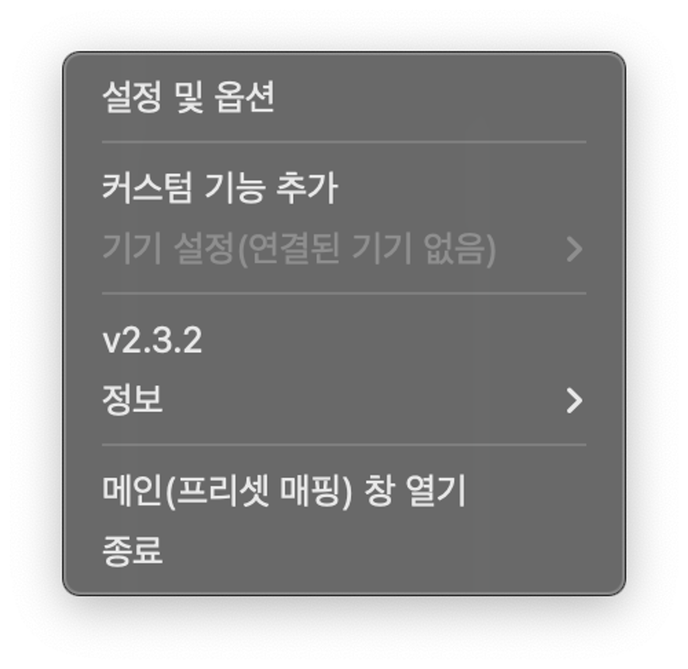
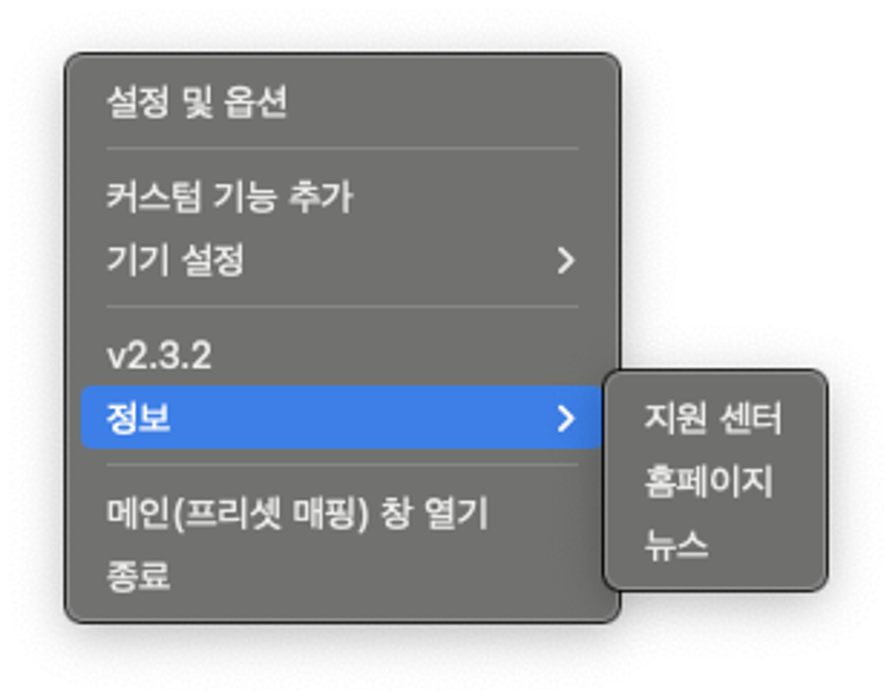
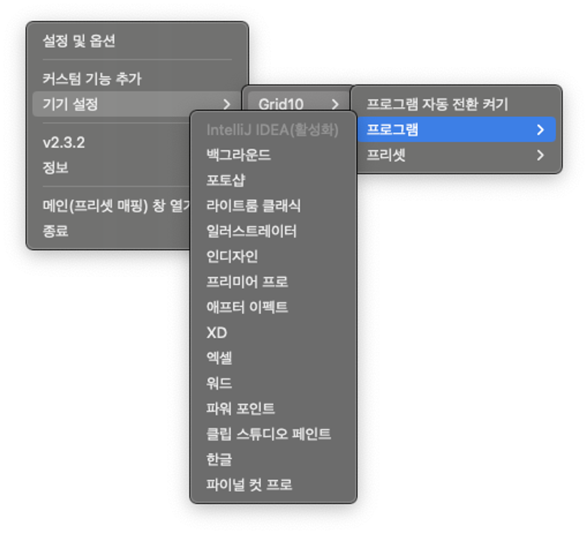

# v2.3.3 정식 업데이트

### 2023.10.24(화)

---

## 요약

**[추가 사항](#추가-사항)**

- [빠른 단축키 입력에서 경로 열기, 타이핑 추가](#빠른-단축키-입력에서-경로-열기-타이핑-추가)
- [빠른 단축키 입력으로 프로그램과 연동된 기능을 사용할 경우, 메시지 표시](#빠른-단축키-입력으로-프로그램과-연동된-기능을-사용할-경우-메시지-표시)
- [대만어 지원(중국어 포함)](#대만어-지원중국어-포함)
- [소프트웨어 - 기기 만족도 조사 시행](#소프트웨어---기기-만족도-조사-시행)

**[수정 사항](#수정-사항)**

- [트레이 메뉴 아이템 이름 직관적으로 개선](#트레이-메뉴-아이템-이름-직관적으로-개선)
- [`Ctrl`, `Shift` 등의 단축키가 꾹 눌려있는 현상 임시 조치](#ctrl-shift-등의-단축키가-꾹-눌려있는-현상-임시-조치)
- [파이널 컷 프로 명령 파일 한글 단축키 입력](#파이널-컷-프로-명령-파일-한글-단축키-입력)
- [수동 업데이트 시, 다운로드 후 비정상적인 창이 표시되는 현상 수정](#수동-업데이트-시-다운로드-후-비정상적인-창이-표시되는-현상-수정)
- [일부 성능 개선](#일부-성능-개선)

---

 

> # 추가 사항

## 빠른 단축키 입력에서 경로 열기, 타이핑 추가

- 커스텀 기능 추가 창을 열어야만 생성할 수 있었던 텍스트 타이핑과 경로 열기를 빠른 단축키 입력에서도 사용할 수 있도록 하였습니다.
- 경로 열기와 타이핑은, `**오른쪽 기능 리스트 → 백그라운드 → 단축키 → 단축키 외(카테고리)**`에 포함되어 있습니다.
- 매핑을 하기 위해선 이를 드래그하여 원하는 위치에 끌어다 놓아 매핑하고, 매핑한 곳을 클릭하여 경로 및 텍스트를 설정합니다.

## 빠른 단축키 입력으로 프로그램과 연동된 기능을 사용할 경우, 메시지 표시

- 프로그램 연동 기능을 수정할 경우, 기존에는 아무 단축키가 매핑되지 않은 것처럼 보여 혼란을 유발하였습니다.
- 이를 해결하기 위해 프로그램 연동 기능이므로, 일반 단축키 매핑으로 변경할지 물어보는 메시지 박스를 출력합니다.

## 대만어 지원(중국어 포함)

- 대만 진출과 함께 대만어 버전을 정식으로 지원합니다.
- 대만 버전의 기능에 대한 번역은 현재 `Adobe Photoshop`, `Adobe Premiere Pro`, `Adobe After Effects`를 집중적으로 번역하였습니다.
    - 이 외의 다른 프로그램 기능에 대해서는 번역이 매끄럽지 않을 수 있습니다.

- 대만어와 함께 중국어 버전도 함께 지원합니다.
    - 중국어 버전은 대만어보다 조금 더 번역이 매끄럽지 않을 수 있습니다.

## 소프트웨어 - 기기 만족도 조사 시행

- 앞으로 일정한 간격으로 사용자 여러분들의 소프트웨어에 대한 피드백을 점수 및 간단한 코멘트로 수집하려고 합니다.
- 해당 만족도 조사를 통해 **(주)인바이즈**는 더 좋은 UX 개선을 약속하고, 사용자 여러분들의 작업 환경을 개선하기 위해 노력하겠습니다.
- **(주)인바이즈**가 여러분에게 좋은 사용성을 제공할 수 있도록 사용자 여러분들의 진심어린 의견을 아낌없이 전달주시면 감사드리겠습니다.
- **(주)인바이즈**는 사용자분들의 목소리를 경청하고 반영할 수 있도록 노력하겠습니다!

 

---

 
 
 

> # 수정 사항

## 트레이 메뉴 아이템 이름 직관적으로 개선

- 기존의 불확실한 트레이 메뉴의 이름을 직관적으로 수정하였습니다.
- 잘 사용하지 않던 트레이 메뉴를 재구성하였습니다.
- 뉴스, 지원센터 등 정보 열람을 위한 메뉴들을 정보 탭으로 묶었습니다.

- 기기가 연결되지 않았을 때는 해당 메뉴 자체를 비활성화하고, 연결된 경우 연결된 기기 별로 상태를 변경할 수 있습니다.

## `Ctrl`, `Shift` 등의 단축키가 꾹 눌려있는 현상 임시 조치

- `Grid Pro` 제품 사용 시, 이러한 특수 키가 계속해서 꾹 눌려있어 일반적인 사용에도 불편을 초래하는 현상을 개선하기 위해 임시조치를 취합니다.
- 마지막으로 떼진 순간부터 5초 후에 모든 키를 떼는 명령을 동시에 실행하는 방식으로 조치합니다.

## 파이널 컷 프로 명령 파일 한글 단축키 입력

- 파이널 컷 프로의 명렁 파일에 한글 입력 단축키 포맷을 추가 지원합니다.
- 기존 파이널 컷 프로의 명령 파일은 영문 기준 단축키(Ex - Cmd + z)만 입력이 되어 있었는데, 한글 기준 단축키(Ex - Cmd + ㅋ)을 추가합니다.

## 수동 업데이트 시, 다운로드 후 비정상적인 창이 표시되는 현상 수정

업데이트 다운로드 버튼을 클릭할 때, 브라우저에서 창을 여는 것이 아니라, 작은 네모 창으로 홈페이지를 열어 다운로드 현황을 손쉽게 확인할 수 없는 버그를 수정합니다.

## 일부 성능 개선

- 최신 버전의 소프트웨어에서도 동작할 수 있도록 수정하였습니다.
- 일부 상황에서 비정상적으로 높은 메모리가 필요한 현상을 수정하였습니다.