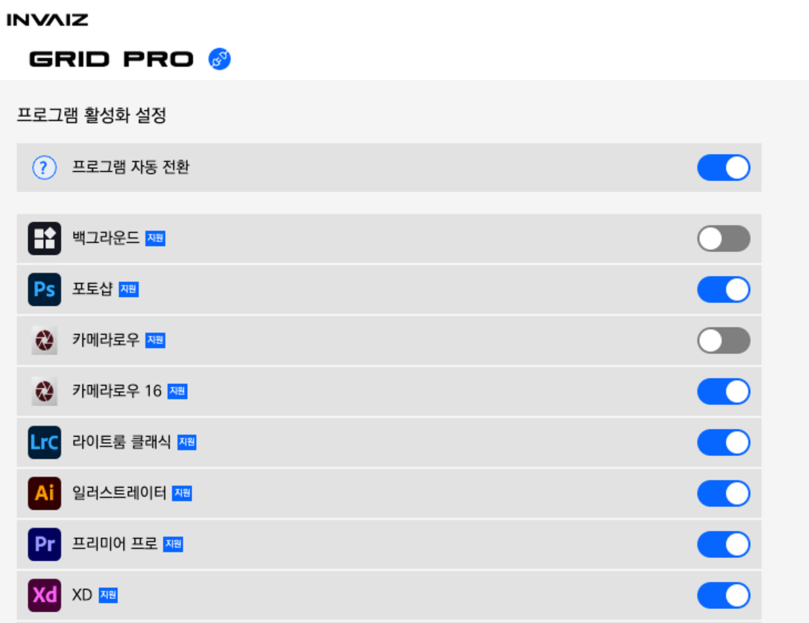
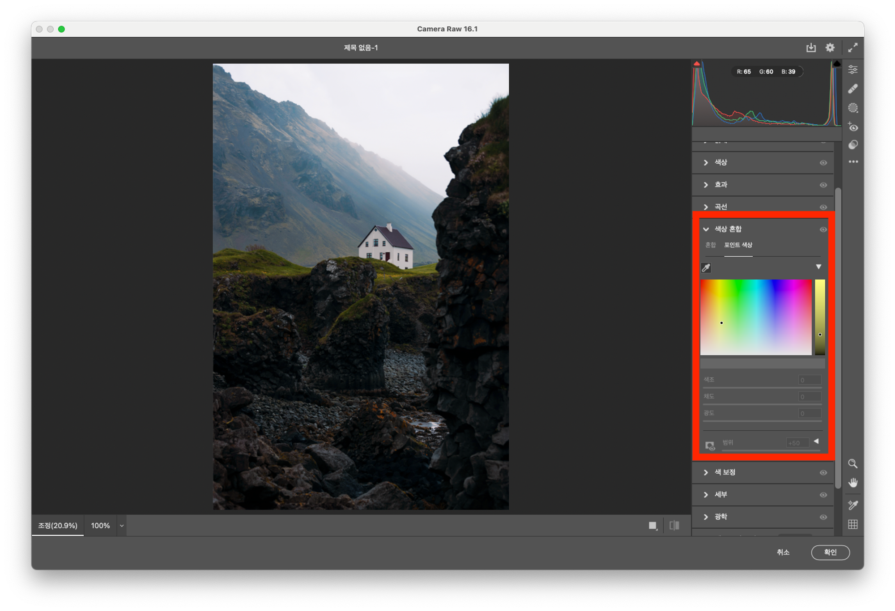
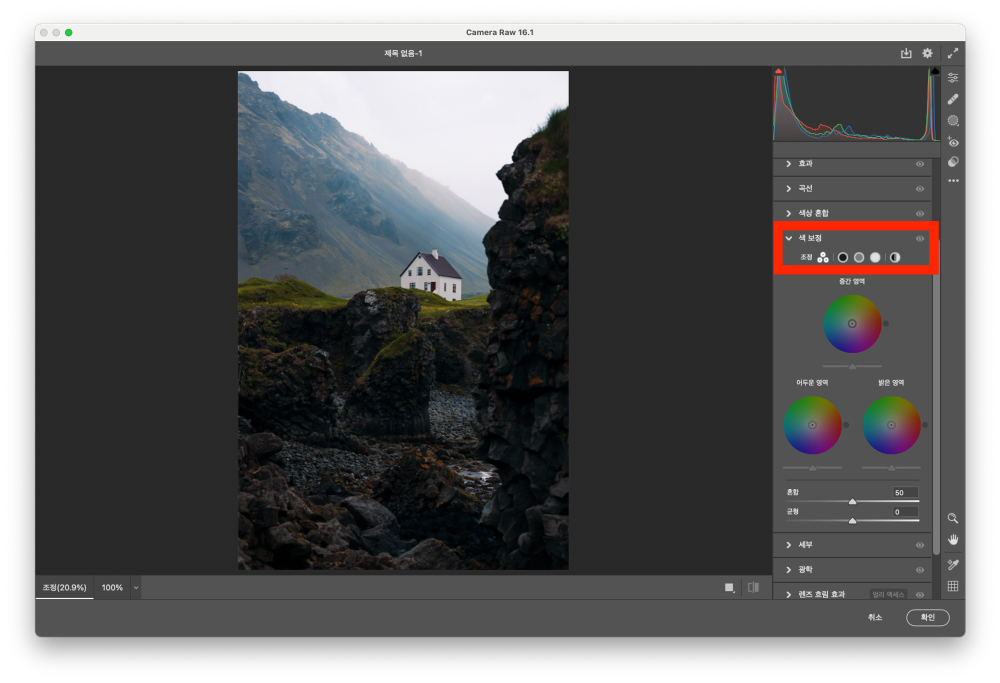
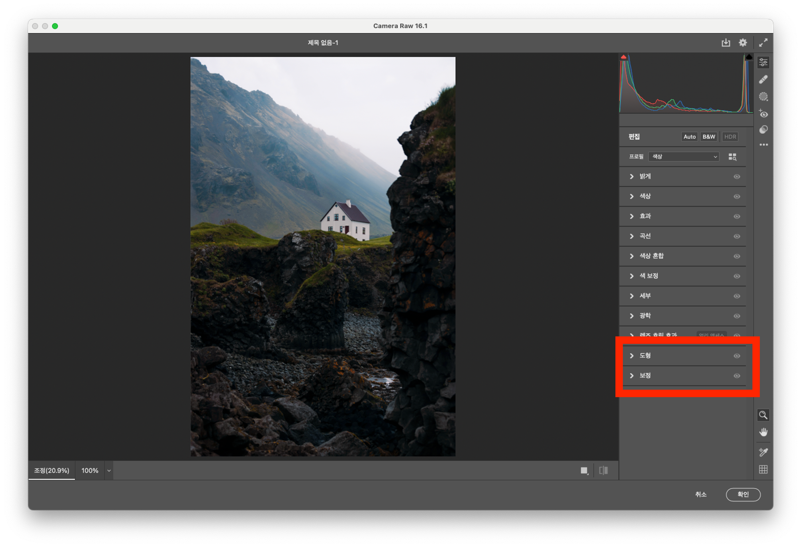
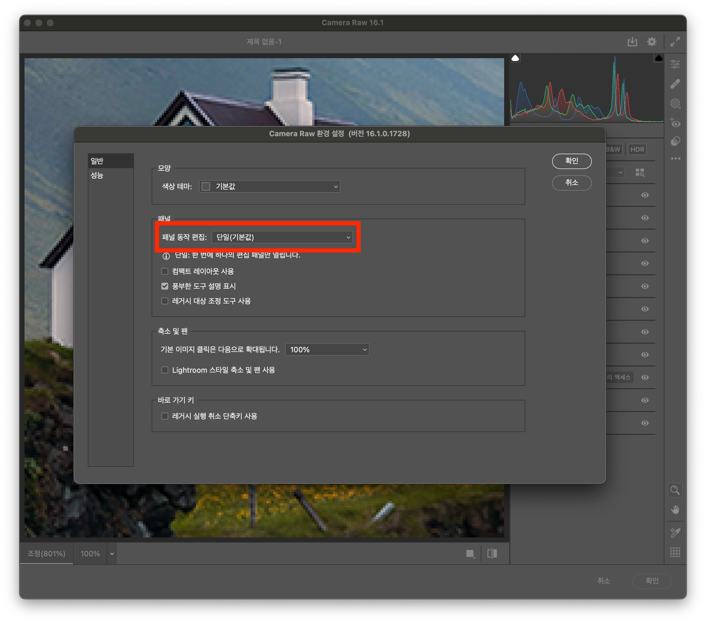
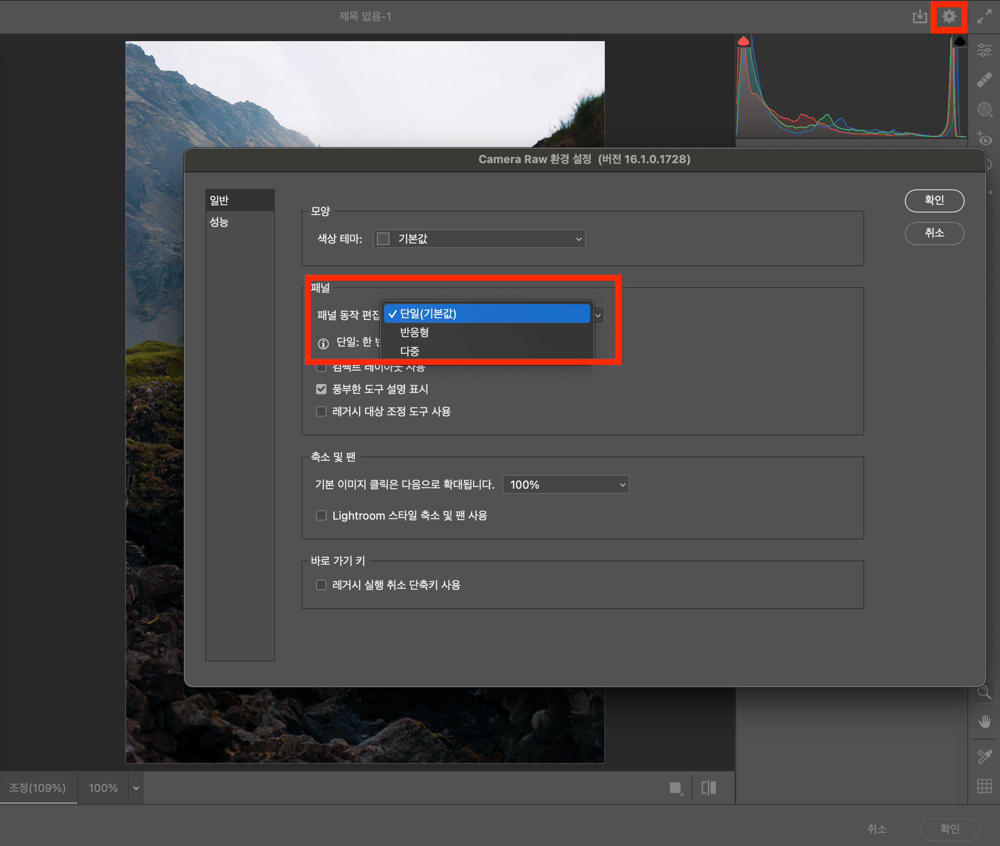
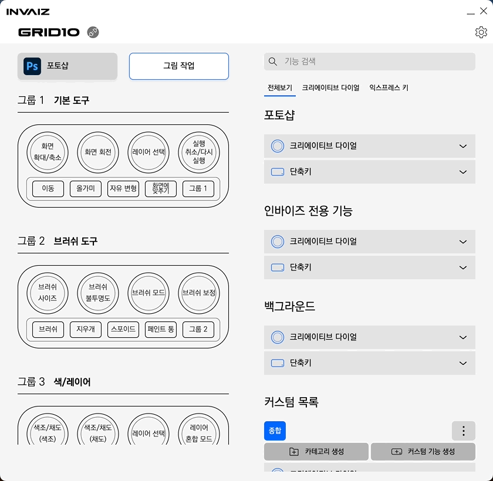
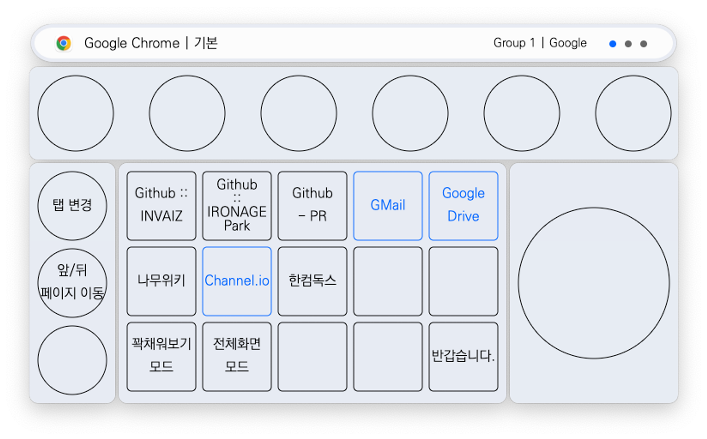

# v2.3.4 정식 업데이트

### 2023.12.26(화)

---

## 요약

**[추가 사항](#추가-사항)**

- [`Adobe Photoshop`에서 `Adobe Camera Raw` 분리](#adobe-photoshop에서-adobe-camera-raw-분리)
- [`Adobe Camera Raw 16`(`ACR 16`) 지원](#adobe-camera-raw-16acr-16-지원)

**[수정 사항](#수정-사항)**

- [검색 개선](#검색-개선)
- [파일 및 폴더 열기 실행 시 오버레이 눌려짐 현상 개선](#파일-및-폴더-열기-실행-시-오버레이-눌려짐-현상-개선)
- [`Grid Pro` 다이얼 시계 방향 안정성 개선](#grid-pro-다이얼-시계-방향-안정성-개선)
- [`macOS 11 Big Sur` 이전 버전 실행 불가능 현상 수정](#macos-11-big-sur-이전-버전-실행-불가능-현상-수정)

> 추가 전달
>
> - 이 다음 버전에는 매크로의 반복 입력을 막고, 매크로 실행 도중 취소 기능을 추가합니다.

---

 

> # 추가 사항

## `Adobe Photoshop`에서 `Adobe Camera Raw` 분리

- `Camera Raw`를 `Adobe Photoshop` 하위에서 프리셋으로 관리하는 것이 아니라, 다른 프로그램으로 분리하여 관리합니다.
- `Camera Raw` 창에 대해 프로그램 자동 전환이 적용되어 있습니다.

## `Adobe Camera Raw 16`(`ACR 16`) 지원

- 2023년 하반기에 업데이트한 `Adobe Camera Raw 16`의 바뀐 UI에서도 `INVAIZ Studio` 기능을 사용할 수 있도록 지원합니다.
- 이전에 사용하던 `Adobe Camera Raw`도 지원하고 있으나, UI가 다르므로 두 프로그램과 그 안의 기능을 모두 분리하여 관리합니다.
- 이전 버전 `Adobe Camera Raw`를 사용하기 위해선 프로그램 설정 창에서 `Adobe Camera 16`을 비활성화 한 후, `Adobe Camera Raw`만 활성화하여 정상적으로 사용 가능합니다.

> 아래의 일부 패널 내 기능들은 패널이 열려있지 않으면 사용할 수 없으므로, 반드시 패널을 열고 사용해주시기 바랍니다.
>
> 
> 
> 
>
> 1. 색상 혼합(Color Mixer) - 포인트 색상(Point Color)
> 2. 색 보정(Color Grading) - 각 영역 별 색조, 채도, 광도
> 3. 도형
> 4. 보정

> `macOS`에서 `Adobe Camera Raw` 사용 시 `설정`에서 `패널 동작 편집`을 `단일(기본값)`으로 설정해야 정상적으로 이용 가능합니다.
>
> 
> 

 

---

 
 
 

> # 수정 사항

## 검색 개선

- 기능 검색 창에서 검색어를 입력할 때 조금 더 추상적으로 입력 가능하도록 수정하였습니다.
- 단어와 단어 사이의 언어를 고려하지 않고도 검색 가능합니다.

## 파일 및 폴더 열기 실행 시 오버레이 눌려짐 현상 개선

- 파일 및 폴더 열기를 실행하고 곧바로 버튼을 뗄 경우, 오버레이에 계속해서 버튼이 눌려짐으로 인식되는 현상을 수정하였습니다.

## `Grid Pro` 다이얼 시계 방향 안정성 개선

- `Grid Pro` 제품의 다이얼을 시계 방향으로 빠르게 회전할 경우, 비정상적인 동작(반시계 방향 실행)이 발생하는 현상을 개선하였습니다.
- 기존 비정상 동작 현상 발생에 비해 안정성을 약 40% 개선하였습니다.

## `macOS 11 Big Sur` 이전 버전 실행 불가능 현상 수정

- 구 버전의 `macOS`에서 간혹 에러 메시지와 함께 `INVAIZ Studio`가 전혀 실행되지 않던 현상을 수정하였습니다.
- 지금까지 확인된 현상에 대해서는 수정 완료하였으나, 보고되지 않은 현상이 있을 수 있으므로 문제 발생 시 언제든지 문의주시기 바랍니다.