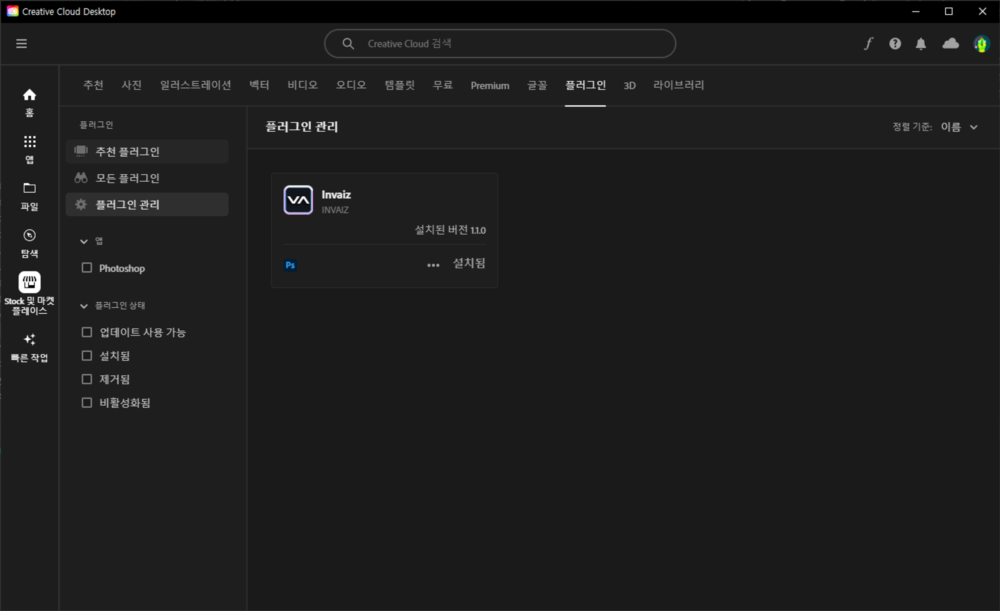
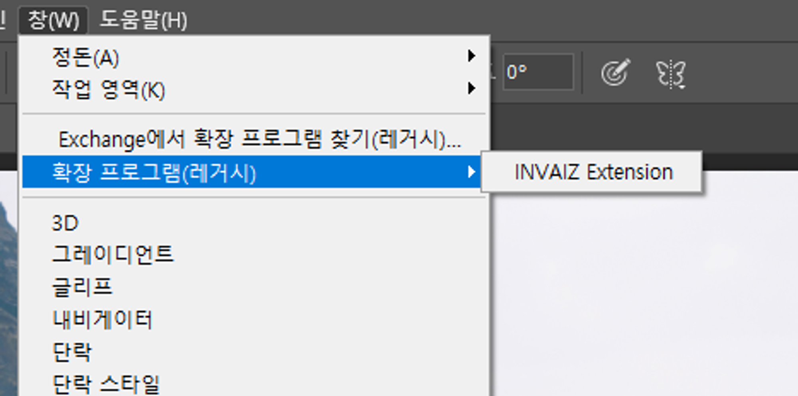
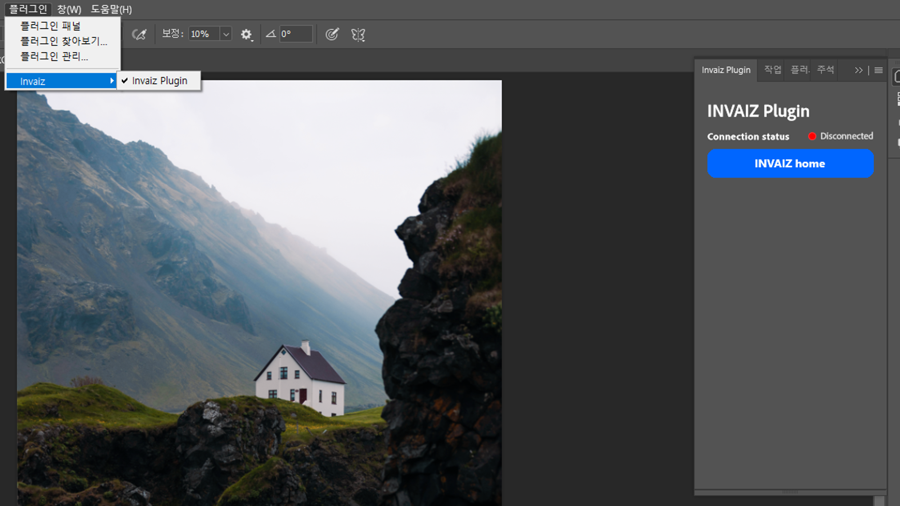
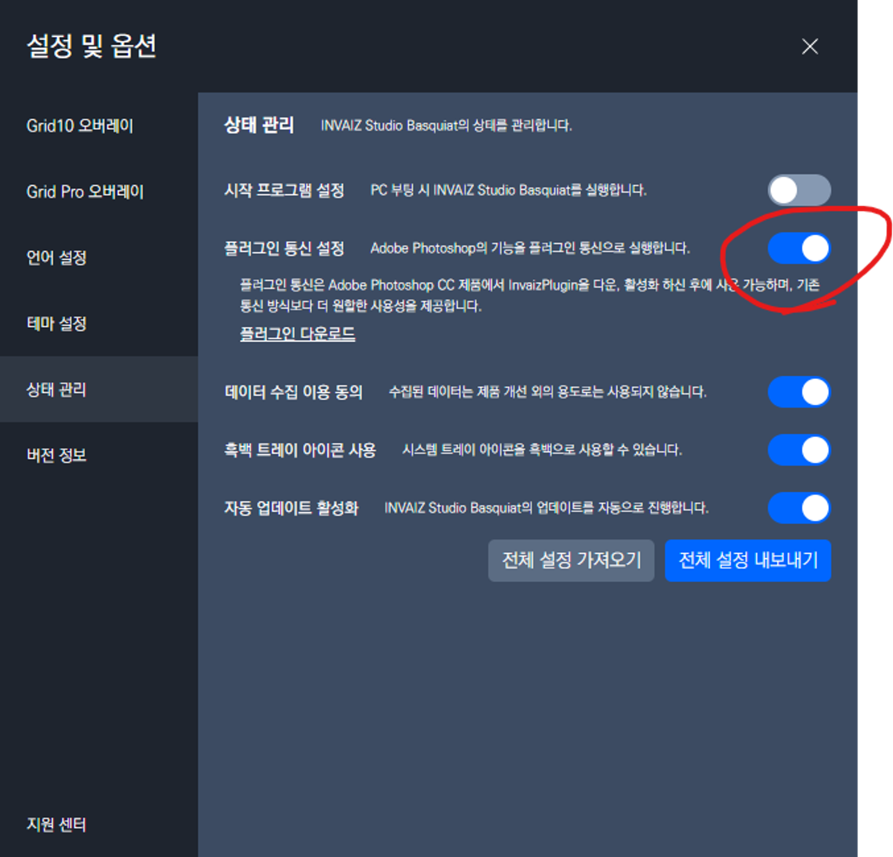
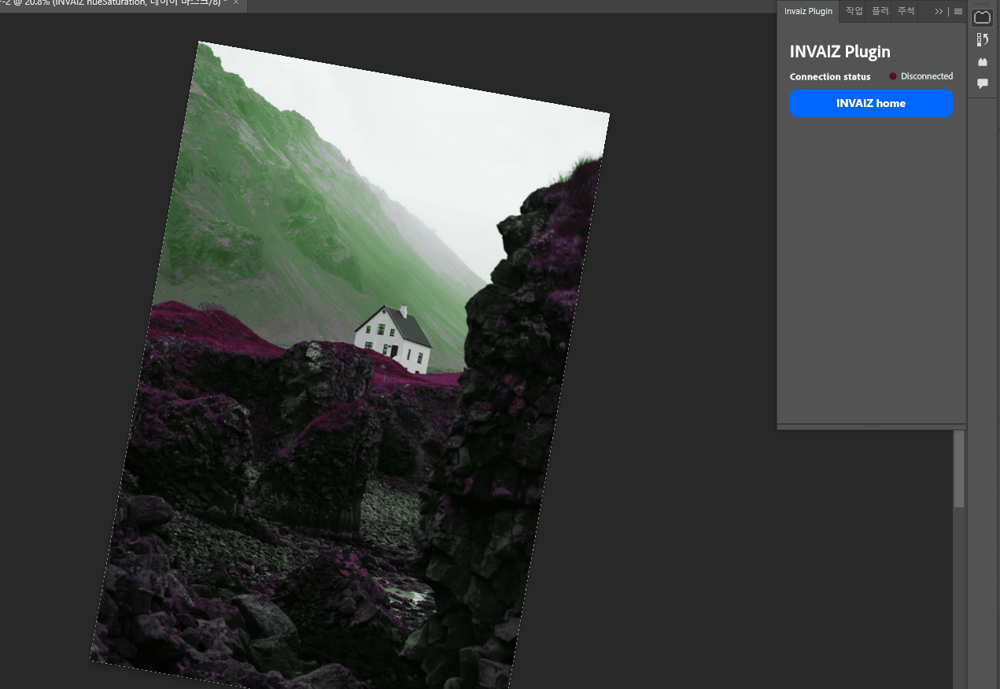

# v2.3.5 업데이트

### 2024.02.02(금)

---

## 요약

**[수정 사항](#수정-사항)**

- [Adobe Photoshop에서 수치 조절 기능이 정상적으로 동작하지 않는 현상 수정](#adobe-photoshop에서-수치-조절-기능이-정상적으로-동작하지-않는-현상-수정)

> 추가 전달
>
> - 매크로의 반복 입력을 막고, 매크로 실행 도중 취소 기능은 다음 정식 버전에 출시됩니다.
> - 현재 프로그램 자동 전환이 정상적으로 동작하지 않는 버그와, 오버레이가 출력되지 않는 현상, 기기가 간혹 연결되지 않는 현상을 수정하고 있습니다.

---

 

> # 수정 사항

## `Adobe Photoshop`에서 수치 조절 기능이 정상적으로 동작하지 않는 현상 수정

- `Adobe Photoshop` 25 버전 업데이트 이후로 조정 레이어 등 수치 조절 기능이 정상적으로 동작하지 않는 현상을 수정하였습니다.
- `INVAIZ Studio Basquiat` v2.3.5 버전부터는 `Adobe Photoshop`의 플러그인 기능을 기본으로 지원합니다. 따라서 이전 방식인 확장 프로그램을 통해 지원되는 방식은 권장되지 않으므로, [`Adobe Creative Cloud`](https://exchange.adobe.com/apps/cc/3fa39056?pluginId=3fa39056&workflow=share)의 플러그인을 설치하시는 것을 권장드립니다.

- 업데이트 이후에도 수치 조절 기능이 동작하지 않는다면 `Invaiz Plugin` 설치 여부와 `설정 및 옵션 → 상태 관리 → 플러그인 통신 설정` 활성화 여부를 확인해주십시오.

- 플러그인은 기기 연결 후 `Adobe Photoshop` 관련 기능을 사용할 때 연결됩니다. 따라서 고객님께서는 플러그인 창에서 연결되지 않음으로 떠있더라도 기능을 실행하시면 됩니다.

<aside>
⚠️ 플러그인이 실행되어 있어야 해당 기능을 이용할 수 있습니다! 따라서 `Not open Photoshop Plugin!` 라는 메시지가 뜬다면, 상단의 플러그인 탭에서 `Invaiz → Invaiz Plugin`을 실행시켜주세요!
</aside>

- 만약 이전 확장 프로그램 방식을 이용하시려면 `설정 및 옵션 → 상태 관리 → 플러그인 통신 설정`을 비활성화하시면 됩니다.