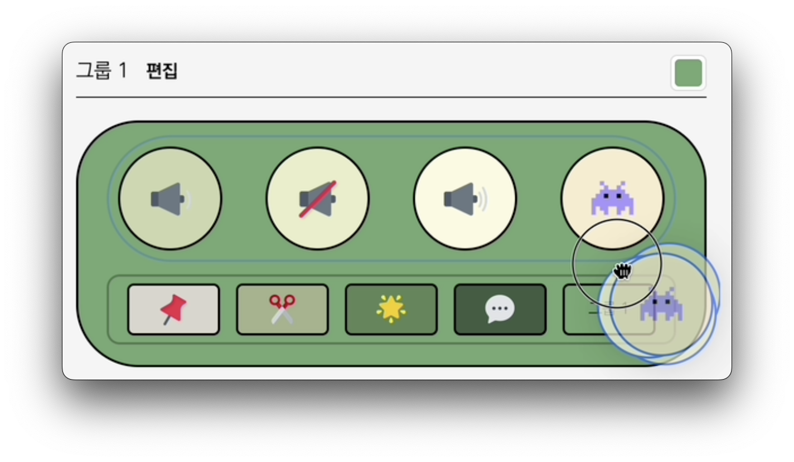
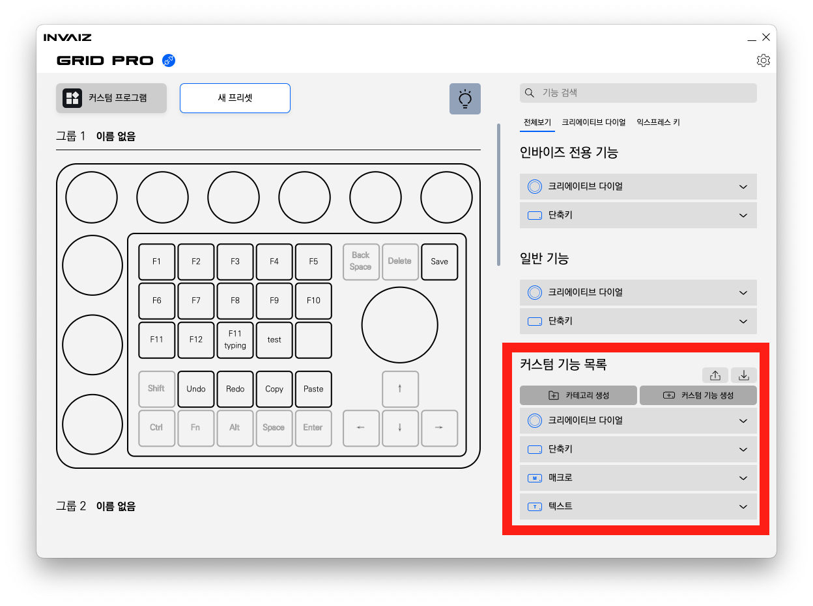

# v2.3.7 추가 업데이트

### 2024.03.25(월)

---

## 요약

- **추가 전달사항**

  - **이 버전은 문제 발생으로 인해 긴급하게 수정한 버전입니다.  
    따라서 본 릴리즈 노트에 2.3.6 버전의 업데이트 내용을 함께 포함하고 있습니다.**
  - `Adobe Camera Raw` 최신 버전(`ACR 16.2`)에서 패널의 디자인이 변경됨으로 인해 또 다시 일부 기능이 동작하지 않는 버그가 발생하여 수정 중에 있습니다.
  - 다음 버전(`v2.4.0`)에선 오버레이에 표시되는 기능에 색상과 이모지를 선택할 수 있는 기능을 추가합니다.
    
    
    

  - 그리고 프로그램 → 프리셋의 관계를 제거하고, 프리셋만을 관리할 수 있도록 대규모 수정이 있을 예정입니다.

---

 

# 추가 사항

## 새로운 색상 선택기

- `Grid Pro`의 LED를 설정할 때 사용하는 색상 선택기의 디자인 및 UX를 수정하였습니다.

## 텍스트 입력을 매크로로 치환하기

- `Google Chrome` 등의 일부 프로그램에서 연속된 텍스트의 입력(Ex. `000111`, `가가가가가나나나나`)이 정상적으로 입력되지 않는 현상이 발생합니다.
- 이를 해결하기 위해 각 연속된 텍스트 입력 사이에 지연시간을 발생시키도록 매크로 치환 기능을 추가합니다.

- 매팽된 텍스트 입력 기능에서 우클릭을 통해 매크로로 전환이 가능합니다.

<aside>
💡 이 기능은 시범적으로 도입되었으며, 추후 지원 방식이 변경될 수 있습니다.

</aside>

## Drag & Drop 직관적 디자인

- 기능을 Drag & Drop으로 매핑할 때 표시되는 아이콘의 직관성을 높였습니다.
- 기기에 따라, 각 기능의 타입에 따라 모양을 표시하도록 합니다.
  
  
  
- 바꾸기 / 덮어쓰기의 구분을 Tooltip으로 할 수 있습니다.
  

---

# 수정 사항

## 기능 매핑 시 덮어쓰기가 작동하지 않는 버그 수정 (v2.3.7)

- 기능을 매핑할 때, Ctrl(또는 Command)키를 누른 채 기능을 덮어쓰기 할 시 작동하지 않는 현상을 수정하였습니다.

## 백그라운드 → 커스텀 프로그램으로 명칭 변경

- 공통 상태(글로벌 상태)를 말하는 백그라운드를 커스텀 프로그램이라는 이름으로 수정합니다.
- 어떠한 프로그램에서도 모두 동작할 수 있는 프리셋의 집합으로, 프로그램 자동 전환의 영향을 받지 않는 상태입니다.

## 가상 키보드 매핑 시 일부 키 오류 해결

- 기능 생성 창에서 가상 키보드를 통해 키를 매핑할 경우, 일부 키가 실제로 실행되지 않는 버그를 수정합니다.

## 마우스 입력 오류 해결

- 아래 기능이 정상적으로 동작하지 않는 현상을 해결하였습니다.
  1. `Ctrl` + 세로 스크롤 입력 시 Control이 계속해서 눌려있음
  2. 마우스 클릭 미동작

---

# 삭제 사항

## 커스텀 파일 제거

- 처음 `INVAIZ Studio Basquiat`를 사용하시는 사용자분들에게 혼란을 가져다주는 주범, 커스텀 파일의 개념을 삭제하였습니다.
- 이전까지 사용하던 커스텀 파일은 `v2.3.6` 버전부터 하나의 화면에서 모두 확인하실 수 있습니다.
- 마찬가지로 이전까지 내보내진 커스텀 파일을 불러와 사용하는 것도 가능합니다.

- 앞으로 기능을 생성하기 위해서 1) 프로그램을 추가하고, 2) 프리셋을 추가하고, 3) 커스텀 파일을 생성하고, 4) 기능을 추가해야 하는 번거로움을 줄이기 위한 업데이트가 계속될 예정입니다.

## `Adobe Photoshop` 기능 리스트에서 `Camera Raw` 제거

- 포토샵 기능 리스트에서 보여지는 불필요한 `Camera Raw` 기능을 제거합니다.

