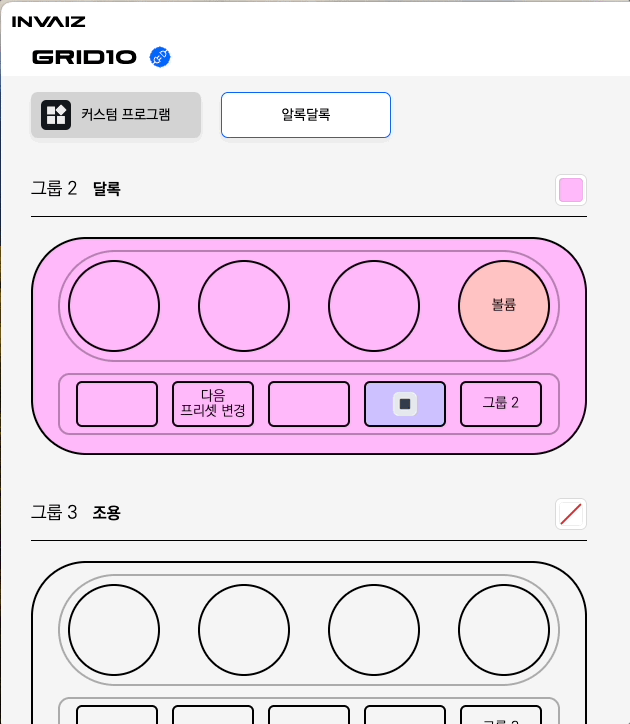
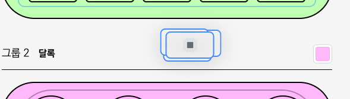

# v2.4.1 추가 버전 업데이트

### 2024.06.18(화)

---

## 요약

**[추가 사항](#추가-사항)**

- [오버레이 디자인 커스터마이징](#오버레이-디자인-커스터마이징)
- [마우스 위치 관련 기능](#마우스-위치-관련-기능)
- [커스텀 기능 카테고리 간 이동](#커스텀-기능-카테고리-간-이동)
- [지원 프로그램 전용 기능 공통 사용](#지원-프로그램-전용-기능-공통-사용)

**[수정 사항](#수정-사항)**

- [`Grid Pro` 고정키 커스텀 가능 및 오버레이 디자인](#grid-pro-고정키-커스텀-가능-및-오버레이-디자인)
- [커스텀 기능 비어있는 카테고리 열림 현상 수정](#커스텀-기능-비어있는-카테고리-열림-현상-수정)

> 추가 전달
>
> - 이 버전은 문제 발생으로 인해 긴급하게 수정한 버전입니다.  
>   따라서 본 릴리즈 노트에 2.4.0 버전의 업데이트 내용을 함께 포함하고 있습니다.
> - `Adobe` 다이얼 지원 기능의 감도가 일정하지 않은 점을 해결하기 위한 작업을 진행하고 있습니다.

---

 

> # 추가 사항

## 오버레이 디자인 커스터마이징

- 설정 창과 설정된 기능들에 대한 오버레이 디자인을 개선하였습니다.
- 기능 Drag & Drop 시 보여지는 디자인을 수정하였습니다.
  
  
  
  
- 기능 설정 시 이모지를 기존 이름을 대신하여 사용할 수 있습니다.
  
- 기능, 기기의 배경색과 텍스트 색상을 적용할 수 있습니다.
  
  - 변경된 텍스트는 오버레이와 기능 Drag & Drop 시 확인 가능합니다.
    
    
- `Grid10`의 그룹 변경 오버레이에서 선택된 그룹의 색상을 변경합니다.
- 명확한 사용 방법은 첫 실행 시 나오는 튜토리얼을 통해 확인해보세요!
- 이제 탁한 `Grid` 제품을 **알록달록**하게 꾸며 작업 환경을 개선해보세요!

## 마우스 위치 관련 기능

[다이얼 & 키 마우스 기능 사용 예시 GIF]

- 다이얼과 키에서 마우스 이동 기능을 사용할 수 있도록 합니다.
- 다이얼에서는 현재 마우스 위치를 기준으로 지정한 각도로 이동시킬 수 있는 기능을 제공합니다.
  - 매핑은 기준 각도와 드래그 여부, 이동 속도와 이동하면서 동시에 누를 키를 지정할 수 있습니다.
    
    - 기준 각도는 원형을 드래그하여 조절할 수 있습니다.
  - 이를 통해 마우스 상하/좌우 이동, Shift 클릭 후 드래그, Ctrl 클릭 후 드래그 등을 수행할 수 있습니다.
    
    
    
    
- 키에서는 마우스를 특정한 위치로 이동시킬 수 있는 기능을 제공합니다.
  
  - 매핑은 이동 위치와 드래그 여부, 이동하면서 동시에 누를 키를 지정할 수 있습니다.
    
    - 이동 위치는 원점을 드래그하여 원하는 위치에서 마우스를 떼서 설정할 수 있습니다.
    - 속도가 0일 경우, 순간이동합니다.
  - 이를 통해 마우스를 특정 위치로 이동시킬 수 있으며 매크로에 적용하여 더 다양한 기능을 사용할 수 있습니다.
    
    [마우스 매크로 응용 예시 GIF]
- 키 기능의 경우 매크로로 만들어낼 수 있습니다.
  
- 추가로, 스크롤 기능을 더욱 다양하게 사용할 수 있습니다.

- 추가된 스크롤 기능은 아래와 같습니다.
  - 가로 스크롤 / 세로 스크롤 - 매우 빠르게
  - Ctrl + 가로 스크롤 / 세로 스크롤
  - Shift + 가로 스크롤 / 세로 스크롤

## 커스텀 기능 카테고리 간 이동

- 커스텀 기능에서 카테고리 간 이동이 가능하도록 합니다.
- 커스텀 기능을 우클릭 한 후 '카테고리 이동' 메뉴를 선택하여 변경 가능합니다.

- 카테고리 이동 창에서 이동할 카테고리를 선택할 수도, 새로운 카테고리를 생성하여 이동시킬 수도 있습니다.
  

## 지원 프로그램 전용 기능 공통 사용

- 이제부터 커스텀 프로그램에서는 지원 프로그램 전용 기능을 모두 사용할 수 있습니다.
  
- 커스텀 프로그램 활성화 시 우측 상단의 프로그램 탭을 통해 어떤 기능을 확인하고 매핑할 것인지 결정할 수 있습니다.
  
  
- 커스텀 프로그램으로 다른 프로그램의 프리셋을 가져올 수 있습니다.
  
  다른 지원 프로그램의 프리셋 커스텀 프로그램으로 가져오기
- 지원 프로그램을 한 프리셋에서 복합적으로 이용하기 위해서는 커스텀 프로그램에 매핑하여 사용하는 것을 권장드립니다.

---

# 수정 사항

## `Grid Pro` 고정키 커스텀 가능 및 오버레이 디자인

- `Grid Pro`의 각인된 버튼에 대해 커스터마이징이 가능하도록 수정하였습니다.
  
- 커스터마이징이 가능함에 따라 오버레이 디자인도 수정하였습니다.
  
  

## 커스텀 기능 비어있는 카테고리 열림 현상 수정

- 커스텀 기능이 비어있음에도 불구하고 열려있을 수 있는 현상을 수정합니다.

## Fn키의 위치를 변경할 수 없는 현상 수정 (v2.4.1)

- Fn키의 위치를 변경할 수 없는 현상을 수정하고, 이름을 직관적으로 ‘오버레이 모드변경’으로 변경합니다.
