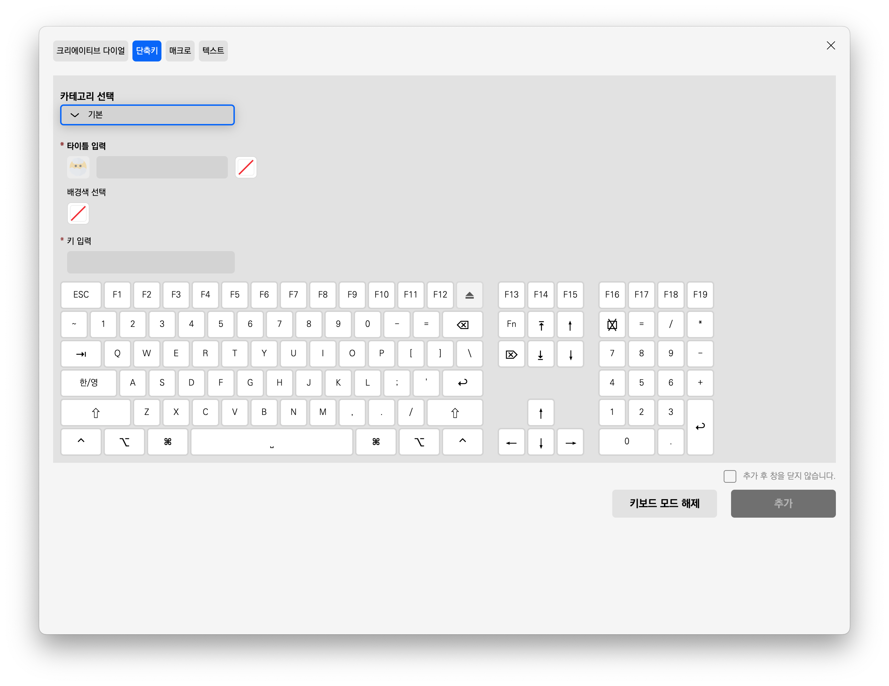
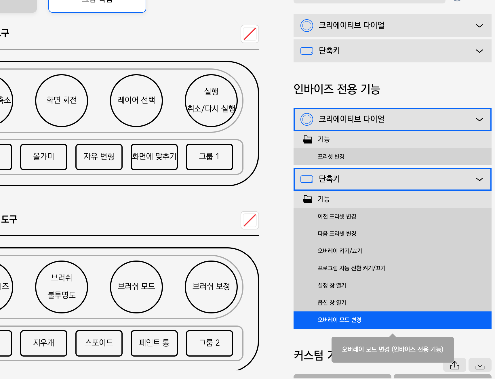
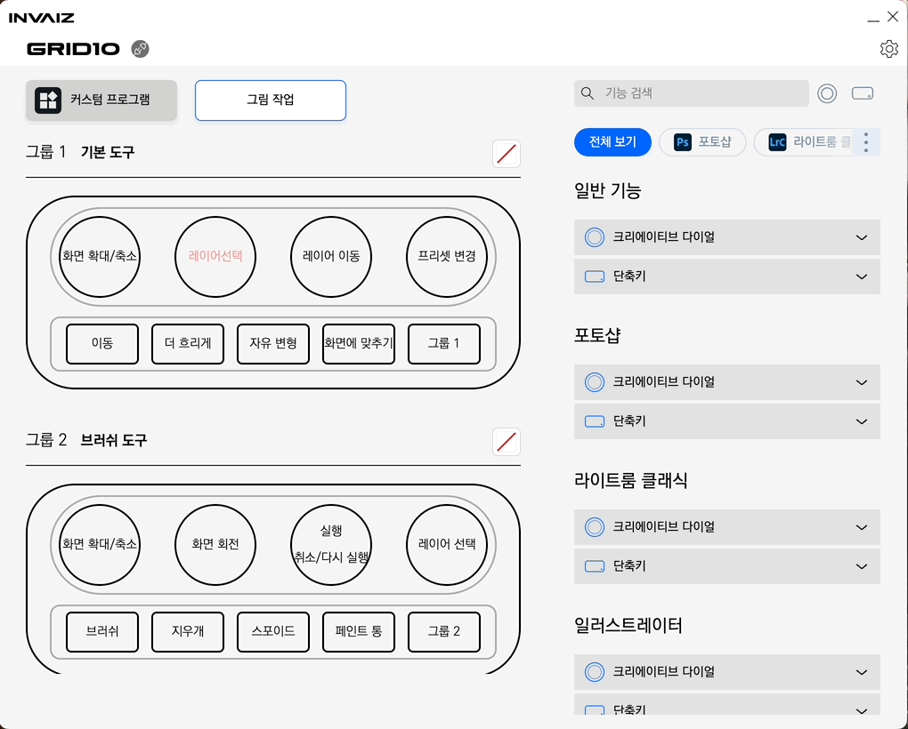
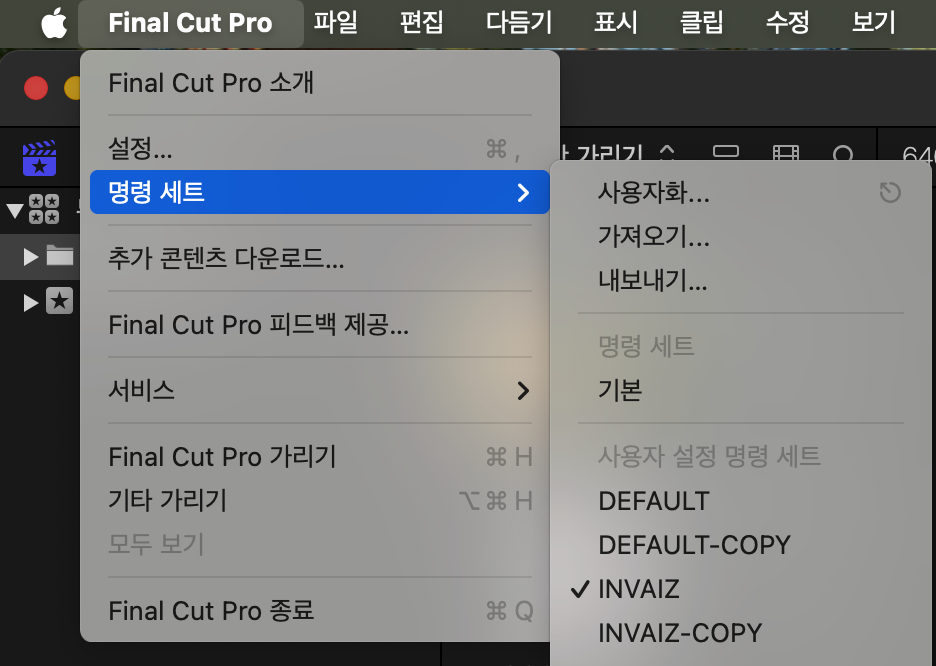
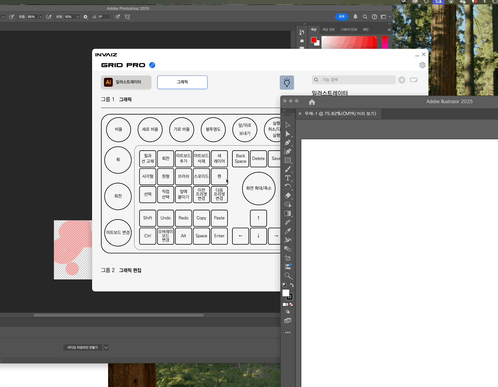

# v2.4.2 정식 버전 업데이트

### 2024.11.28(목)

---

## 요약

**[추가 사항](#추가-사항)**

- [`Windows 7` / `macOS 10.14` 이하 버전 지원 종료](#windows-7--macos-1014-이하-버전-지원-종료)
- [`macOS`에서 키 입력 품질 향상](#macos에서-키-입력-품질-향상)
- [오버레이 변경 모드 기능 리스트에 추가](#오버레이-변경-모드-기능-리스트에-추가)

**[수정 사항](#수정-사항)**

- [검색 식에서 타이핑 시 걸리는 지연 시간 개선](#검색-식에서-타이핑-시-걸리는-지연-시간-개선)
- [`Final Cut Pro 11`에서 실행 불가 현상 수정](#final-cut-pro-11에서-실행-불가-현상-수정)
- [`Grid Pro` 오버레이 전체 보기 모드에서 프로그램 자동 전환 수정](#grid-pro-오버레이-전체-보기-모드에서-프로그램-자동-전환-수정)
- [커스텀 프로그램에서 `Adobe` 전용 기능 정상 동작](#커스텀-프로그램에서-adobe-전용-기능-정상-동작)

> 추가 전달
>
> - 현재 인바이즈가 **인프라를 구축하기 위해 많은 노력을 기울이고 있어 소프트웨어 업데이트가 지연**이 되고 있습니다.
> - 이번 버전에서는 급하게 발생한 **치명적 버그를 우선적으로 해결**하려 합니다.
> - 치명적 버그 개선 후 계속해서 소프트웨어 업데이트 예정이니, 문제가 계속 있거나 발생하는 고객님께서는 **홈페이지에서 피드백 주시면 빠르게 반영**할 수 있도록 노력하겠습니다!
> - 또한, 프로그램 자동 전환이 제대로 동작하지 않거나, `Grid Pro` 제품이 계속해서 끊기는 현상은 수정 중에 있으나, 환경마다 발생하는 케이스가 달라 완전한 수정까지 시간이 걸릴 것으로 예상됩니다!

---

 

> # 추가 사항

## `Windows 7` / `macOS 10.14` 이하 버전 지원 종료

- 이제부터 `Windows 7` / `macOS 10.14` 이하 **버전을 지원하지 않습니다.**

## `macOS`에서 키 입력 품질 향상

`macOS`에서 조합키 사용하기

- `macOS`에서 조합키 입력을 지원할 수 있게 하고, `Numpad`, `Function` 또한 추가로 지원합니다.
- 이러한 기능들은 커스텀 기능 생성 창에서 키보드 모드를 통해 편하게 추가할 수 있습니다.
- 현재 `macOS`에서 `Fn` 키 등 특수 키와 일부 조합에 대해 비정상 동작으로 강제 종료되는 버그가 간혹 발생합니다.

## 오버레이 변경 모드 기능 리스트에 추가

- `Grid Pro`의 `Fn`에 매핑된 기능인 오버레이 모드 변경을 인바이즈 전용 기능에 추가합니다.

---

> # 수정 사항

## 검색 식에서 타이핑 시 걸리는 지연 시간 개선

- 원래 검색 시 타이핑 한 번 할 때마다 끊겨서 입력이 됐는데, 입력 자체는 부드럽게 할 수 있도록 개선하였습니다.

## `Final Cut Pro 11`에서 실행 불가 현상 수정

- 최신 버전(11.0 이상)의 `Final Cut Pro`에서 모든 전용 기능 실행이 불가능했던 현상을 해결합니다.

- 최신 다운로드 받으신 `Final Cut Pro` 기준으로는, `Final Cut Pro`의 좌측 상단 설정에서 INVAIZ 이름으로 명령 세트(commandset)가 설정되어 있는지 확인할 필요가 있습니다!

## `Grid Pro` 오버레이 전체 보기 모드에서 프로그램 자동 전환 수정

- `Grid Pro`로 오버레이 모드를 ‘전체보기’로 지정했을 때, 프로그램 자동 전환이 동작하지 않는 현상을 수정합니다.

## 커스텀 프로그램에서 `Adobe` 전용 기능 정상 동작

- 최근 업데이트에서 각 프로그램의 특수 기능들을 커스텀 프로그램에 매핑할 수 있게 했으나, `Adobe` 기능의 경우에는 기능이 정상적으로 실행되지 않는 버그를 수정하였습니다.
